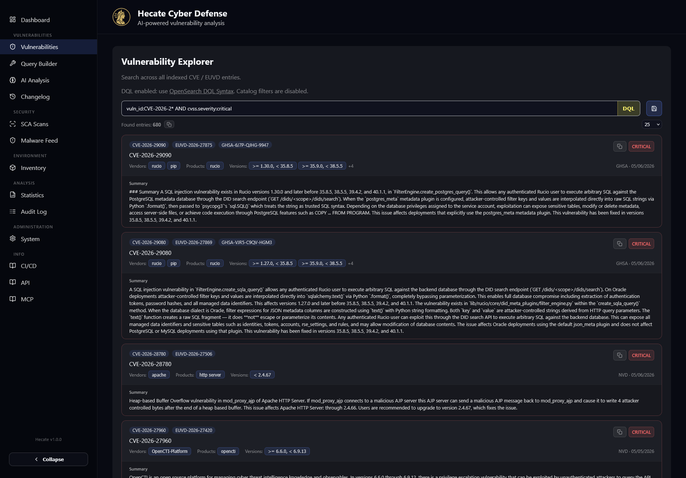
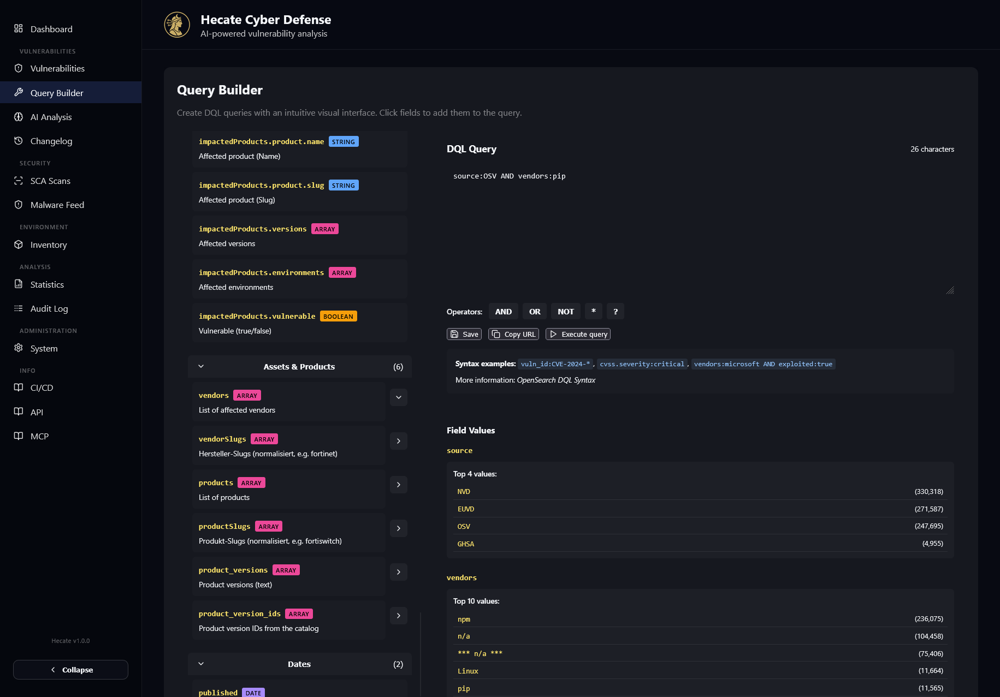
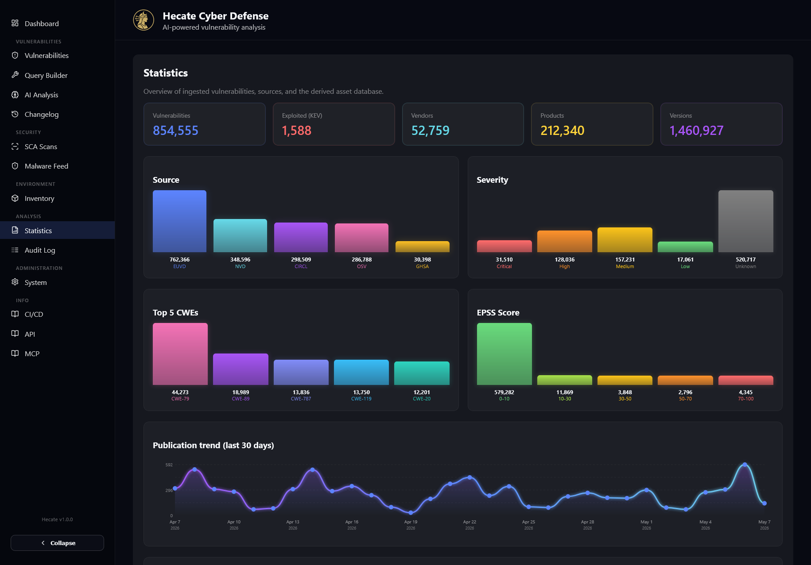
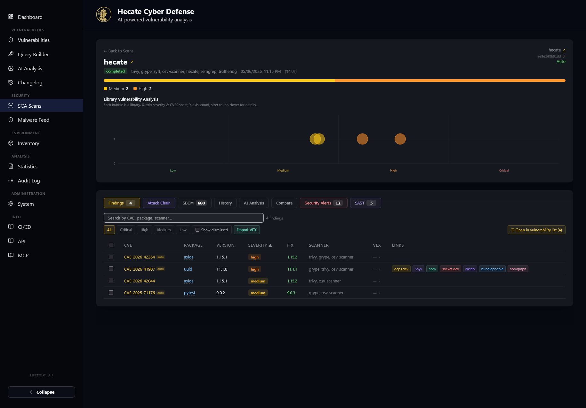
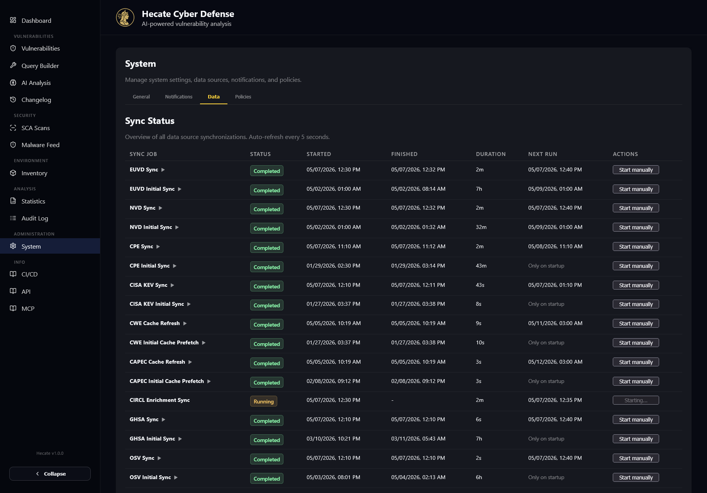
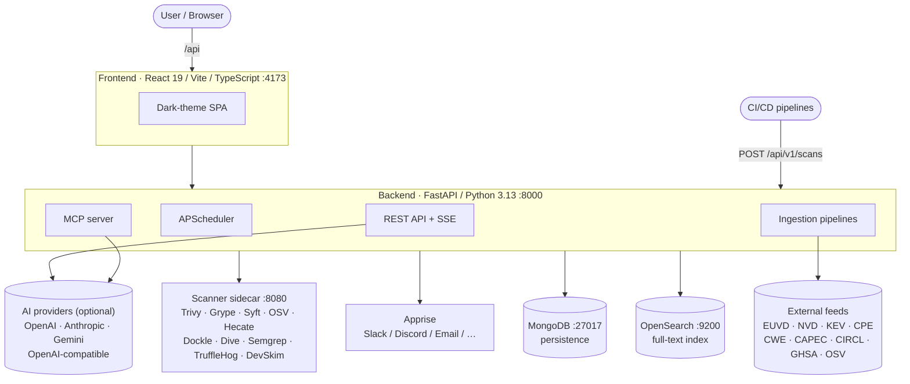

# Hecate

> Vulnerability management platform that aggregates, normalises, enriches, and analyses security advisories — and actively scans container images and source repositories (SCA).

Hecate ingests data from **9 external sources** (EUVD, NVD, CISA KEV, CPE, CWE, CAPEC, CIRCL, GHSA, OSV), normalises everything into a single `VulnerabilityDocument` schema, and exposes the result through a REST API and a React frontend. On top of the catalogue, a hardened scanner sidecar runs Trivy, Grype, Syft, OSV Scanner, the Hecate Analyzer, Dockle, Dive, Semgrep, TruffleHog, and DevSkim against your container images and source repos.


---

<p align="center">
  
</p>

<details>
<summary><strong>More screenshots</strong> — vulnerability search, SCA scans, SBOM, attack path, malware feed, system</summary>

<br/>

### Vulnerability management

<table>
  <tr>
    <td width="50%"></td>
    <td width="50%"></td>
  </tr>
  <tr>
    <td align="center"><sub>Vulnerability list · DQL filter</sub></td>
    <td align="center"><sub>Saved searches</sub></td>
  </tr>
  <tr>
    <td width="50%"></td>
    <td width="50%"></td>
  </tr>
  <tr>
    <td align="center"><sub>Query builder</sub></td>
    <td align="center"><sub>Statistics</sub></td>
  </tr>
</table>

### SCA scanning

<table>
  <tr>
    <td width="50%"></td>
    <td width="50%"></td>
  </tr>
  <tr>
    <td align="center"><sub>Scan targets</sub></td>
    <td align="center"><sub>Findings · VEX · dismissal</sub></td>
  </tr>
  <tr>
    <td width="50%"></td>
    <td width="50%"></td>
  </tr>
  <tr>
    <td align="center"><sub>SBOM · provenance</sub></td>
    <td align="center"><sub>Attack-path graph</sub></td>
  </tr>
</table>

### Intelligence & operations

<table>
  <tr>
    <td width="50%"></td>
    <td width="50%"></td>
  </tr>
  <tr>
    <td align="center"><sub>Malware feed</sub></td>
    <td align="center"><sub>System settings</sub></td>
  </tr>
  <tr>
    <td width="50%"></td>
    <td width="50%"></td>
  </tr>
  <tr>
    <td align="center"><sub>Data sources</sub></td>
    <td></td>
  </tr>
</table>

</details>

---

## Architecture



---

## Table of contents

- [Highlights](#highlights)
- [Project layout](#project-layout)
- [Core capabilities](#core-capabilities)
- [Quick start (Docker Compose)](#quick-start-docker-compose)
- [Local development](#local-development)
- [API surface](#api-surface)
- [Backend CLI](#backend-cli)
- [Configuration](#configuration)
- [CI/CD](#cicd)
- [Tech stack](#tech-stack)
- [Further reading](#further-reading)

---

## Highlights

| | |
| --- | --- |
| **9-source ingestion** | EUVD, NVD, KEV, CPE, CWE, CAPEC, CIRCL, GHSA, OSV — normalised into a single schema with priority-gated upserts and a 3-tier cache. |
| **Active SCA scanning** | 10 scanners (Trivy, Grype, Syft, OSV, Hecate, Dockle, Dive, Semgrep, TruffleHog, DevSkim) for container images and source repos. |
| **Supply-chain malware detection** | 35 heuristic rules informed by real attacks (Shai-Hulud, LiteLLM, Trivy v0.69.4, Glassworm, Telnyx, Axios, …). |
| **Provenance verification** | npm, PyPI, Go, Maven, RubyGems, Cargo, NuGet, Docker — Sigstore, PEP 740, Go sumdb, Cosign. |
| **Attack-path graph** | Per-CVE deterministic Mermaid graph (`entry → asset → package → CVE → CWE → CAPEC → exploit → impact → fix`) with optional AI narrative. |
| **Cross-CVE attack chain** | Per-scan ATT&CK kill-chain narrative bucketing all findings into Foothold → Credential Access → Privilege Escalation → Lateral Movement → Impact. |
| **Environment inventory** | User-declared products + versions matched against the catalogue for impact callouts and a dedicated notification rule type. |
| **MCP server** | 35 tools, OAuth 2.0 with delegated auth (GitHub / Microsoft / OIDC), DCR + PKCE, scope-gated writes. |
| **Notifications** | Apprise integration with rules, watch queries, message templates, and per-tag channel routing. |
| **Bilingual UI** | German + English, browser detection, no external i18n framework. |

---

## Project layout

```text
.
├── backend/              FastAPI service · ingestion pipelines · scheduler · CLI
├── frontend/             React 19 SPA
├── scanner/              Hardened scanner sidecar (10 scanners)
├── docs/                 Architecture + design notes
├── .gitea/workflows/     CI (build · Hecate scan · SonarQube)
├── .env.example          Environment-variable template (~104 vars)
└── docker-compose.yml.example
```

<details>
<summary><strong>Detailed tree</strong></summary>

```text
backend/
├── app/
│   ├── api/v1/           REST endpoints (19 router modules)
│   ├── core/             Pydantic settings, logging
│   ├── db/               MongoDB (Motor) + OpenSearch connections
│   ├── models/           MongoDB document schemas
│   ├── repositories/     Data-access layer (repository pattern)
│   ├── schemas/          API request/response schemas
│   ├── services/         Business logic, AI, backup, stats
│   │   ├── ingestion/    Pipelines + clients (10 sources)
│   │   ├── scheduling/   APScheduler job management
│   │   └── http/         Retry, rate limiter, SSL helper
│   └── utils/
└── pyproject.toml

frontend/
├── src/
│   ├── api/              Axios service modules
│   ├── components/       Reusable UI components
│   ├── views/            Page components (16 views)
│   ├── hooks/            Custom React hooks
│   ├── ui/               Layout (Sidebar, Header, TabPill)
│   ├── utils/, constants/, i18n/, timezone/, server-config/
│   ├── router.tsx, types.ts, styles.css
└── package.json

scanner/
├── app/
│   ├── main.py           FastAPI app (POST /scan, /check, /stats, /health)
│   ├── scanners.py       Subprocess wrappers
│   ├── hecate_analyzer.py
│   ├── malware_detector/
│   └── provenance.py
└── pyproject.toml
```
</details>

---

## Core capabilities

### Data aggregation & automation

- **9 sources** with configurable intervals, weekly full syncs (EUVD Sun, NVD Wed, OSV Fri at 02:00 UTC), and bootstrap-on-startup.
- **Normaliser** funnels every source into a single `VulnerabilityDocument` schema with CVSS v2.0 / v3.0 / v3.1 / v4.0 metrics.
- **Priority-gated NVD ↔ EUVD upserts** prevent version-identification fields from flapping between sources every cycle.
- **Asset catalogue** (vendors, products, versions) is derived automatically from ingested data.
- **Change tracking** with full audit trail and denormalised `last_change_at` index.
- **Server-Sent Events (SSE)** stream job status, new vulnerabilities, and AI-analysis results to the frontend.

### SCA scanning

- **Scanner sidecar** running 10 scanners as a hardened Docker container (`no-new-privileges`, read-only, `cap_drop: ALL`, tmpfs).
- **CI/CD or interactive triggers** via `POST /api/v1/scans` and `/scans/manual`.
- **Auto-scan** of registered targets with the scanner set chosen at first scan, change-detection via image digest / commit SHA, and a per-target diagnostics view (`POST /v1/scans/targets/{id}/check`).
- **Target grouping** lets you combine repos and images of one application into a single roll-up section in the UI.
- **SBOM generation** (CycloneDX 1.5 + SPDX 2.3 export) and **SBOM import** for EU CRA compliance.
- **VEX support** (CycloneDX) — inline editor, multi-select bulk updates, automatic carry-forward across scans.
- **License compliance** with policy-based allow/deny/review evaluation after every scan.
- **Provenance verification** across 8 ecosystems.
- **Best-practice + layer analysis** for container images (Dockle + Dive, opt-in).
- **Deduplication** of multi-scanner results, severity summaries dedup by CVE-ID.

### Search & analysis

- **OpenSearch full-text** with DQL (Domain-Specific Query Language) and relevance ranking.
- **AI assessments** via OpenAI (Responses API + reasoning + web search), Anthropic, Google Gemini, or any OpenAI-compatible endpoint (Ollama, vLLM, OpenRouter, LocalAI, LM Studio).
- **Attack-path graph** rendered with Mermaid: deterministic structural layer plus optional AI narrative.
- **Cross-CVE attack chain** synthesises every finding of a scan into a multi-stage ATT&CK story.
- **CWE / CAPEC enrichment** with a 3-tier cache (memory → MongoDB → upstream, 7-day TTL) and stale-tolerant reads so a missed sync never blacks out the UI.
- **EPSS scores** (CIRCL is the source of truth, scale `0..1`) and KEV exploitation status.

### Frontend views

| Page | Description |
| --- | --- |
| Dashboard | Vulnerability search with CVSS, EPSS, exploitation status, real-time refresh via SSE. |
| Vulnerability list | Paginated list with full-text, vendor, product, version filters and an advanced filter set (severity, CVSS vector, EPSS, CWE, sources, time range). |
| Vulnerability detail | Tabs for CWE, CAPEC, references, affected products, **Attack Path** (Mermaid graph + optional AI narrative), AI analysis, change history, raw. |
| Query builder | Interactive DQL editor with field browser and aggregations. |
| AI analysis | Combined timeline of single, batch, and scan analyses. |
| Stats | Trend charts, top vendors / products, severity distribution. |
| Audit log | Ingestion-job logs with status, duration, metadata. |
| Changelog | Recent vulnerability changes with date and job filters. |
| SCA scans | Targets, scans, consolidated findings, SBOM (sortable, provenance filter), licenses, scanner monitoring. |
| Scan detail | Findings (multi-select VEX, dismissal toggle), **Attack Chain**, SBOM, history, compare, security alerts, SAST, secrets, best practices, layer analysis, license compliance. |
| Inventory | User-declared products + versions matched against the catalogue. |
| Malware feed | Overview of all MAL-aliased OSV advisories (~417 k records, server-paginated). |
| System | 4 tabs: General, Notifications, Data, Policies. |
| CI/CD · API · MCP | Embedded docs and Swagger UI. |

### Notifications (Apprise)

- Apprise REST-API integration with bundled Docker sidecar or external service.
- Channel routing via Apprise tags (Slack, Discord, email, Telegram, Signal, webhooks, …).
- **Rule types**: `event`, `saved_search`, `vendor`, `product`, `dql`, `scan`, `inventory`.
- Customisable title and body templates per event with `{variable}` and `{#each list}{/each}` loops.
- Watch rules evaluated after every ingestion with concurrency-safe compare-and-set claim.
- Fire-and-forget: notification failures never break primary workflows.

### Operations

- **Backup & restore** for vulnerabilities (EUVD / NVD / all), saved searches, and the environment inventory.
- **Saved searches** with sidebar integration and audit trail.
- **Statistics** via OpenSearch aggregations with MongoDB fallback.
- **Manual sync triggers** for all 9 sources via the API.

---

## Quick start (Docker Compose)

> [!NOTE]
> Requires Docker + Docker Compose.

```sh
# 1. Create configuration
cp .env.example .env
cp docker-compose.yml.example docker-compose.yml

# 2. Edit secrets (Mongo password, OpenSearch password, API keys, …)
nano .env

# 3. Bring the stack up
docker compose up --build
```

### Default endpoints

| Service | URL |
| --- | --- |
| Frontend | <http://localhost:4173> |
| Backend API | <http://localhost:8000/api/v1> |
| Health check | <http://localhost:8000/api/v1/status/health> |
| MongoDB | `mongodb://localhost:27017` |
| OpenSearch | <https://localhost:9200> |
| Scanner sidecar | <http://localhost:8080> |
| Apprise (internal) | `http://apprise:8000` |

---

## Local development

```sh
# Backend
cd backend && poetry install
uvicorn app.main:app --reload

# Frontend (separate terminal)
cd frontend && corepack enable pnpm && pnpm install
pnpm run dev   # dev server on port 3000, proxies /api → backend
```

Vite proxies `/api` to `http://backend:8000` (Docker) or `http://localhost:8000` (local) automatically. The UI auto-detects the browser language (German / English) and persists the choice in `localStorage` — no external i18n framework involved.

---

## API surface

> [!TIP]
> Interactive Swagger UI lives at `/api/docs`, ReDoc at `/api/redoc` (both reachable through the frontend proxy).

<details>
<summary><strong>Status</strong></summary>

- `GET /api/v1/status/health` — liveness probe
- `GET /api/v1/status/scanner-health` — scanner sidecar reachability
</details>

<details>
<summary><strong>Vulnerabilities</strong></summary>

- `POST /api/v1/vulnerabilities/search` — full-text search with DQL, filters, pagination
- `GET /api/v1/vulnerabilities/{id}` — fetch a single vulnerability
- `POST /api/v1/vulnerabilities/lookup` — lookup with auto-sync
- `POST /api/v1/vulnerabilities/refresh` — manual refresh of individual IDs
</details>

<details>
<summary><strong>AI analysis (asynchronous, web UI)</strong></summary>

- `POST /api/v1/vulnerabilities/{id}/ai-investigation` — single analysis (HTTP 202, result via SSE)
- `POST /api/v1/vulnerabilities/ai-investigation/batch` — batch analysis (HTTP 202, result via SSE)
- `GET  /api/v1/vulnerabilities/ai-investigation/batch` — paginated batch history
- `GET  /api/v1/vulnerabilities/ai-investigation/batch/{id}` — fetch a single batch analysis
- `GET  /api/v1/vulnerabilities/ai-investigation/single` — paginated single-analysis history
- `POST /api/v1/scans/{scan_id}/ai-analysis` — SCA scan triage (HTTP 202; persisted as `ai_analysis` / `ai_analyses[]` on the scan document)
- `GET  /api/v1/scans/ai-analyses` — list of all scans with at least one stored AI analysis
</details>

<details>
<summary><strong>Attack-path graph</strong></summary>

- `GET  /api/v1/vulnerabilities/{id}/attack-path` — deterministic graph (`entry → asset → package → CVE → CWE → CAPEC → exploit → impact → fix`) plus persisted narrative if available. **Not** AI-password-gated. Optional query parameters: `package` / `version` / `scanId` / `targetId` for scan-finding context, `language=en|de`.
- `POST /api/v1/vulnerabilities/{id}/attack-path` — generate an AI narrative for the graph (HTTP 202, result via SSE event `attack_path_{vulnId}`). Persisted as `attack_path` / `attack_paths[]` in OpenSearch.
</details>

<details>
<summary><strong>Cross-CVE attack chain</strong></summary>

- `GET  /api/v1/scans/{scan_id}/attack-chain` — deterministic cross-CVE chain (findings bucketed by ATT&CK stages) plus persisted narrative. Optional `?language=`. **Not** AI-password-gated.
- `POST /api/v1/scans/{scan_id}/attack-chain` — generate an AI narrative for the chain (HTTP 202, background task; the frontend polls the scan until `attack_chain` is filled — no SSE). Persisted as `attack_chain` / `attack_chains[]` on the scan document in MongoDB.
</details>

<details>
<summary><strong>Catalogues</strong></summary>

- `GET  /api/v1/cwe/{id}` · `POST /api/v1/cwe/bulk`
- `GET  /api/v1/capec/{id}` · `POST /api/v1/capec/from-cwes`
- `GET  /api/v1/cpe/entries|vendors|products`
- `GET  /api/v1/assets/vendors|products|versions`
</details>

<details>
<summary><strong>SCA scans</strong></summary>

- `POST /api/v1/scans` — submit a scan (CI/CD; API key required)
- `POST /api/v1/scans/manual` — manual scan from the frontend
- `GET  /api/v1/scans/targets` — list scan targets
- `POST /api/v1/scans/targets/{id}/check` — force a `/check` probe against the scanner sidecar (image digest / commit SHA), persist `lastCheck*` fields, return the updated target. Does not trigger a scan; powers the clickable verdict pill in the auto-scan diagnostics table.
- `GET  /api/v1/scans` — list scans
- `GET  /api/v1/scans/{scanId}` — scan details
- `GET  /api/v1/scans/{scanId}/findings` — findings of a scan
- `GET  /api/v1/scans/{scanId}/sbom` — SBOM components of a scan
- `GET  /api/v1/scans/{scanId}/sbom/export` — SBOM export (CycloneDX 1.5 or SPDX 2.3 JSON)
- `GET  /api/v1/scans/{scanId}/findings/export` — findings export (SonarQube external issues)
- `GET  /api/v1/scans/{scanId}/layers` — layer analysis (Dive)
- `POST /api/v1/scans/import-sbom` — import an external SBOM (JSON)
- `POST /api/v1/scans/import-sbom/upload` — import an external SBOM (file upload)
- `GET  /api/v1/scans/{scanId}/license-compliance` — license-compliance evaluation of a scan
- `GET  /api/v1/scans/license-overview` — license-compliance overview across scans
- `GET  /api/v1/scans/findings` — consolidated findings across all latest scans
- `GET  /api/v1/scans/sbom` — consolidated SBOM across all latest scans
- `GET  /api/v1/scans/alerts` — consolidated security alerts (malicious-indicator findings)
</details>

<details>
<summary><strong>Malware intelligence</strong></summary>

- `GET /api/v1/malware/malware-feed` — paginated malware-feed for the frontend overview page (all MAL-aliased OSV records from the `vulnerabilities` collection plus optional `malware_intel` entries; `offset`/`limit` pagination; OpenSearch-backed substring search when `search` is set; ecosystem filter via display-case variants; 60 s response cache + 30 min count cache).
</details>

<details>
<summary><strong>VEX & dismissal</strong></summary>

- `PUT  /api/v1/scans/vex/findings/{findingId}` — set VEX status on a single finding
- `POST /api/v1/scans/vex/bulk-update` — set VEX status for all findings of a vulnerability + target
- `POST /api/v1/scans/vex/bulk-update-by-ids` — set VEX status on a list of finding IDs (multi-select)
- `POST /api/v1/scans/findings/dismiss` — mark findings dismissed / restored
- `POST /api/v1/scans/vex/import` — import a CycloneDX VEX document
- `GET  /api/v1/scans/{scanId}/vex/export` — export a CycloneDX VEX document
- `GET  /api/v1/scans/{scanId}/findings?includeDismissed=true` — include dismissed findings
</details>

<details>
<summary><strong>Environment inventory</strong></summary>

- `GET    /api/v1/inventory` — list inventory items
- `POST   /api/v1/inventory` — create an item
- `GET    /api/v1/inventory/{id}` — fetch an item
- `PUT    /api/v1/inventory/{id}` — update an item
- `DELETE /api/v1/inventory/{id}` — delete an item
- `GET    /api/v1/inventory/{id}/affected-vulnerabilities` — currently affected CVEs for an item
</details>

<details>
<summary><strong>License policies</strong></summary>

- `GET    /api/v1/license-policies` — list policies
- `POST   /api/v1/license-policies` — create a policy
- `GET    /api/v1/license-policies/{id}` — fetch a policy
- `PUT    /api/v1/license-policies/{id}` — update a policy
- `DELETE /api/v1/license-policies/{id}` — delete a policy
- `POST   /api/v1/license-policies/{id}/set-default` — set a policy as default
- `GET    /api/v1/license-policies/groups` — built-in SPDX license groups
</details>

<details>
<summary><strong>Notifications</strong></summary>

- `GET  /api/v1/notifications/status` — Apprise reachability
- `POST /api/v1/notifications/test` — send a test notification (optional `tag`)
- `GET / POST /api/v1/notifications/channels` — list / add Apprise channels
- `DELETE /api/v1/notifications/channels/{id}` — remove a channel
- `GET / POST /api/v1/notifications/rules` — list / create rules
- `GET / PUT / DELETE /api/v1/notifications/rules/{id}` — fetch / update / delete a rule
- `GET / POST /api/v1/notifications/templates` — list / create templates
- `PUT / DELETE /api/v1/notifications/templates/{id}` — update / delete a template
</details>

<details>
<summary><strong>MCP server (Model Context Protocol)</strong></summary>

- `POST /mcp` — MCP protocol endpoint (Streamable HTTP; requires `MCP_ENABLED=true` and a configured OAuth IdP)
- `GET  /.well-known/oauth-authorization-server` — OAuth 2.0 discovery
- `POST /mcp/oauth/register` — Dynamic Client Registration (RFC 7591)
- `GET  /mcp/oauth/authorize` — redirects to the configured upstream IdP (GitHub / Microsoft / OIDC)
- `GET  /mcp/oauth/idp/callback` — IdP callback (internal redirect endpoint)
- `POST /mcp/oauth/token` — token exchange with PKCE (S256)

**35 tools** (server name: `hecate`):

- *Read-only*: `search_vulnerabilities`, `get_vulnerability`, `search_cpe`, `search_vendors`, `search_products`, `get_vulnerability_stats`, `get_cwe`, `get_capec`, `get_scan_findings`, `get_scan_findings_by_scan`, `get_security_alerts`, `get_scan_sbom`, `get_sbom_components`, `get_sbom_facets`, `get_target_scan_history`, `compare_scans`, `get_layer_analysis`, `list_scan_targets`, `list_target_groups`, `list_scans`, `find_findings_by_cve`, `get_sca_scan`, `prepare_vulnerability_ai_analysis`, `prepare_vulnerabilities_ai_batch_analysis`, `prepare_scan_ai_analysis`, `prepare_attack_path_analysis`, `refine_attack_path_analysis`, `prepare_scan_attack_chain_analysis`
- *Write* (source IP must be in `MCP_WRITE_IP_SAFELIST` at authorize time): `trigger_scan`, `trigger_sync`, `save_vulnerability_ai_analysis`, `save_vulnerabilities_ai_batch_analysis`, `save_scan_ai_analysis`, `save_attack_path_analysis`, `save_scan_attack_chain_analysis`

> [!IMPORTANT]
> AI analysis over MCP uses **prepare/save pairs**: `prepare_*` returns Hecate's predefined prompts plus context, the calling assistant generates the analysis with its own model, then writes it back through the matching `save_*` tool. The provider keys (`OPENAI_API_KEY`, `ANTHROPIC_API_KEY`, `GOOGLE_GEMINI_API_KEY`) are only used by the web-UI flows.
</details>

<details>
<summary><strong>Real-time events (SSE)</strong></summary>

- `GET /api/v1/events` — Server-Sent Events stream (job status, new vulnerabilities, AI-analysis results)
</details>

<details>
<summary><strong>Administration</strong></summary>

- `GET / POST / DELETE /api/v1/saved-searches` — saved searches
- `GET  /api/v1/stats/overview` — statistics aggregations
- `GET  /api/v1/audit/ingestion` — audit log
- `GET  /api/v1/changelog` — recent changes (pagination, date and source filters)
- `POST /api/v1/sync/trigger/{job}` — sync trigger (`euvd`, `nvd`, `cpe`, `kev`, `cwe`, `capec`, `circl`, `ghsa`, `osv`)
- `POST /api/v1/sync/resync` — delete vulnerabilities and optionally re-fetch from upstream (multi-ID, wildcards, delete-only)
- `GET  /api/v1/backup/vulnerabilities/{source}/export` · `POST /api/v1/backup/vulnerabilities/{source}/restore` — vulnerability backup (`NVD` / `EUVD` / `ALL`, streaming JSON)
- `GET  /api/v1/backup/saved-searches/export` · `POST /api/v1/backup/saved-searches/restore` — saved-search backup
- `GET  /api/v1/backup/inventory/export` · `POST /api/v1/backup/inventory/restore` — environment-inventory backup (preserves `_id`, restore is upsert by ID)
</details>

The request schemas accept an optional `triggeredBy` field; the web UI does not set it, MCP `save_*` tools set it to `{client_name} - MCP`, and the server appends the label as a Markdown footer to the stored summary. The provider keys (`OPENAI_API_KEY` · `ANTHROPIC_API_KEY` · `GOOGLE_GEMINI_API_KEY` · `OPENAI_COMPATIBLE_BASE_URL` + `OPENAI_COMPATIBLE_MODEL`) are used **only** by the HTTP endpoints — MCP AI flows never call a server-side provider.

---

## Backend CLI

```sh
poetry run python -m app.cli ingest         [--since ISO] [--limit N] [--initial]
poetry run python -m app.cli sync-euvd      [--since ISO] [--initial]
poetry run python -m app.cli sync-cpe       [--limit N] [--initial]
poetry run python -m app.cli sync-nvd       [--since ISO | --initial]
poetry run python -m app.cli sync-kev       [--initial]
poetry run python -m app.cli sync-cwe       [--initial]
poetry run python -m app.cli sync-capec     [--initial]
poetry run python -m app.cli sync-circl     [--limit N]
poetry run python -m app.cli sync-ghsa      [--limit N] [--initial]
poetry run python -m app.cli sync-osv       [--limit N] [--initial]
poetry run python -m app.cli enrich-mal     [--limit N]                    # deps.dev enrichment of existing MAL-* docs (broad >=0 → real versions)
poetry run python -m app.cli purge-malware  --ecosystem <eco> [--dry-run]  # delete an ecosystem from malware_intel + MAL-* vulnerabilities
poetry run python -m app.cli reindex-opensearch
```

---

## Configuration

Everything is driven through environment variables — see [`.env.example`](.env.example) for the full list.

| Category | Key variables |
| --- | --- |
| **General** | `ENVIRONMENT`, `API_PREFIX`, `LOG_LEVEL`, `TZ`, `HTTP_CA_BUNDLE` (path to a PEM with corporate / MITM CA; merged with the system CAs at container start, so it only needs to contain the corporate CA) |
| **MongoDB** | `MONGO_URL`, `MONGO_USERNAME`, `MONGO_PASSWORD`, `MONGO_DB` |
| **OpenSearch** | `OPENSEARCH_URL`, `OPENSEARCH_USERNAME`, `OPENSEARCH_PASSWORD`, `OPENSEARCH_VERIFY_CERTS`, `OPENSEARCH_CA_CERT` |
| **AI providers** | `OPENAI_API_KEY`, `OPENAI_MODEL`, `OPENAI_REASONING_EFFORT`, `OPENAI_MAX_OUTPUT_TOKENS`, `ANTHROPIC_API_KEY`, `GOOGLE_GEMINI_API_KEY`, `OPENAI_COMPATIBLE_BASE_URL`, `OPENAI_COMPATIBLE_API_KEY`, `OPENAI_COMPATIBLE_MODEL`, `OPENAI_COMPATIBLE_LABEL` (Ollama / vLLM / OpenRouter / LocalAI / LM Studio via `/v1/chat/completions`) |
| **Data sources** | `EUVD_BASE_URL`, `NVD_BASE_URL`, `NVD_API_KEY`, `NVD_TIMEOUT_SECONDS`, `NVD_MAX_RETRIES`, `NVD_RETRY_BACKOFF_SECONDS`, `KEV_FEED_URL`, `GHSA_TOKEN`, `GHSA_MAX_RETRIES`, `GHSA_RETRY_BACKOFF_SECONDS`, `CIRCL_MAX_RETRIES`, `CIRCL_RETRY_BACKOFF_SECONDS`, `OSV_BASE_URL`, `OSV_TIMEOUT_SECONDS`, `OSV_RATE_LIMIT_SECONDS`, `OSV_MAX_RETRIES`, `OSV_RETRY_BACKOFF_SECONDS`, `OSV_MAX_RECORDS_PER_RUN`, `OSV_INITIAL_SYNC_CONCURRENCY`, `OSV_INITIAL_SYNC_BATCH_SIZE` |
| **Scheduler** | `SCHEDULER_ENABLED`, `SCHEDULER_*_INTERVAL_*`. CWE / CAPEC use wall-clock cron instead of intervals: `SCHEDULER_CWE_CRON_DAY_OF_WEEK` (default `mon`), `SCHEDULER_CWE_CRON_HOUR` (`3`), `SCHEDULER_CAPEC_CRON_DAY_OF_WEEK` (default `tue`), `SCHEDULER_CAPEC_CRON_HOUR` (`3`). Stale-on-startup catch-up via `SCHEDULER_CATALOG_STALE_CATCHUP_MULTIPLIER` (default `1.5`). |
| **Frontend** | `VITE_API_BASE_URL` (feature flags are derived from backend settings and exposed via `GET /api/v1/config`) |
| **SCA scanner** | `SCA_ENABLED`, `SCA_API_KEY`, `SCA_SCANNER_URL`, `SCA_AUTO_SCAN_INTERVAL_MINUTES`, `SCA_AUTO_SCAN_ENABLED`, `SCA_MAX_CONCURRENT_SCANS`, `SCA_MIN_FREE_MEMORY_MB`, `SCA_MIN_FREE_DISK_MB`, `SCANNER_AUTH`, `SEMGREP_RULES` |
| **Notifications** | `NOTIFICATIONS_ENABLED`, `NOTIFICATIONS_APPRISE_URL`, `NOTIFICATIONS_APPRISE_TAGS`, `NOTIFICATIONS_APPRISE_TIMEOUT` |
| **MCP server** | `MCP_ENABLED`, `MCP_OAUTH_PROVIDER`, `MCP_OAUTH_CLIENT_ID`, `MCP_OAUTH_CLIENT_SECRET`, `MCP_OAUTH_ISSUER`, `MCP_OAUTH_SCOPES`, `MCP_WRITE_IP_SAFELIST`, `MCP_ALLOWED_USERS`, `MCP_RATE_LIMIT_PER_MINUTE`, `MCP_MAX_RESULTS`, `MCP_MAX_CONCURRENT_CONNECTIONS`, `MCP_PUBLIC_URL` (pin OAuth resource / issuer URL behind multi-hostname proxies), `MCP_AUTH_DISABLED` (DEV ONLY: full OAuth bypass) |

> [!WARNING]
> `MCP_AUTH_DISABLED=true` skips authentication entirely and stamps every request with a synthetic `local-dev` identity holding `mcp:read mcp:write`. It is intended for local single-user deployments only — never enable it on a publicly reachable instance.

---

## CI/CD

The Gitea workflow [`.gitea/workflows/ci.yml`](.gitea/workflows/ci.yml) uses the public [Hecate Scan Action](https://github.com/0x3e4/hecate-scan-action) (`0x3e4/hecate-scan-action@v1`):

- **`ci.yml`** — SonarQube code analysis, Docker image build + push, Hecate security scan (images on `main`, source repos on PRs), SonarQube findings upload.
- **Hecate Scan Action** — reusable composite action for GitHub / Gitea Actions: scan submission, polling, quality gates, SonarQube export. Source lives in [`0x3e4/hecate-scan-action`](https://github.com/0x3e4/hecate-scan-action).

---

## Tech stack

| Component | Technology |
| --- | --- |
| Backend | Python 3.13, FastAPI 0.128, Uvicorn, Poetry |
| Frontend | React 19, TypeScript 5.9, Vite 7, React Router 7 |
| Database | MongoDB 8 (Motor async), OpenSearch 3 |
| Scheduling | APScheduler 3.11 |
| HTTP client | httpx 0.28 (async) |
| Logging | structlog 25 |
| AI | OpenAI, Anthropic, Google Gemini, OpenAI-compatible (Ollama / vLLM / OpenRouter / LocalAI / LM Studio) — each optional |
| Scanner sidecar | Trivy, Grype, Syft, OSV Scanner, Hecate Analyzer, Dockle, Dive, Semgrep, TruffleHog, DevSkim (.NET 8 runtime), Skopeo, FastAPI |
| Notifications | Apprise (caronc/apprise) |
| MCP server | mcp SDK, OAuth 2.0 (PKCE), Streamable HTTP |
| CI/CD | Gitea Actions, Hecate Scan Action, SonarQube |

---

## Further reading

- [Backend details](backend/README.md)
- [Frontend details](frontend/README.md)
- [Scanner sidecar](scanner/README.md)
- [Architecture overview](docs/architecture.md)

## License

MIT - see [LICENSE](LICENSE).