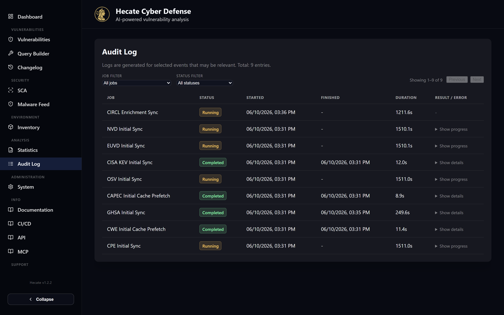

# Audit & Observability

The Audit Log at `/audit` is Hecate's operations cockpit. Every time the system does something
noteworthy — pulls a data feed, refreshes a CVE, runs a scan, generates an AI analysis, or answers an
MCP request — it records a row here with a start time, an outcome, a duration, and any metadata worth
keeping. When you want to know *what the system has been doing*, or *why something didn't happen*,
this is the page you open.

It exists because Hecate runs a lot of work on a schedule and in the background, out of your sight.
Ingestion runs every few minutes, the scheduler kicks off weekly full syncs, scans complete
asynchronously, and notifications fire on their own. The audit log makes all of that visible in one
chronological, filterable list, so you can confirm the pipelines are healthy, spot a feed that has
started failing, and read the error message behind it without digging through container logs.

The header tells you how many entries exist in total, and the table is paginated 50 rows at a time
with **Previous** / **Next** controls and a "Showing X–Y of N" counter. If your instance sets
`SYSTEM_PASSWORD`, this page is gated: a dialog asks for the system password before any rows are
shown, and **Cancel** (or Escape) takes you back.

## What gets logged

The log spans the whole system, not just one subsystem. Most rows are ingestion runs from the nine
data feeds — EUVD, NVD, CISA KEV, CPE, CWE, CAPEC, CIRCL, GHSA and OSV — each appearing as both a
regular incremental sync and an "initial sync" variant for the first full bootstrap. Alongside those
you will see manual CVE refreshes, saved-search create/update/delete actions, SCA scans, AI analyses
(single and batch), attack-path narrative generation, the MAL-* deps.dev enrichment backfill, and
MCP tool calls and OAuth events. In short, anything that touches data or runs as a tracked job leaves
a trace.

Each row carries up to six columns: the **Job** name (rendered with a friendly label such as "EUVD
Sync" or "AI batch analysis"), the **Status** badge, the **Started** and **Finished** timestamps,
the **Duration** in seconds, and a **Result / Error** column. The last column is where the detail
lives — a client IP for MCP requests, token usage for AI jobs, an expandable error message for
failures, an "overdue" hint, or a "Show progress" / "Show details" expander with the raw JSON payload
for a job.

## Status colours

Every row gets a coloured status badge so the health of a run is readable at a glance. The colours map
to a small fixed set of states.

| Status | Colour | Meaning |
| --- | --- | --- |
| Completed | Green | The job finished successfully. |
| Running | Amber | The job is currently in progress. |
| Failed | Red | The job errored out; the reason is in the Result / Error column. |
| Running (Overdue) | Orange | Still running, but it has exceeded the expected duration — not aborted, just flagged. |
| Cancelled | Grey | The job was cancelled before completing; any note appears in the detail column. |

A long-running job is never killed automatically just for taking a while. Instead, once it passes the
threshold set by `INGESTION_RUNNING_TIMEOUT_MINUTES`, it is marked **overdue** and its badge turns
orange while it keeps working. That distinction matters during a big initial sync: an EUVD or NVD
bootstrap legitimately runs for a long time, and seeing it flagged overdue (rather than failed) tells
you it is still making progress.

!!! tip
    A row stuck on **Running** long past its normal duration, or one that has flipped to orange, is
    your cue to open its detail and check the progress payload before assuming anything is broken.

## Filtering and reading the table

Two dropdowns above the table narrow the view. The **Job Filter** lets you focus on a single job type
(for example, only OSV syncs, or only SCA scans), and the **Status Filter** restricts to one outcome
(Running, Completed, Failed or Cancelled). Changing either filter resets you to the first page. With a
status filter set to **Failed**, the table becomes a focused triage list of everything that has gone
wrong recently.

Durations are shown to a tenth of a second, and timestamps render in the timezone you choose under
**System → General** — so a run that started at UTC midnight shows in your local clock, matching every
other date in the product. For failures, a short error message is shown inline; longer ones collapse
into a "Show details" expander so the table stays readable. AI jobs additionally surface their input
and output token counts, and MCP rows expose the originating client IP alongside the full request
payload, which is useful when you are auditing who triggered a tool.

## When to use it

In day-to-day operation the audit log answers two recurring questions. The first is *"are the feeds
healthy?"* — scan the recent rows, confirm the syncs are completing green on their expected cadence,
and you have your answer. The second is *"why didn't X happen?"* — filter to the relevant job,
find the failed or cancelled run, and read the error. Because saved-search edits, manual refreshes and
MCP calls are all logged too, the page doubles as a lightweight change record of who did what.

For anything deeper than the audit log captures — request-level tracing, stack traces, third-party
library noise — Hecate writes structured logs through structlog to the backend container's stdout.
The audit log is the curated, user-facing view of job outcomes; the container logs are the full
firehose for when you need to investigate an incident in detail.

## Related pages

The audit log is the read-out for work configured elsewhere. The ingestion feeds and their schedules
are managed on the [System Settings](system.md) page (the **Data** tab), which is also where you
trigger manual re-syncs that then show up here as rows. MCP tool calls and OAuth events recorded in
this log originate from the integration described in the [MCP Server](../integrations/mcp.md) guide.
