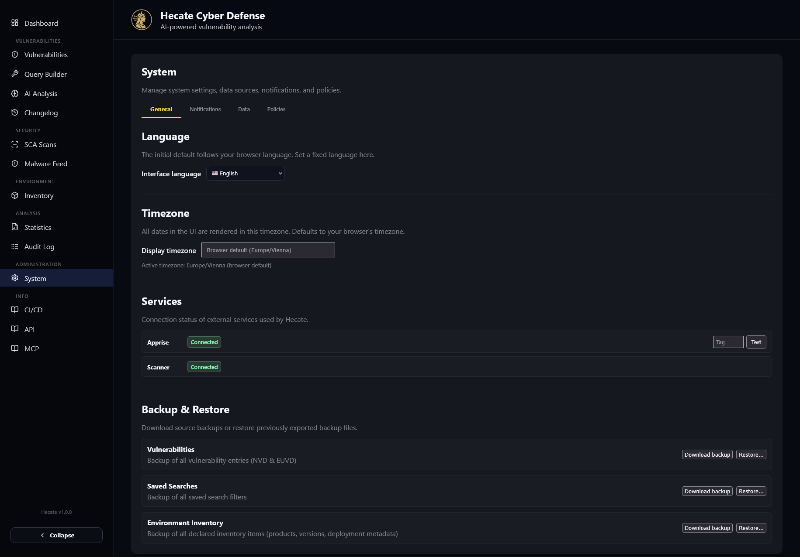
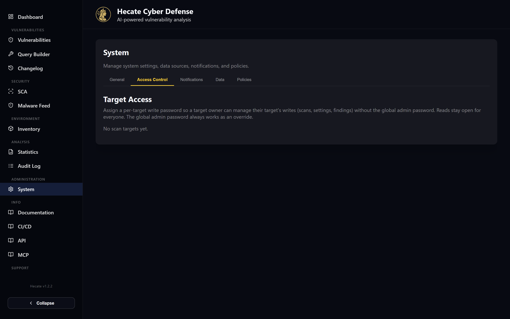
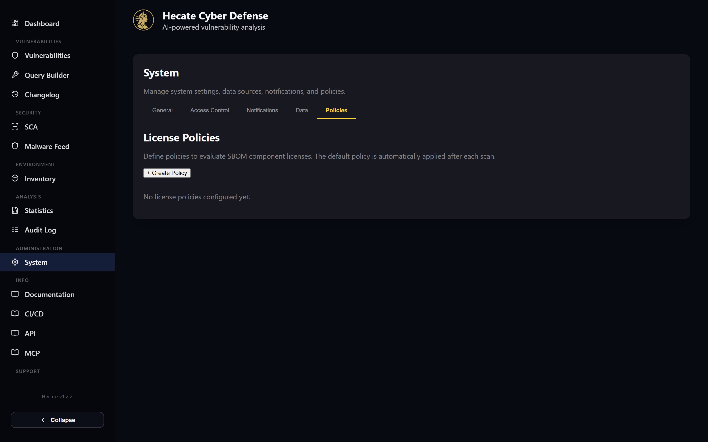

# System Settings

The System page (`/system`) is where you administer the instance rather than investigate a single CVE.
It is one card with five tabs — **General**, **Access Control**, **Notifications**, **Data**, and
**Policies** — covering everything from the interface language to the health of the nine ingestion
feeds. If you only ever touch one administrative screen in Hecate, this is it.

Because these tabs hold mutating controls, the whole page can be locked behind a shared admin password.
When `SYSTEM_PASSWORD` is set, opening `/system` first shows an unlock dialog; enter the password (or
press Escape to back out) and the page appears. The password you type is remembered for the session so
that protected writes elsewhere in the UI — deleting a scan target, saving a notification rule — no
longer prompt you again. With no `SYSTEM_PASSWORD` configured, the page opens directly. See
[Security & Access Control](../security-access-control.md) for how the gate works end to end.

## The five tabs at a glance

Each tab groups a distinct administrative concern. The heavier tabs have their own dedicated pages,
linked in the last column.

| Tab | What you do here | More detail |
| --- | --- | --- |
| **General** | Set the UI language and display timezone, cap the AI batch size, check service health, send a test notification, and back up / restore data. | this page |
| **Access Control** | Set or clear a per-target write password for each scan target. | [Security & Access Control](../security-access-control.md) |
| **Notifications** | Manage Apprise channels, notification rules, and message templates. | [Notifications](../integrations/notifications.md) |
| **Data** | Watch the sync status of all nine sources, trigger syncs by hand, re-sync or delete specific vulnerabilities, and manage saved searches. | this page |
| **Policies** | Define SPDX license policies that are evaluated after every scan. | [License Compliance](../sca/licenses.md) |

## General

The General tab collects the personal and instance-wide preferences that shape how the rest of Hecate
behaves, plus the health checks and data exports you reach for occasionally.

**Language and timezone** sit at the top. Hecate ships in English and German; the interface language
defaults to your browser language, and the dropdown here pins it permanently for this browser. The
timezone field controls how *every* timestamp in the UI is rendered — it defaults to your browser's
timezone, and you can type or pick any IANA zone (for example `Europe/Vienna`) from the autocomplete
list. Both settings persist locally, so they follow you per browser rather than being global to the
instance. A "Reset to browser default" button clears an explicit timezone choice.

!!! note
    Timezone matters for more than cosmetics. The dashboard's "Today" card and the calendar-day
    drill-downs compute their day boundaries against the timezone you set here, so picking the right
    zone keeps "today" aligned with your local midnight rather than UTC.

**AI Analysis** exposes a single tunable: the batch limit, the maximum number of vulnerabilities that
can be sent together in one AI batch analysis. Enter a whole number between 1 and 100 and click
**Save**. This is an instance-wide setting (stored on the backend), so it changes the cap for everyone
using the AI Analysis page.

**Services** shows the live connection status of the two external services Hecate talks to — Apprise
(notifications) and the scanner sidecar. Each renders a coloured badge: *Connected*, *Unreachable*, or
*Disabled*. Next to the Apprise badge is a small tag field and a **Test** button that fires a single
test notification through the matching channel, so you can confirm delivery without waiting for a real
event.

**Backup & Restore** lets you export and re-import three datasets — Vulnerabilities (NVD & EUVD),
Saved Searches, and Environment Inventory — as JSON files. Each row has a **Download backup** button
(it streams the file straight to your browser) and a **Restore…** button that opens a file picker.
Restores are upsert-by-ID: entries that already exist are overwritten in place and unknown entries are
inserted, so an export → edit → restore round trip never creates duplicates. The restore validates the
file's metadata before touching anything and reports how many rows were inserted, updated, and skipped.

## Access Control

The Access Control tab is a single panel for managing **per-target write passwords**. Hecate's write
protection has two layers: a global admin password that can authorise any mutation, and an optional
per-target password that authorises writes scoped to one scan target (rescans, deletes, VEX edits).
Here you set or clear that per-target secret for each registered target. The admin password always
overrides a per-target password, so this tab is about delegating narrow write access — for example,
letting one team manage their own target without handing out the admin password.

The full model — how the two layers interact, what the `🔒` badge means on a target card, and the
environment variables involved — lives in [Security & Access Control](../security-access-control.md).

## Notifications

The Notifications tab manages the three building blocks of Hecate's alerting: **channels** (Apprise
URLs that say *where* a message goes, each carrying a routing tag), **rules** (that say *when* to fire
— on system events, saved-search matches, vendor/product/DQL matches, scan results, inventory hits, or
retroactive malware alerts), and **message templates** (that customise the title and body per event
type using `{placeholder}` variables and `{#each}…{/each}` loops).

Channels, rules, and templates each have an add button, an inline editor, and a list with edit/delete
actions; rules additionally show a clickable status pill to enable or disable them and a "last
triggered" timestamp. Because this is a substantial subsystem in its own right, the complete reference —
channel URL formats, every rule type and its parameters, and the full template variable catalogue — is
on the [Notifications](../integrations/notifications.md) page.

## Data

The Data tab is the operational cockpit for Hecate's ingestion. It shows you, at a glance, whether the
intelligence feeding the platform is fresh, and gives you the controls to repair or re-pull specific
records when something looks wrong.

### Sync status

The **Sync Status** table lists every ingestion job — the regular and initial-sync variants of EUVD,
NVD, CPE, CISA KEV, CWE, CAPEC, CIRCL, GHSA, and OSV — with one row each. For every job you see its
status (Idle, Running, Completed, or Failed, colour-coded), when it last started and finished, how
long it took, and when it is next scheduled to run. Initial syncs show "Only on startup" in the
*Next Run* column because they have no recurring schedule. The table auto-refreshes every few seconds
and reacts immediately to live job events, so you can watch a running sync progress without reloading.

Each row carries a **Start manually** button that kicks off that job out of band — handy after a feed
outage, or to force an initial bootstrap. Click a row to expand its details: a successful run shows its
last result as formatted JSON, and a failed run shows the error text in red. A few jobs (such as the
MAL enrichment backfill) are CLI-only and display "CLI only" instead of a trigger button, since they
are run from the command line rather than the scheduler.

!!! tip
    The regular sync of a source runs on its own schedule (every 10–120 minutes for most feeds), so
    you rarely need the manual trigger in day-to-day use. Reach for **Start manually** when you have
    just brought the stack up, recovered from an upstream outage, or want to confirm a fix immediately.

### Vulnerability re-sync

Below the status table, **Vulnerability Re-Sync** is the surgical tool for fixing individual records.
Paste one or more identifiers into the textarea — one per line or comma-separated — and Hecate will
delete those documents from both MongoDB and OpenSearch. You can mix CVE, GHSA, OSV, and other IDs, and
you can use wildcard patterns such as `CVE-2024-*` to match a whole range at once (up to 1000 records).

Two buttons control what happens next. **Delete & Re-Sync** removes the matched documents and then
re-fetches them fresh from their upstream sources — the usual choice when a record has drifted or
carries stale data. **Delete Only** (styled in red) removes the documents without re-fetching, for
records you want gone entirely. Either way, Hecate reports how many entries were deleted and refreshed,
and surfaces any per-ID errors. Because both actions are mutations, they go through the write gate
described under [Security & Access Control](../security-access-control.md).

!!! warning
    Wildcard re-syncs are powerful: a pattern like `CVE-2024-*` can match a very large number of
    records. Re-syncing re-pulls each one from upstream, which takes time and hits external APIs, so
    scope the pattern as narrowly as the problem allows.

### Saved searches

The bottom of the Data tab lists all saved searches — the named filters you create on the
Vulnerabilities page. Each row shows its query parameters or DQL query and its creation date, with
inline **Edit** (rename, adjust the query) and **Delete** actions. This is purely a management view;
you create and run saved searches from the [Search & Query Builder](../guide/search.md).

## Policies

The Policies tab manages **license policies** — the allow/deny lists of SPDX license IDs that Hecate
evaluates against every SBOM component after a scan. You define which licenses are explicitly allowed,
which are denied, and a default action (allow, warn, or deny) for anything unlisted, then mark one
policy as the default that runs automatically after each scan.

The editor includes quick-fill buttons that populate the allowed or denied fields from built-in SPDX
groups (permissive, copyleft, weak copyleft), so you can start from a sensible baseline. For how
policies are evaluated, what the verdicts mean, and where the results appear in scan detail, see
[License Compliance](../sca/licenses.md).
