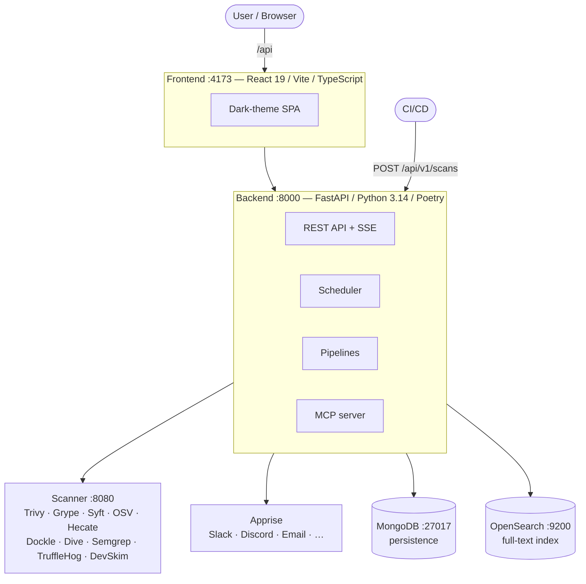

# Hecate Architecture

## Overview

Hecate is a vulnerability management platform that aggregates data from nine external sources,
normalises it into a single schema, and exposes it through a REST API and a React frontend. On top
of that intelligence layer it actively scans container images and source repositories for
vulnerabilities, secrets, misconfigurations and malicious packages (SCA).

This page is the engineering reference for how the system is put together. If you are looking for
how to *use* Hecate rather than how it is built, start with the [User Guide](guide/overview.md).

### System context

A React single-page application talks to a FastAPI backend over a REST API. The backend is the
orchestrator: it runs the ingestion pipelines, owns persistence, performs AI calls, and serves data
to both the web UI and external clients. Persistence is split deliberately — MongoDB holds the
normalised documents and all job state, while OpenSearch is the performant full-text and DQL query
index that the search-heavy pages read from. Raw intelligence arrives from EUVD, NVD, CISA KEV, CPE,
CWE, CAPEC, CIRCL, GHSA and OSV, with optional AI providers (OpenAI, Anthropic, Gemini, or any
OpenAI-compatible endpoint such as Ollama, vLLM, OpenRouter, LocalAI or LM Studio) layered on for
analysis. A separate scanner sidecar — bundling Trivy, Grype, Syft, OSV Scanner, the in-house Hecate
Analyzer, Dockle, Dive, Semgrep, TruffleHog and DevSkim — executes the active SCA scans.

## Deployment topology



The whole stack is orchestrated with Docker Compose — backend, frontend, scanner, mongo, opensearch
and apprise. Images are published to GitHub Container Registry at
`ghcr.io/0x3e4/hecate-{backend,frontend,scanner}` (the namespace is configurable via
`HECATE_GHCR_OWNER`) and tagged `latest`, `main-<sha>` and the matching semver on release. Two GitHub
Actions workflows drive CI/CD: `build-images.yml` builds all three images on every push to `main` and
on semver tags, while `release.yml` extracts the matching section from `CHANGELOG.md` and cuts a
GitHub Release whenever a semver tag is pushed.

Deployments that sit behind a corporate MITM proxy are supported through `HTTP_CA_BUNDLE`. At startup
the backend and scanner entrypoints concatenate the mounted PEM with the system CA bundle
(`/etc/ssl/certs/ca-certificates.crt`) into a single combined trust store and re-export
`HTTP_CA_BUNDLE`, `SSL_CERT_FILE` and `REQUESTS_CA_BUNDLE` to point at it. Because the mount is
*additive* to the system roots, the PEM only has to carry the corporate CA — without the
concatenation every non-proxied egress (for example direct calls to NVD) would fail with
`CERTIFICATE_VERIFY_FAILED`.

## Backend architecture

### API layer

Twenty router modules under `app/api/v1` group the REST surface into functional areas. The default
prefix is `/api/v1` (configurable) and CORS is enabled for local integration.

| Router | Responsibility |
| --- | --- |
| `status` | Health / liveness probe and scanner health. |
| `config` | Public runtime config (`GET /config`) — derives `aiEnabled`, `scaEnabled`, `scaAutoScanEnabled`, `eolEnabled` from backend settings, replacing the former `VITE_*` flags. |
| `vulnerabilities` | Search, lookup, refresh, AI analysis, and the attack-path graph. |
| `cwe` | CWE queries (single + bulk). |
| `capec` | CAPEC queries and the CWE→CAPEC mapping. |
| `cpe` | CPE catalogue (entries, vendors, products). |
| `assets` | Asset catalogue (vendors, products, versions). |
| `stats` | Statistics aggregations. |
| `backup` | Streaming export / import. |
| `sync` | Manual sync triggers for all nine data sources. |
| `saved_searches` | Saved-search CRUD. |
| `audit` | Ingestion logs. |
| `changelog` | Recent changes. |
| `scans` | SCA scan management — submit, targets and groups, findings, SBOM + export/import, layer analysis, VEX, license compliance, AI analysis, and the public shields.io badges. |
| `notifications` | Notification status, channels, rules and message templates. |
| `events` | Server-Sent Events (SSE) stream. |
| `license_policies` | License-policy CRUD, default policy and license groups. |
| `inventory` | Environment inventory CRUD + per-item affected vulnerabilities. |
| `malware` | The malware-intel feed for the frontend overview (MongoDB-backed with OpenSearch-routed substring search). |
| `version` | Build / release metadata that powers the in-app Support page. |

Several routes in `scans` are order-sensitive: collection-style routes such as
`GET /scans/ai-analyses`, the per-target `GET /scans/targets/{id}/history`, and the public
`GET /scans/{scan_id}/shield` / `GET /scans/targets/{id}/shield` badges must all be declared *before*
their bare dynamic counterparts (`/{scan_id}`, `/targets/{id:path}`), otherwise FastAPI's greedy path
converter swallows the literal suffix and 404s.

In addition, the MCP server under `app/mcp/` is mounted as a separate ASGI sub-app at `/mcp` with
**40 tools** spanning CVE search and detail, the asset catalogue, CWE/CAPEC, stats, environment-inventory
CRUD (with endoflife.date status), the full range of
SCA scan lookups, and the AI-analysis prepare/save pairs plus scan/sync triggers. The server is
initialised as `FastMCP("hecate", ...)`. Its auth middleware is path-aware — it processes only paths
that are exactly `/mcp` or start with `/mcp/` and returns 404 for everything else, so a misrouted SPA
route such as `/info/mcp` can never produce a 401. Authentication is delegated OAuth: Hecate acts as
an authorisation server toward the MCP client (Dynamic Client Registration + Authorization Code +
PKCE/S256) but delegates user authentication to an upstream IdP (a GitHub OAuth App, Microsoft Entra
ID, or any OIDC provider such as Authentik, Keycloak, Auth0 or Zitadel). There are no static API keys.
Write tools (`trigger_scan`, `trigger_sync`, all `save_*_ai_analysis`) are scope-gated: a session is
granted the `mcp:write` scope only if the browser IP at authorize time was inside
`MCP_WRITE_IP_SAFELIST`, and at tool-call time only the token scope is checked — proxied transports
like Claude Desktop deliver calls from vendor infrastructure, so the token scope is authoritative
rather than a second IP check. `MCP_PUBLIC_URL` pins the base URL advertised in OAuth metadata when a
proxy doesn't reliably forward `Host`, and `MCP_AUTH_DISABLED=true` bypasses OAuth entirely with a
synthetic `local-dev` identity for single-user local deployments.

AI analysis over MCP runs as **prepare / save pairs** without any server-side AI call. The `prepare_*`
tools return the system and user prompts defined in `ai_service.py` together with the full context
(the vulnerability, batch, scan findings, attack-path graph or cross-CVE chain); the calling client
generates the analysis with its own model and writes it back through the matching `save_*` tool. The
read-only `refine_attack_path_analysis` tool re-renders an attack-path graph under hypothetical
`assumptions` ("what if internet-facing?") and persists nothing. A `{client_name} - MCP` attribution
footer is attached on save. The server-side AI keys are used only by the web-UI flows.

Responses are Pydantic schemas with input and output validation, following the project's wire
convention: snake_case in Python, camelCase on the wire via `Field(alias=..., serialization_alias=...)`.
Every outward-facing datetime uses the shared `UtcDatetime` alias, which coerces naive values
(OpenSearch `_source` reads, legacy documents) to UTC-aware so the JSON always carries a `+00:00`
suffix and the frontend never misreads it as browser-local time. The Motor client runs with
`tz_aware=True` so MongoDB reads come back UTC-aware too.

### Services & domain

The domain logic lives in one service class per use case, each encapsulating its repositories and
coordinating the MongoDB and OpenSearch writes.

The **vulnerability and catalogue core** is `VulnerabilityService` (search, refresh and lookup,
including the Lucene `regexp` regex mode over a curated field set and saved searches that remember
their `queryMode`), backed by the catalogue services `CWEService` and `CAPECService` (both 3-tier
caches: memory → MongoDB → upstream), `CPEService`, and `AssetCatalogService`, which derives the
vendor / product / version slugs that drive the filter UI. `StatsService` runs the OpenSearch
aggregations (with a MongoDB fallback), `ChangelogService` tracks changes, `SavedSearchService` owns
saved searches, and `AuditService` writes the audit log.

The **AI layer** is `AIService`, a single wrapper over OpenAI, Anthropic, Gemini and any
OpenAI-compatible endpoint (httpx for the first, third and fourth; the google-genai SDK for Gemini).

The **SCA layer** is led by `ScanService`, which orchestrates the scanner sidecar, processes results
and handles SBOM import. Around it sit `VexService` (CycloneDX VEX export/import and VEX + dismissal
carry-forward across scans) and `LicenseComplianceService` (policy evaluation after every scan).
`BackupService` provides streaming export/import, `SyncService` coordinates manual syncs, and
`NotificationService` integrates Apprise with its rules, channels and templating engine.

Three services deserve a closer look because they build the platform's differentiating features:

*Attack path.* `AttackPathService` deterministically builds the per-CVE graph rendered on the Attack
Path tab — `entry → asset → package → CVE → CWE → CAPEC → exploit → impact → fix`. It orchestrates
`CAPECService`, `CWEService` and `InventoryService`, and derives a label set (likelihood, exploit
maturity, reachability, privileges required, user interaction, business impact) deterministically from
EPSS, KEV and the CVSS vector. The optional AI narrative is generated through the web UI or the MCP
prepare/save pair and persisted via an OpenSearch update script (`attack_path` latest plus an
`attack_paths[]` history) — the same pattern as `ai_assessment`.

*Attack chain.* `ScanAttackChainService` synthesises a multi-stage attacker narrative from all the
findings of a single scan, bucketed by ATT&CK kill-chain stages (Foothold → Credential Access →
Privilege Escalation → Lateral Movement → Impact). It joins per-finding CWEs, fetches the top CAPEC
patterns per stage, and emits the same `AttackPathGraph` shape so the existing Mermaid component
renders it unchanged. The CWE→stage map is currently hard-coded in `attack_chain_stages.py`; the
narrative persists to MongoDB on the scan document (`attack_chain` latest plus `attack_chains[]`),
because scans are MongoDB-primary rather than OpenSearch-primary.

*Malware watch.* `ScaMalwareWatchService` is the continuous `MAL-*` watcher. It cross-checks
newly-arrived OSV malware records against the SBOM of the latest completed scan per target and injects
synthetic findings (`scanner="mal-watch"`, `package_type="malicious-indicator"`) into the existing
scan so they surface on the Findings and Security Alerts tabs without a re-scan. It keeps its own
watermark in `ingestion_state`, bootstraps silently on first run (no notification storm), rolls back
on failure so the next OSV tick retries, and never touches OSV's own pipeline state. Each affected
scan gets one `sca_malware_alert` SSE event and fires the matching notification rules — for newly
inserted findings only, deduplicated by a partial unique index.

### Ingestion pipelines

| Pipeline | Source | Default interval | Description |
| --- | --- | --- | --- |
| EUVD | ENISA REST API | 60 min | Vulnerabilities with change history; incremental + weekly full sync (Sun 02:00 UTC) |
| NVD | NIST REST API | 10 min | CVSS, EPSS, CPE configurations, optional API key, full sync (Wed 02:00 UTC) |
| KEV | CISA JSON feed | 60 min | Exploitation status |
| CPE | NVD CPE 2.0 API | 1440 min (daily) | Product / version catalogue |
| CWE | MITRE REST API | 7 days | Weakness definitions |
| CAPEC | MITRE XML download | 7 days | Attack patterns |
| CIRCL | CIRCL REST API | 120 min | Additional enrichment |
| GHSA | GitHub Advisory API | 120 min | GitHub Security Advisories (hybrid: enriches CVEs + creates GHSA-only entries) |
| OSV | OSV.dev GCS bucket + REST API | 120 min + weekly full sync (Fri 02:00 UTC) | OSV vulnerabilities (hybrid: CVE enrichment + MAL / PYSEC / OSV entries, 11 ecosystems) |

Every pipeline supports both incremental and initial syncs, and they all share one HTTP retry layer
in `http/retry.py`: transient `httpx.HTTPError`, 5xx and 429 (honouring `Retry-After`) are retried with
exponential backoff, tuned per source via `{SOURCE}_MAX_RETRIES` / `{SOURCE}_RETRY_BACKOFF_SECONDS`.
The callers differ in how they handle exhaustion. NVD is **fail-hard** — its pagination runs backwards
from the total, so silently skipping a page of 2000 CVEs would be worse than a clean abort. CIRCL, OSV
and GHSA are **fail-soft**, skipping the affected record, ecosystem or page; GHSA additionally sets a
`_last_fetch_failed` flag so an aborted iteration is logged distinctly rather than mistaken for the
real end of the pages.

The **EUVD** pipeline reads paginated, matches CVE IDs, enriches with NVD and KEV data, maintains the
change history, and writes both stores. **NVD** refreshes CVSS, EPSS and references for existing
records (optionally bounded by `modifiedSince`) on a 60-second read timeout, widened from the old
30 seconds because 2000-per-page JSON responses need the headroom. **CPE** synchronises the NVD CPE
catalogue and creates vendor / product / version entries with slug metadata, reporting progress every
500 records. **KEV** keeps the CISA known-exploited catalogue current and supplies exploitation
metadata to EUVD and NVD.

**CWE** and **CAPEC** both run on a 7-day TTL cache and a wall-clock `CronTrigger` (defaults Mon 03:00
and Tue 03:00 UTC) rather than an interval trigger, because a backend redeploy inside the seven-day
window would otherwise reset the timer to `now + 7 days` and the sync would never fire — an observed
case left a catalogue 73 days stale. A stale-on-startup catch-up runs the sync immediately when the
last successful run is older than 1.5× the TTL, and `CAPECService` serves stale MongoDB data with a
single warning instead of returning `None`, so a missed sync degrades gracefully rather than blacking
out the Attack Path tab and CAPEC display.

**CIRCL** pulls additional vulnerability information and is the source of truth for EPSS: it calls the
CVE and EPSS endpoints in parallel, normalises the value to the `0..1` scale, and overwrites
`epss_score` unconditionally; documents with an out-of-range `epss_score > 1` are pulled back into the
queue so legacy EUVD-contaminated values self-heal on the next run. **GHSA** runs in hybrid mode —
advisories carrying a CVE ID enrich or pre-fill CVE documents, while those without create standalone
GHSA entries, with aliases taken exclusively from the API `identifiers` array.

**OSV** is the most involved pipeline. The initial sync streams GCS-bucket ZIP exports; the incremental
sync reads `modified_id.csv` plus the REST API. Like GHSA it is hybrid — CVE-aliased records enrich CVE
documents, while `MAL-*`, `PYSEC-*` and bare OSV records become standalone entries across 11 ecosystems.
`MAL-*` is always promoted to the primary `_id`: existing EUVD or GHSA documents for the same package
are absorbed into the MAL document and the originals deleted from both stores (remaining priority
CVE > GHSA > raw OSV ID). The initial sync dispatches records in semaphore-bounded batches
(`OSV_INITIAL_SYNC_BATCH_SIZE=32`, `OSV_INITIAL_SYNC_CONCURRENCY=16`) with intra-batch dedup on the
canonical `vuln_id`, while unchanged records — roughly 95 % of the load — short-circuit through a
read-only `_osv_would_change()` predicate before any deep copy. These optimisations took the initial
sync from about 12 seconds per record to roughly 100 records per second. The incremental sync runs with
a concurrency of one because the OSV rate limiter dominates there anyway.

Two further pieces round out ingestion. The **deps.dev enrichment** queries the deps.dev Package API
for `MAL-*` / `GHSA-*` documents whose `impactedProducts` carry a broad `>=0` range and replaces it
with the real version list — triggered inline after each OSV MAL/GHSA upsert, on manual refresh, and
as the `enrich-mal` CLI backfill; it rewrites `impactedProducts` and `product_versions`, records a
change-history entry, and reindexes into OpenSearch. The **manual refresher** does targeted
reingestion of individual IDs (API and CLI), auto-detecting the ID type (CVE fans out to
NVD + EUVD + CIRCL + GHSA + OSV; `MAL-` / `PYSEC-` / `OSV-` short-circuit to OSV so they aren't
overwritten with a reserved placeholder) and reporting a `resolvedId` when the final document differs.
The re-sync endpoint additionally supports multiple IDs, wildcard patterns and a delete-only mode.

### Data relationships

The CVE→CWE link comes from the NVD `weaknesses` array and is stored on the vulnerability document.
The CWE→CAPEC mapping is bidirectional, derived from the CWE raw data plus the CAPEC XML. CAPEC IDs
are deliberately *not* stored on the vulnerability document — they are resolved at display time from
the CWEs.

### Scheduler & job tracking

`SchedulerManager` initialises APScheduler (AsyncIO) with an interval per data source plus an optional
SCA auto-scan. The high-frequency pipelines (NVD, EUVD, KEV, OSV, GHSA, CIRCL, CPE) use an interval
trigger; CWE and CAPEC use a wall-clock cron trigger for the redeploy-resilience reasons described
above. A one-shot bootstrap runs at startup for the empty sources and is marked complete in the
ingestion-state repository, while `_run_catalog_catchup_jobs()` runs in parallel to repair stale CWE
and CAPEC catalogues. CIRCL has no bootstrap job because it only ever enriches existing records.

`JobTracker` keeps runtime status, sets overdue flags and persists progress to the audit log; startup
cleanup marks any job still "Running" after a restart as cancelled. The audit service records every
run with its duration, result and metadata, and `INGESTION_RUNNING_TIMEOUT_MINUTES` flags long runs as
overdue without aborting them.

### Persistence

#### MongoDB (22 collections)

| Collection | Description |
| --- | --- |
| `vulnerabilities` | Vulnerabilities with CVSS, EPSS, CWEs, CPEs, source raw data |
| `cwe_catalog` | CWE weaknesses (7-day TTL cache) |
| `capec_catalog` | CAPEC attack patterns (7-day TTL cache) |
| `known_exploited_vulnerabilities` | CISA KEV entries |
| `cpe_catalog` | CPE entries (vendor, product, version) |
| `asset_vendors` | Vendors with slug and product count |
| `asset_products` | Products with vendor mapping |
| `asset_versions` | Versions with product mapping |
| `ingestion_state` | Sync-job status (Running / Completed / Failed) |
| `ingestion_logs` | Detailed job logs with metadata |
| `saved_searches` | Saved queries |
| `scan_targets` | Scan targets (container images, source repos) |
| `scans` | Scan runs with status and summary |
| `scan_findings` | Vulnerability findings from SCA scans |
| `scan_sbom_components` | SBOM components from SCA scans |
| `scan_layer_analysis` | Image-layer analysis from Dive scans |
| `notification_rules` | Notification rules (event, watch, DQL, scan, inventory, sca_malware_alert) |
| `notification_channels` | Apprise channels (URL + tag) |
| `notification_templates` | Title / body templates per event type |
| `license_policies` | License policies (allowed, denied, review-required) |
| `environment_inventory` | User-declared product / version inventory with deployment / environment / instance count |
| `malware_intel` | Dynamic malware-intel entries (reserved for future threat-intel pipelines) |

Repositories on top of Motor (async) encapsulate the queries and updates. Each follows the project's
repository pattern: a `create()` classmethod sets up the indexes, the entity ID *is* the `_id`, and
`upsert()` reports back `"inserted"`, `"updated"` or `"unchanged"`. TTL indexes (such as `expires_at`)
handle optional cleanup of transient state documents.

#### OpenSearch

The `hecate-vulnerabilities` index holds the normalised documents keyed by CVE or EUVD ID. Text fields
back full-text search, `.keyword` fields back aggregations, and a nested `sources` path captures
per-source provenance. Advanced search uses DQL (a Domain-Specific Query Language). The index is
provisioned with `max_result_window` at 200 000 and `total_fields.limit` at 2 000.

### SCA scanning (Software Composition Analysis)

SCA is the active half of Hecate. A request — from CI/CD or the web UI — reaches the backend, which
calls the scanner sidecar, parses the normalised results, and stores them in MongoDB. The sidecar is a
separate Docker container bundling ten scanners. Scanner tools pull container images directly through
registry APIs (no Docker socket); Dive uses Skopeo to fetch the image as a docker-archive. Registry
and git authentication is supplied through the `SCANNER_AUTH` environment variable.

Each tool's output — Trivy JSON, Grype JSON, the Syft CycloneDX SBOM, OSV JSON, Hecate JSON, Dockle
JSON, Dive JSON, Semgrep JSON, TruffleHog JSON and DevSkim SARIF — is converted into a common model.
The SARIF parser is generic and reusable for any future SARIF-emitting tool.

The **Hecate Analyzer** is the in-house engine: its own SBOM extractor (28 parsers across 12
ecosystems — Docker, npm, Python, Go, Rust, Ruby, PHP, Java, .NET, Swift, Elixir, Dart and CocoaPods,
reading lockfiles additively to manifests), a malware detector with 35 rules (HEC-001 through HEC-090),
and provenance verification across eight ecosystems. The opt-in scanners cover the rest of the
surface: **Dockle** lints container images against the CIS Docker Benchmark (results as
`compliance-check`, not counted toward the vulnerability summary); **Dive** analyses image layers for
wasted space and stores its breakdown in a separate collection; **Semgrep** is the SAST scanner for
source repos (results as `sast-finding`, rulesets via `SEMGREP_RULES`); **DevSkim** adds Microsoft's
SAST engine with strong .NET/ASP.NET coverage and native SARIF output, sharing the SAST tab with
Semgrep and distinguished per finding by a scanner badge; and **TruffleHog** scans repos for exposed
secrets (verified secrets are critical, unverified are high). The scanners chosen at a target's first
scan are stored on the target and reused for auto-scans.

Beyond raw scanning, the SCA layer adds several analysis and workflow features. **Scan compare**
diffs two scans into added, removed and changed findings, where "changed" groups the same package
under a different vulnerability. **SBOM export** produces CycloneDX 1.5 and SPDX 2.3 JSON from a
pure-function builder (no external libraries), suitable for EU Cyber Resilience Act compliance, and
**SBOM import** accepts external CycloneDX or SPDX uploads, auto-detects the format, matches the
components against the vulnerability DB, and creates a target and scan of type `sbom-import`. **VEX**
status annotations (`not_affected`, `affected`, `fixed`, `under_investigation`) carry justification and
detail, are editable inline and in bulk, export and import as CycloneDX VEX, and carry forward onto
matching findings after every scan. **Findings dismissal** is a separate personal display filter that
hides irrelevant findings and likewise carries forward. **Target grouping** combines multiple targets
into one application via an optional `group` field (resolved at runtime, no separate collection) with
severity roll-ups in the UI.

**License compliance** evaluates SBOM component licenses against the configured policies (allowed,
denied, review-required) after every scan and stores the summary on the scan document, with an
overview across all scans.

The **environment inventory** records the products and versions you run, and the pure-function matcher
in `inventory_matcher.py` connects them to vulnerabilities. It evaluates hits in a three-tier priority
— `impacted_products` (curated EUVD data, both snake_case and camelCase), then `cpe_configurations`
(structured NVD range data), then the flat `cpes` list as a last resort — and each tier ends the
search the moment it finds the vendor/product slug pair, treating "no match" as an authoritative
answer. The matcher is uniformly **fail-closed for version-less references**: a bare
`vendor:product:*` / `:-:` CPE with no version bounds, and broad range strings (`>=0`, `*`, `-`,
empty), carry no version evidence and never match a specific installed version. That design fixed
three regression classes: Graylog 7.0.6 was wrongly flagged for CVE-2023-41041 because the old
fallback loop blindly matched a wildcard CPE after the ranges had correctly rejected it; .NET 8.0.25
was wrongly cleared for CVE-2026-33116 because its authoritative ranges live only as
`">= 8.0.0, < 8.0.26"` strings under the camelCase `impactedProducts` field that the old matcher never
read; and phpBB 3.3.17 was wrongly flagged for old phpBB add-on-module CVEs (e.g. CVE-2008-6301) whose
only `phpbb:phpbb` reference is a version-less wildcard CPE, until the bound-less wildcard and `>=0`
paths were made fail-closed.

Inventory items are additionally enriched with **end-of-life status from endoflife.date** (v1 API,
cached, best-effort). `EndOfLifeService` conservatively auto-links an item to an endoflife.date product
by slug/alias and resolves the installed version's release cycle to an active-support / security-support
/ end-of-life status plus the cycle's latest release — surfaced on the inventory rows and as the
`eolEnabled` runtime flag. The Inventory page also renders a "Flagged CVEs" roll-up table across all
items, and the dashboard "Today" widgets highlight and float inventory-matched vendors, products, and
CVEs. The same widgets additionally cross-reference **SCA scan coverage** via `GET /v1/scans/coverage`
(`cveScan` / `productScan` maps from the latest scan of every target, by finding and SBOM package), tagging
covered items "in scans"; both the inventory and scan tags deep-link (to the Inventory page and the
most-recent covering scan).

The matcher runs in both directions. *Inventory → CVE* (used by the inventory detail page and the
`inventory` notification rule) queries MongoDB with an `$or` over both the slug arrays and the raw
display-name arrays — catching historical CPE tags whose slug differs from the asset catalogue (for
example `graylog2` versus `graylog`) — and then runs the three-tier evaluation in Python against
single-field indexes on `vendor_slugs` and `product_slugs` (no compound index, because MongoDB rejects
a compound multikey index over two array fields). *CVE → inventory* (used by the vulnerability detail
page and AI prompts) builds a union of `vendor_slugs ∪ vendors ∪ impacted_products[*].vendor`,
pre-filters the inventory, and runs the full matcher on the survivors. Version comparison is
self-contained — no `packaging` dependency — handling dotted-numeric releases, pre-release suffixes,
the `v` prefix, length padding and wildcard ranges, and falling back to fail-closed case-insensitive
equality for anything it cannot parse; slug normalisation reuses the asset catalogue's `slugify()` so
`.net_8.0` and `net-8-0` match. The range-string parser understands exact versions, AND-chained bounds
and single-sided bounds, treating unconstrained values (`*`, `-`, `ANY`, `>=0`, empty) as no match. Inventory
context is also threaded into AI prompts as a "YOUR ENVIRONMENT IMPACT" block and attached to the
vulnerability detail response as `affectedInventory`.

Findings are **deduplicated** so the same CVE-and-package combination across multiple scanners
collapses into a single row, while the severity summaries on cards, headers and charts count by CVE ID
only (the same CVE in `busybox`, `busybox-binsh` and `ssl_client` counts once, highest severity wins);
findings without a CVE fall back to `package_name:version`. **Provenance verification** checks each
SBOM component's attestation or signature against the relevant registry API and shows the verdict as a
column in the UI.

Scan throughput is bounded by `SCA_MAX_CONCURRENT_SCANS` (excess scans wait as `pending`), and a
pre-scan resource gate checks free memory and disk against the sidecar — insufficient resources cause a
wait, though a scan proceeds anyway if nothing else is running (fail-open). **Auto-scan** optionally
re-scans registered targets on a schedule, detecting change via the sidecar `/check` endpoint (image
digest or commit SHA). Every probe persists diagnostics onto the target — last check time, verdict,
current fingerprint and the underlying error string from `git ls-remote` or `skopeo inspect` — which
the Scanner tab surfaces in a per-target table with a clickable verdict pill for an on-demand re-probe.
All scan events are recorded in the ingestion log.

### AI & analysis

`AIClient` discovers the available providers from the configured API keys and base URLs. OpenAI uses
the Responses API with reasoning (`OPENAI_REASONING_EFFORT`) and web search; Anthropic uses the
Messages API over httpx; Gemini uses the google-genai SDK with optional Google Search; and the generic
OpenAI-compatible client posts to `{base_url}/v1/chat/completions` for local or third-party endpoints
(Ollama, vLLM, OpenRouter, LocalAI, LM Studio), activating as soon as both `OPENAI_COMPATIBLE_BASE_URL`
and `OPENAI_COMPATIBLE_MODEL` are set. `AI_WEB_SEARCH_ENABLED` only affects OpenAI and OpenRouter; the
corporate `HTTP_CA_BUNDLE` applies to all of them.

A prompt builder assembles the context — asset, inventory and history information — in the chosen
language. The single and batch analysis endpoints return HTTP 202 immediately and run the actual
analysis as a background `asyncio` task, streaming progress to the frontend over SSE
(`job_started`, `job_completed`, `job_failed`). Results are stored in MongoDB and recorded as audit
events; configuration errors return 4xx, while provider outages surface as an SSE `job_failed`.

### Notifications (Apprise)

`NotificationService` talks to the Apprise REST API over HTTP in a fire-and-forget manner. **Channels**
are Apprise URLs with tags, stored in MongoDB and managed from the System page. **Rules** come in four
flavours: event rules (`scan_completed`, `scan_failed`, `sync_failed`, `new_vulnerabilities`), watch
rules (`saved_search`, `vendor`, `product`, `dql`, `inventory`), scan rules (with an optional severity
threshold and target filter), and `sca_malware_alert` for the retroactive `MAL-*` hits injected by the
continuous watcher. **Message templates** customise the title and body per event type with
`{placeholder}` variables and `{#each}…{/each}` loops, resolving by exact tag match, then an `all`
fallback, then a hard-coded default.

Watch rules are evaluated automatically after every ingestion that produced new entries, with a
one-shot evaluation 30 seconds after startup to cover the gap before the first scheduler pass. The
OpenSearch query filters on `first_seen_at`, which is set once on insert and never overwritten by
enrichment, so re-enriching a known CVE does not re-fire a notification. A concurrency safeguard widens
the time filter to `min(last_evaluated_at, pipeline_started_at)` so a long pipeline still catches its
own updates; if a referenced saved search is missing or the query fails to build, the watermark is left
untouched so the next run retries. Scan notifications carry an extended variable set (severity
breakdown, scanners, source, branch, commit SHA, image ref, error) plus a top-findings loop, and a
partial delivery (HTTP 424 from Apprise) is treated as success.

### Backup & restore

The backup service exports JSON snapshots for three datasets: vulnerabilities (per source — EUVD, NVD
or All — streamed to avoid timeouts on large sets), saved searches, and the environment inventory
(including `_id`, timestamps and deployment metadata). Each snapshot carries metadata — `dataset`,
`exportedAt`, `itemCount`, plus `source` for vulnerabilities — and the restore endpoint validates the
dataset field and aborts with 400 on a mismatch. Inventory restore is upsert-by-`_id`, so a round-trip
of export → mutate → restore returns the original state without duplicates; vulnerability restore goes
through the normal upsert with a `backup_restore_<source>` change context so the change history flags
the import. The System page's General tab drives all three from the browser.

### Observability

`structlog` provides structured logging consistently across the pipelines and services, and the audit
log doubles as an operations cockpit — status, error reasons, durations and overdue hints in one place.

### CLI

```sh
poetry run python -m app.cli ingest         [--since ISO] [--limit N] [--initial]
poetry run python -m app.cli sync-euvd      [--since ISO] [--initial]
poetry run python -m app.cli sync-cpe       [--limit N]   [--initial]
poetry run python -m app.cli sync-nvd       [--since ISO | --initial]
poetry run python -m app.cli sync-kev       [--initial]
poetry run python -m app.cli sync-cwe       [--initial]
poetry run python -m app.cli sync-capec     [--initial]
poetry run python -m app.cli sync-circl     [--limit N]
poetry run python -m app.cli sync-ghsa      [--limit N]   [--initial]
poetry run python -m app.cli sync-osv       [--limit N]   [--initial]
poetry run python -m app.cli enrich-mal     [--limit N]                   # deps.dev enrichment of existing MAL-* docs
poetry run python -m app.cli purge-malware  --ecosystem <eco> [--dry-run] # delete an ecosystem from malware_intel + MAL-* vulnerabilities
poetry run python -m app.cli reindex-opensearch
```

## Frontend architecture

### Tech stack

The frontend is a React 19 single-page app written in TypeScript 5.9, built with Vite 7 and routed by
React Router 7. It uses Axios for HTTP (60-second timeout), react-markdown to render AI summaries,
react-select for the async multi-selects, and react-icons (Lucide) for iconography.

### Pages & routing

| Route | Component | Description |
| --- | --- | --- |
| `/` | `DashboardPage` | Home with vulnerability search and recent entries |
| `/vulnerabilities` | `VulnerabilityListPage` | Paginated list with full-text, vendor, product, version filters and an advanced filter set (severity, CVSS vector, EPSS, CWE, sources, time range) |
| `/vulnerability/:vulnId` | `VulnerabilityDetailPage` | Detail view with tabs for CWE, CAPEC, references, affected products, **Attack Path** (Mermaid graph + optional AI narrative), AI analysis, change history, raw |
| `/query-builder` | `QueryBuilderPage` | Interactive DQL editor with field browser and aggregations |
| `/ai-analyse` | `AIAnalysePage` | AI-analysis history as a combined timeline of single, batch, and scan analyses (newest first), plus the trigger form for new batch analyses |
| `/stats` | `StatsPage` | Trend charts, top vendors / products, severity distribution |
| `/audit` | `AuditLogPage` | Ingestion-job logs with status and metadata |
| `/changelog` | `ChangelogPage` | Recent changes (created / updated) |
| `/inventory` | `InventoryPage` | Environment inventory: products and versions you run as compact status rows (click a row to expand its affecting CVEs and full endoflife.date detail), a "Flagged CVEs" roll-up table, a modal add/edit form, and endoflife.date support / end-of-life status per item |
| `/system` | `SystemPage` | Five tabs: General, Access Control, Notifications, Data, Policies |
| `/scans` | `ScansPage` | SCA scan management with seven tabs (Targets, Scans, Findings, SBOM, Security Alerts, Licenses, Scanner) |
| `/malware-feed` | `MalwareFeedPage` | Overview of all `MAL-*`-aliased OSV advisories (`/blocklist` is a legacy redirect) |
| `/scans/targets/*` | `ScanTargetDetailPage` | Per-target overview (deep-linkable): metadata, severity rollup, auto-scan diagnostics, scan history, top findings, quick actions. Splat route — pasting the raw target URL (un-encoded or scheme-less) also resolves; the backend canonicalizes fuzzy ids |
| `/scans/:scanId` | `ScanDetailPage` | Scan details: findings, Attack Chain, SBOM, history, AI analysis, compare, security alerts, SAST, secrets, best practices, layer analysis, license compliance, scanner breakdown |
| `/info/cicd` | `CiCdInfoPage` | CI/CD integration guide |
| `/info/api` | `ApiInfoPage` | API documentation with embedded Swagger UI |
| `/info/mcp` | `McpInfoPage` | MCP server info, IdP setup, tools, example prompts |
| `/support` | `SupportPage` | Per-component version check against the latest published images |

The info pages live under `/info/*` so their paths cannot collide with the backend prefixes `/api*`
and `/mcp*` when a reverse proxy forwards those by prefix. The legacy paths `/cicd`, `/api-docs` and
`/mcp-info` are client-side redirects for bookmark compatibility.

### State management

There is no Redux or Zustand — the app is built on React's own primitives. A Context API provider
holds the global saved searches; `useState` carries local component state; URL parameters carry the
bookmarkable filters, pagination and query mode; and `localStorage` (via the `usePersistentState`
hook) persists sidebar state and asset-filter selections. Data loading follows a consistent pattern of
`useEffect → setLoading → API call → setData / setError`, with skeleton placeholders while in flight.

### Styling

The look is a custom dark theme in `styles.css` (800+ lines) with no CSS framework. CSS variables
define the palette (`#080a12` background, `#f5f7fa` text) and the severity colours (critical `#ff6b6b`,
high `#ffa3a3`, medium `#ffcc66`, low `#8fffb0`). Layout uses CSS Grid and Flexbox throughout, with the
sidebar collapsing to an overlay on mobile.

### Localisation

Hecate ships German and English through a small home-grown i18n built on the Context API and the
`t(english, german)` pattern, with browser-language detection and `localStorage` persistence — no
external framework. Dates render as `DD.MM.YYYY HH:mm` (de-DE) or `MM/DD/YYYY` (en-US). The timezone is
a user setting on the System page (persisted under `hecate.ui_timezone`, defaulting to the browser
timezone), and `formatDate` reads the current value per call.

### Code splitting

Vite's manual chunk split in `vite/chunk-split.ts` isolates `react-select`, `react-icons` and `axios`
into their own chunks and groups the remaining `node_modules` into a single `vendor` chunk; the Mermaid
diagramming stack is deliberately left to Rollup's automatic splitting so it loads lazily only when an
attack-path or attack-chain tab is opened.

## Design patterns

### Repository pattern

Every repository exposes a `create()` classmethod that provisions its indexes, uses the entity ID as
the MongoDB `_id`, and returns `"inserted"`, `"updated"` or `"unchanged"` from `upsert()` so callers
can react to what actually happened.

### 3-tier cache (CWE, CAPEC)

```text
Memory dict → MongoDB collection → External API / XML
                  (7-day TTL)
```

The cache is a singleton via `@lru_cache` with lazy repository loading.

### Job tracking

```text
start(job_name) → Running in MongoDB → finish(ctx, result) → Completed + Log
```

Startup cleanup marks any job still in the "Running" state after a restart as cancelled.

### Normaliser

All sources are funnelled through `normalizer.py` into a unified `VulnerabilityDocument`, with CVSS
metrics normalised across v2.0, v3.0, v3.1 and v4.0. EUVD aliases are sanitised — foreign CVE and GHSA
IDs are stripped, because EUVD has prefix collisions in its alias data — so GHSA-to-CVE mapping happens
exclusively through the GHSA pipeline.

### Priority-gated NVD ↔ EUVD upserts

`INGESTION_PRIORITY_VULN_DB` (default `NVD`, alternative `EUVD`) decides per field which source may
overwrite and which may only enrich: the priority source writes unconditionally, the non-priority
source only writes a field that is currently empty. The gated fields are the version-identification
set — `cpe_configurations`, `impactedProducts`, `vendors`, `products`, `product_versions`, the slug and
version-id arrays, `cvss` (gated on `base_score`), and the paired `published` / `modified` timestamps
(writable only when both are empty so the timeline never interleaves between sources). Left ungated are
`title`, `summary` and `assigner` (EUVD is the sole writer; gating would block legitimate corrections),
`epss_score` (CIRCL is authoritative), and the merge-additive fields (`references`, `aliases`, `cpes`,
`cwes`, `cvss_metrics`, `cpe_version_tokens`). Before the gate existed, only the two timestamps were
protected and the version fields flapped on every cycle because NVD and EUVD ship different vulnerable
versions (the motivating case was CVE-2026-32147). The empty-check deliberately does not treat a
numeric `0.0` base score as empty.

## Data flow

```text
Scheduler / CLI
      │
      v
Pipeline (EUVD / NVD / KEV / CPE / CWE / CAPEC / CIRCL / GHSA / OSV)
      │
      ├──> Normalizer ──> VulnerabilityDocument
      │                         │
      │                    +----+----+
      │                    │         │
      │                    v         v
      │               MongoDB   OpenSearch
      │
      └──> AssetCatalogService ──> vendor / product / version slugs
```

The scheduler or CLI triggers an ingestion job. The pipeline pulls from the external source,
normalises each record with `build_document`, and updates MongoDB and OpenSearch together.
`AssetCatalogService` derives the vendor / product / version data and refreshes the filter slugs. The
frontend then reads the list and detail endpoints, optionally kicking off AI assessments or backups,
while the audit service records every relevant action and the stats service aggregates KPIs from
OpenSearch (with a MongoDB fallback).

## External integrations

| Integration | Type | Description |
| --- | --- | --- |
| EUVD (ENISA) | REST API | Primary vulnerability data source |
| NVD (NIST) | REST API | CVE detail and CPE catalogue sync |
| CISA KEV | JSON feed | Exploitation metadata |
| CPE (NVD) | REST API | CPE 2.0 product catalogue |
| CWE (MITRE) | REST API | Weakness definitions (`cwe-api.mitre.org`) |
| CAPEC (MITRE) | XML download | Attack patterns (`capec.mitre.org`) |
| CIRCL | REST API | Additional vulnerability information (`vulnerability.circl.lu`) |
| GHSA (GitHub) | REST API | GitHub Security Advisories (`api.github.com`) |
| OSV (OSV.dev) | GCS bucket + REST API | OSV vulnerabilities (`storage.googleapis.com/osv-vulnerabilities`, 11 ecosystems) |
| OpenAI | API | Optional AI provider for summaries and risk hints |
| Anthropic | API | Optional AI provider for summaries and risk hints |
| Google Gemini | API | Optional AI provider for summaries and risk hints |
| OpenAI-compatible | HTTP (`/v1/chat/completions`) | Optional generic provider for local / third-party endpoints (Ollama, vLLM, OpenRouter, LocalAI, LM Studio) |

## Tech stack

| Component | Technology |
| --- | --- |
| Backend | Python 3.14, FastAPI 0.128, Uvicorn, Poetry |
| Frontend | React 19, TypeScript 5.9, Vite 7, React Router 7 |
| Database | MongoDB 8 (Motor async), OpenSearch 3 |
| Scheduling | APScheduler 3.11 |
| HTTP client | httpx 0.28 (async), Axios 1.13 (frontend) |
| Logging | structlog 25 |
| AI | OpenAI, Anthropic, Google Gemini, OpenAI-compatible (Ollama / vLLM / OpenRouter / LocalAI / LM Studio) |
| Scanner sidecar | Trivy, Grype, Syft, OSV Scanner, Hecate Analyzer, Dockle, Dive, Semgrep, TruffleHog, DevSkim (.NET 8 runtime), Skopeo, FastAPI |
| Notifications | Apprise (caronc/apprise) |
| MCP server | mcp SDK, OAuth 2.0 (DCR + PKCE/S256), delegated auth via GitHub / Microsoft Entra / OIDC, Streamable HTTP |
| CI/CD | GitHub Actions, GitHub Container Registry (GHCR) |
