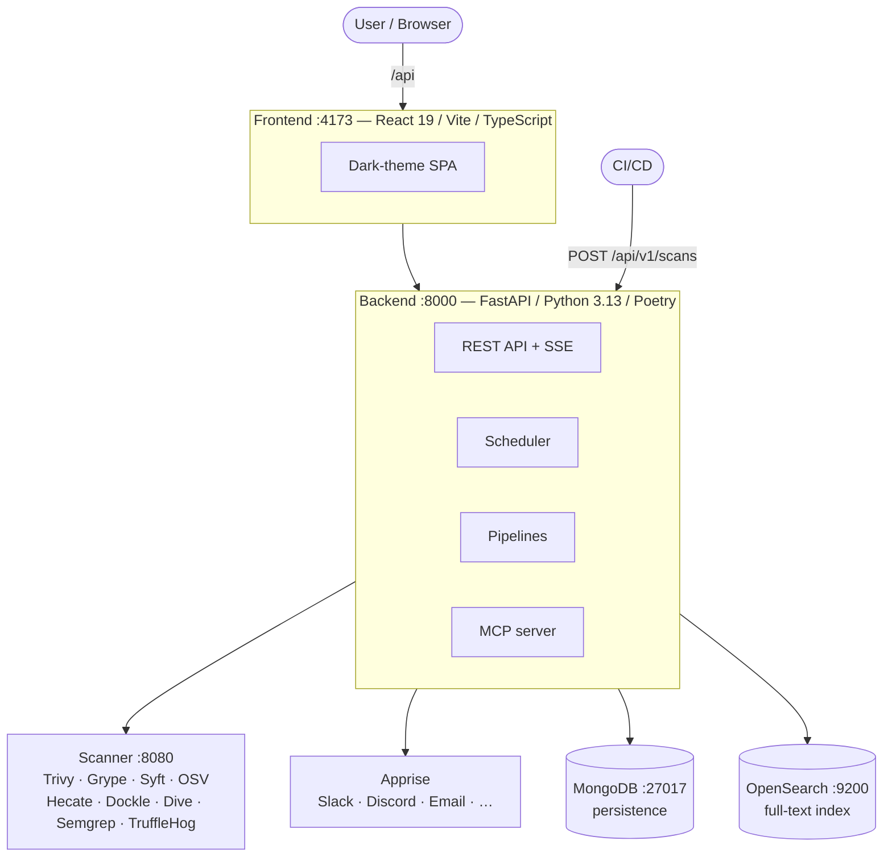

# Hecate Architecture

## Overview

Hecate is a vulnerability management platform that aggregates data from 9 external sources, normalises it, and exposes it through a REST API and a React frontend. On top of that, container images and source repositories can be actively scanned for vulnerabilities (SCA).

### System context

- A React Single-Page-Application consumes the REST API of the FastAPI backend.
- FastAPI orchestrates ingestion, persistence, and AI calls, and serves data to the frontend.
- OpenSearch is the performant query index; MongoDB holds normalised data and job state.
- External feeds (EUVD, NVD, CISA KEV, CPE, CWE, CAPEC, CIRCL, GHSA, OSV) plus optional AI providers (OpenAI, Anthropic, Gemini, OpenAI-compatible for Ollama / vLLM / OpenRouter / LocalAI / LM Studio) provide the raw data.
- A scanner sidecar (Trivy, Grype, Syft, OSV Scanner, Hecate Analyzer, Dockle, Dive, Semgrep, TruffleHog) executes active SCA scans against container images and source repositories.

## Deployment topology



- Docker Compose orchestration: backend, frontend, scanner, mongo, opensearch, apprise.
- Container registry: `git.nohub.lol/rk/hecate-{backend,frontend,scanner}:latest`.
- CI/CD: Gitea Actions (`ci.yml` build + Hecate scan + SonarQube), external composite action [`0x3e4/hecate-scan-action`](https://github.com/0x3e4/hecate-scan-action).
- Corporate-MITM support: backend and scanner containers load `HTTP_CA_BUNDLE` at startup via identical entrypoint scripts ([backend/entrypoint.sh](../backend/entrypoint.sh), [scanner/entrypoint.sh](../scanner/entrypoint.sh)). The mounted PEM is concatenated with `/etc/ssl/certs/ca-certificates.crt` into `/tmp/hecate-trust-bundle.pem`, and `HTTP_CA_BUNDLE` / `SSL_CERT_FILE` / `REQUESTS_CA_BUNDLE` are re-exported to that combined path. The PEM therefore only has to contain the corporate / MITM CA and is used additively to the system store, not as a replacement (without the concatenation, every non-MITM-proxied egress destination would break with `CERTIFICATE_VERIFY_FAILED`).

## Backend architecture

### API layer

19 router modules under `app/api/v1` group functional areas:

- `status.py` — health check / liveness probe, scanner health
- `config.py` — public runtime config (`GET /api/v1/config`): derives `aiEnabled`, `scaEnabled`, `scaAutoScanEnabled` from backend settings and replaces the former `VITE_*` feature flags
- `vulnerabilities.py` — search, lookup, refresh, AI analysis, attack-path graph (`GET/POST /vulnerabilities/{id}/attack-path`)
- `cwe.py` — CWE queries (single + bulk)
- `capec.py` — CAPEC queries, CWE→CAPEC mapping
- `cpe.py` — CPE catalogue (entries, vendors, products)
- `assets.py` — asset catalogue (vendors, products, versions)
- `stats.py` — statistics aggregations
- `backup.py` — streaming export / import
- `sync.py` — manual sync triggers for all 9 data sources
- `saved_searches.py` — saved searches (CRUD)
- `audit.py` — ingestion logs
- `changelog.py` — recent changes
- `scans.py` — SCA scan management (submit, targets incl. group filter, target-group roll-up, findings, SBOM, SBOM export, SBOM import, layer analysis, VEX, license compliance, AI analysis via `POST /scans/{id}/ai-analysis` + listing via `GET /scans/ai-analyses` — the latter is registered before the dynamic `/{scan_id}` route, otherwise the path `ai-analyses` would be interpreted as a scan ID)
- `notifications.py` — notification status, channels, rules, message templates
- `events.py` — Server-Sent Events (SSE) stream
- `license_policies.py` — license-policy management (CRUD, default policy, license groups)
- `inventory.py` — environment inventory (CRUD + `/affected-vulnerabilities` per item)

In addition, the MCP server (`app/mcp/`) is mounted as a separate ASGI sub-app under `/mcp` with **35 tools** (CVE search and detail, asset catalogue, CWE / CAPEC, stats; SCA scan lookups including per-scan findings, security alerts, SBOM components + facets, target scan history, scan compare, Dive layer analysis, target / group discovery, `list_scans`, `find_findings_by_cve`; AI-analysis prepare / save pairs; scan / sync triggers), plus rate limiting and audit logging. The server is initialised as `FastMCP("hecate", ...)`; the `MCPAuthMiddleware` is path-aware and only processes paths under `/mcp` and `/mcp/*` — anything else is rejected with 404 so misrouted SPA routes such as `/info/mcp` cannot produce 401 responses. Authentication uses delegated OAuth: Hecate acts as an authorisation server toward the MCP client (Dynamic Client Registration + Auth Code + PKCE/S256) and delegates user authentication to an upstream IdP (GitHub OAuth App, Microsoft Entra ID, or a generic OIDC provider such as Authentik / Keycloak / Auth0 / Zitadel). There are no static API keys any more. Write tools (`trigger_scan`, `trigger_sync`, all `save_*_ai_analysis`) are scope-gated: only sessions whose browser IP at authorize time was inside `MCP_WRITE_IP_SAFELIST` get the `mcp:write` scope. At tool-call time only the token scope is verified (no second IP check), because proxied transports such as Claude Desktop deliver tool calls from vendor infrastructure — the token scope is authoritative. Provider abstraction lives in `app/mcp/oauth_providers.py`. Two deployment switches: `MCP_PUBLIC_URL` pins the base URL advertised in OAuth metadata (resource / issuer / endpoints) and the 401 `WWW-Authenticate` hint — needed when the reverse proxy doesn't reliably forward `Host` / `X-Forwarded-Host`, or when several hostnames point at the same backend. `MCP_AUTH_DISABLED=true` bypasses OAuth entirely (synthetic `local-dev` identity with `mcp:read mcp:write`, WARNING log per request) — for local single-user deployments only; mount gating in `app/main.py` allows mounting with `MCP_ENABLED=true` plus the bypass, without any IdP configuration.

AI analysis over MCP runs as **prepare / save pairs** without any server-side AI provider call: the `prepare_*` tools (`prepare_vulnerability_ai_analysis`, `prepare_vulnerabilities_ai_batch_analysis`, `prepare_scan_ai_analysis`, `prepare_attack_path_analysis`, `prepare_scan_attack_chain_analysis`) return the system / user prompts defined in `app/services/ai_service.py` plus the full context (vulnerability / batch / scan findings / attack-path graph / cross-CVE attack chain). The calling MCP client generates the analysis with its own model and writes it back via the matching `save_*` tool (`save_vulnerability_ai_analysis`, `save_vulnerabilities_ai_batch_analysis`, `save_scan_ai_analysis`, `save_attack_path_analysis`, `save_scan_attack_chain_analysis`). In addition, `refine_attack_path_analysis` lets a client re-render an attack-path graph repeatedly under hypothetical `assumptions` ("what if internet-facing?") — read-only, writes nothing; persistence still goes exclusively through the matching `save_*` tool. An attribution footer `{client_name} - MCP` is appended. The server-side `AI_API` keys are used only by the web-UI flows (`POST /api/v1/vulnerabilities/{id}/ai-investigation`, `/ai-investigation/batch`, `/scans/{scan_id}/ai-analysis`). SCA scan lookups (`get_sca_scan`, `get_scan_findings_by_scan`, `get_security_alerts`, `get_scan_sbom` / `get_sbom_components` / `get_sbom_facets`, `get_target_scan_history`, `compare_scans`, `get_layer_analysis`, `list_scan_targets` / `list_target_groups` / `list_scans`, `find_findings_by_cve`) let assistants pull complete scan context without the web UI.

The default prefix is `/api/v1` (configurable) and CORS is enabled for local integration. Responses are based on Pydantic schemas with input + output validation. Schema convention: snake_case in Python, camelCase on the wire (`Field(alias="fieldName", serialization_alias="fieldName")`). Datetime fields use the shared `UtcDatetime` alias from `app/schemas/_utc.py` (`Annotated[datetime, BeforeValidator(_coerce_utc)]`), which normalises naive values (OpenSearch `_source` reads, legacy documents) to UTC-aware so the JSON output always carries a `+00:00` suffix and the frontend doesn't misinterpret it as browser-local time. The Motor client in `app/db/mongo.py` runs with `tz_aware=True` so MongoDB reads come back UTC-aware too.

### Services & domain

One service class per use case:

- `VulnerabilityService` — search, refresh, lookup
- `CWEService` — 3-tier cache (memory → MongoDB → MITRE API)
- `CAPECService` — 3-tier cache + CWE→CAPEC mapping
- `CPEService` — CPE catalogue
- `AIService` — OpenAI, Anthropic, Gemini, OpenAI-compatible wrapper (httpx for OpenAI / Anthropic / OpenAI-compatible, google-genai SDK for Gemini)
- `StatsService` — OpenSearch aggregations (MongoDB fallback)
- `BackupService` — streaming export / import
- `SyncService` — sync coordination
- `AuditService` — audit logging
- `ChangelogService` — change tracking
- `SavedSearchService` — saved searches
- `AssetCatalogService` — asset catalogue from ingested data
- `ScanService` — SCA scan orchestration (scanner sidecar, result processing, SBOM import)
- `VexService` — VEX export / import (CycloneDX VEX), VEX + dismissal carry-forward across scans
- `LicenseComplianceService` — license-policy evaluation, automatic evaluation after scans
- `NotificationService` — Apprise integration, rules, channels, message templates with template engine
- `AttackPathService` — deterministic graph builder for the Attack Path tab (`entry → asset → package → CVE → CWE → CAPEC → exploit → impact → fix`); orchestrates `CAPECService`, `CWEService`, `InventoryService`; derives the label set (likelihood, exploit_maturity, reachability, privileges_required, user_interaction, business_impact) deterministically from EPSS, KEV, and CVSS vector. The optional AI narrative is generated through `AIClient.analyze_attack_path()` (web UI) or MCP `prepare/save_attack_path_analysis` (client side) and persisted via an OpenSearch update script (`attack_path` latest + `attack_paths[]` history) — same pattern as `ai_assessment`. The MCP `refine_attack_path_analysis` tool re-renders the same graph under user-supplied `assumptions` (`reachability` / `entry_point` / `network_exposure` / `privileges_required` / `user_interaction`) for iterative "what-if" exploration — read-only, no persistence.
- `ScanAttackChainService` — cross-CVE attack-chain builder for the `/scans/:scanId` Attack Chain tab. Synthesises a multi-stage attacker narrative from the findings of a single SCA scan, bucketed by ATT&CK kill-chain stages (Foothold → Credential Access → Privilege Escalation → Lateral Movement → Impact). The CWE → stage mapping is hard-coded in [backend/app/services/attack_chain_stages.py](../backend/app/services/attack_chain_stages.py) (Phase 3 will replace it with the `Taxonomy_Mapping[Taxonomy_Name="ATT&CK"]` block from CAPEC raw data). Joins per-finding CWEs from the vulnerability repo, fetches top-2 CAPEC patterns per stage, and builds an `AttackPathGraph` (same shape as the per-CVE graph so the existing Mermaid component renders it without modification). The AI narrative is generated via `AIClient.analyze_scan_attack_chain()` or MCP `prepare/save_scan_attack_chain_analysis`; persistence via `ScanService.save_attack_chain()` in MongoDB (`attack_chain` latest + `attack_chains[]` history on `ScanDocument` — scans are MongoDB-primary, not OpenSearch-primary).

Services encapsulate database access (repositories) and coordinate OpenSearch + MongoDB operations. The asset catalogue is derived from ingested data (vendor / product / version slugs) and feeds the filter UI.

### Ingestion pipelines

| Pipeline | Source | Default interval | Description |
| --- | --- | --- | --- |
| EUVD | ENISA REST API | 60 min | Vulnerabilities with change history; incremental + weekly full sync (Sun 02:00 UTC) |
| NVD | NIST REST API | 10 min | CVSS, EPSS, CPE configurations, optional API key, full sync (Wed 02:00 UTC) |
| KEV | CISA JSON feed | 60 min | Exploitation status |
| CPE | NVD CPE 2.0 API | 1440 min (daily) | Product / version catalogue |
| CWE | MITRE REST API | 7 days | Weakness definitions |
| CAPEC | MITRE XML download | 7 days | Attack patterns |
| CIRCL | CIRCL REST API | 120 min | Additional enrichment |
| GHSA | GitHub Advisory API | 120 min | GitHub Security Advisories (hybrid: enriches CVEs + creates GHSA-only entries) |
| OSV | OSV.dev GCS bucket + REST API | 120 min + weekly full sync (Fri 02:00 UTC) | OSV vulnerabilities (hybrid: CVE enrichment + MAL / PYSEC / OSV entries, 11 ecosystems; cursor-advancement fix against cap-hit data loss) |

- All pipelines support both incremental and initial syncs.
- **Shared HTTP retry layer** ([backend/app/services/http/retry.py](../backend/app/services/http/retry.py)): every ingestion client (NVD, EUVD, CPE, CIRCL, GHSA, OSV) retries transient `httpx.HTTPError`, 5xx, and 429 (honours `Retry-After`) with exponential backoff. Per-source tuning via `{SOURCE}_MAX_RETRIES` / `{SOURCE}_RETRY_BACKOFF_SECONDS`. NVD is fail-hard (pagination runs backwards; silently jumping over a page of 2000 CVEs would be worse than a clear abort); CIRCL / OSV / GHSA are fail-soft (skip record / ecosystem / page). GHSA additionally sets a `_last_fetch_failed` flag so `iter_all_advisories` logs retry exhaustion as `ghsa_client.iteration_aborted_on_failure` instead of falling silent as "end of pages".
- **EUVD pipeline** — paginated read, matches CVE IDs, enriches with NVD and KEV data, maintains change history, updates the OpenSearch index + MongoDB documents.
- **NVD pipeline** — refreshes CVSS / EPSS / references for existing records, optionally bounded by `modifiedSince`. Read timeout 60 s (was 30 s) — too short for 2000-per-page JSON responses.
- **CPE pipeline** — synchronises the NVD CPE catalogue, creates vendor / product / version entries, and stores slug metadata in MongoDB. Mid-run progress reporting (every 500 records or 60 s).
- **KEV pipeline** — keeps the CISA known-exploited catalogue current and provides exploitation metadata for EUVD / NVD.
- **CWE pipeline** — synchronises the MITRE CWE catalogue via REST API with a 7-day TTL cache. Wall-clock `CronTrigger` (default Mon 03:00 UTC), not interval trigger — survives backend redeploys without drift. The stale-on-startup catch-up runs the sync immediately if the latest successful run is older than 1.5× TTL.
- **CAPEC pipeline** — parses MITRE CAPEC XML, creates attack-pattern entries with CWE mapping. Wall-clock `CronTrigger` (default Tue 03:00 UTC) + stale-on-startup catch-up (same mechanism as CWE). `CAPECService._get_capec_data` serves stale MongoDB data with a one-off `capec_service.catalog_stale` warning per process instead of returning `None` — otherwise a missed sync would black out the Attack Path tab and CAPEC display entirely.
- **CIRCL pipeline** — pulls additional vulnerability information from CIRCL and enriches existing records. **Source of truth for EPSS:** `CirclClient.fetch_cve` calls `/api/cve/{id}` and `/api/epss/{id}` in parallel, normalises the FIRST value to the `0..1` scale, and overwrites `epss_score` unconditionally. `_find_vulns_needing_enrichment` additionally pulls documents with `epss_score > 1` back into the queue so legacy data (e.g. EUVD `0..100` form) is repaired on the next run.
- **GHSA pipeline** — synchronises GitHub Security Advisories. Hybrid: advisories with a CVE ID enrich existing CVE documents or create new ones (pre-fill); advisories without a CVE ID create standalone GHSA entries. Aliases come exclusively from the `identifiers` array, not from reference URLs.
- **OSV pipeline** — synchronises OSV.dev vulnerabilities. Initial sync via GCS bucket ZIP exports, incremental sync via `modified_id.csv` + REST API. Hybrid like GHSA: records with a CVE alias enrich CVE documents; records without (MAL-*, PYSEC-*, …) create standalone OSV entries. **MAL as primary ID:** MAL-* records are always the primary `_id` — existing EUVD / GHSA documents for the same package are merged into the MAL document via `_absorb_aliased_docs()` and the original docs are deleted from MongoDB + OpenSearch. Remaining ID priority: CVE > GHSA > raw OSV ID. 11 ecosystems (npm, PyPI, Go, Maven, RubyGems, crates.io, NuGet, Packagist, Pub, Hex, GitHub Actions). Mid-run progress reporting (every 500 records or 60 s). **Initial-sync concurrency:** records are dispatched in batches (`OSV_INITIAL_SYNC_BATCH_SIZE=32`) through an `asyncio.Semaphore`-bounded `asyncio.gather` (`OSV_INITIAL_SYNC_CONCURRENCY=16`); intra-batch dedup on `vuln_id` (collisions slip into the next batch) avoids concurrent writes to the same `_id`. Unchanged records (~95 % of the load) short-circuit through the `_osv_would_change()` predicate in [vulnerability_repository.py](../backend/app/repositories/vulnerability_repository.py) **before** the deep copy. `find_docs_aliasing` uses an `$in` lookup over the canonical case variants (was `$regex` with `$options:"i"`, which couldn't use the multikey index). Incremental sync runs with `concurrency=1` because the OSV REST limiter dominates anyway.
- **deps.dev enrichment (MAL-* / GHSA-*):** [backend/app/services/ingestion/mal_enrichment.py](../backend/app/services/ingestion/mal_enrichment.py) queries the deps.dev Package API for documents with broad `>=0` ranges in `impactedProducts[].versions` and replaces the range with the actual version list. Triggered (a) inline after every OSV MAL / GHSA upsert via `maybe_enrich_by_id()`, (b) on manual refresh for MAL / GHSA IDs even when OSV returns nothing, and (c) as a CLI backfill via `poetry run python -m app.cli enrich-mal`. Writes `impactedProducts`, `product_versions`, `last_change_job="deps_dev_enrichment"` / `last_change_at`, a change-history entry with `job_label="deps.dev Enrichment"`, and **reindexes the resulting document into OpenSearch** (necessary because `VulnerabilityService.get_by_id()` reads OpenSearch, not MongoDB). Idempotent via the `_is_broad_range()` gate.
- **Manual refresher** — targeted reingestion of individual IDs (API + CLI). Auto-detects ID type (CVE → NVD + EUVD + CIRCL + GHSA + OSV, EUVD → EUVD, GHSA → GHSA API, MAL- / PYSEC- / OSV- → OSV). OSV refresh available for all ID types. Without the OSV short-circuit branch for MAL- / PYSEC- / OSV-, the default flow would fall through to `_build_reserved_document()` and overwrite existing MAL documents with a placeholder (`source="EUVD"`, `summary="reserved…"`). The response includes `resolvedId` if the final document ID differs. Re-sync (`POST /api/v1/sync/resync`) supports multiple IDs (`vulnIds: list[str]`), wildcard patterns (e.g. `CVE-2024-*`), and a delete-only mode.

### Data relationships

- CVE → CWE: from the NVD `weaknesses` array, stored on `VulnerabilityDocument`.
- CWE → CAPEC: bidirectional mapping from CWE raw data + CAPEC XML.
- CAPEC IDs are **not** stored on `VulnerabilityDocument`; resolution happens at display time.

### Scheduler & job tracking

- `SchedulerManager` initialises APScheduler (AsyncIO) with intervals for all 9 data sources + an optional SCA auto-scan. High-frequency pipelines (NVD / EUVD / KEV / OSV / GHSA / CIRCL / CPE) use `IntervalTrigger`; **CWE and CAPEC use `CronTrigger`** (wall-clock), because backend redeploys within the 7-day window would reset the interval timer to `now + N days` and the sync would never fire (observed: catalogue 73 days stale).
- The initial bootstrap runs once at startup (EUVD, CPE, NVD, KEV, CWE, CAPEC, GHSA, OSV) and is marked complete in `IngestionStateRepository` (MongoDB). In parallel, `_run_catalog_catchup_jobs()` runs once per backend start: it checks the latest successful `finished_at` for CWE and CAPEC and dispatches an out-of-band sync if it is older than `interval_days × SCHEDULER_CATALOG_STALE_CATCHUP_MULTIPLIER` (default `1.5`).
- CIRCL has no bootstrap job because it only enriches existing records.
- `JobTracker` updates runtime status, sets overdue flags, and persists progress in the audit log.
- Startup cleanup marks zombie jobs (Running status at restart) as cancelled.
- The audit service writes events to `ingestion_logs` including duration, result, and metadata.
- Configurable `INGESTION_RUNNING_TIMEOUT_MINUTES` marks jobs as overdue without aborting them.

### Persistence

#### MongoDB (22 collections)

| Collection | Description |
| --- | --- |
| `vulnerabilities` | Vulnerabilities with CVSS, EPSS, CWEs, CPEs, source raw data |
| `cwe_catalog` | CWE weaknesses (7-day TTL cache) |
| `capec_catalog` | CAPEC attack patterns (7-day TTL cache) |
| `known_exploited_vulnerabilities` | CISA KEV entries |
| `cpe_catalog` | CPE entries (vendor, product, version) |
| `asset_vendors` | Vendors with slug and product count |
| `asset_products` | Products with vendor mapping |
| `asset_versions` | Versions with product mapping |
| `ingestion_state` | Sync-job status (Running / Completed / Failed) |
| `ingestion_logs` | Detailed job logs with metadata |
| `saved_searches` | Saved queries |
| `scan_targets` | Scan targets (container images, source repos) |
| `scans` | Scan runs with status and summary |
| `scan_findings` | Vulnerability findings from SCA scans |
| `scan_sbom_components` | SBOM components from SCA scans |
| `scan_layer_analysis` | Image-layer analysis from Dive scans |
| `notification_rules` | Notification rules (event, watch, DQL, scan, inventory) |
| `notification_channels` | Apprise channels (URL + tag) |
| `notification_templates` | Title / body templates per event type |
| `license_policies` | License policies (allowed, denied, review-required) |
| `environment_inventory` | User-declared product / version inventory with deployment / environment / instance count |
| `malware_intel` | Dynamic malware-intel entries; merged into the `/v1/malware/malware-feed` UI (currently unused, reserved for future threat-intel pipelines) |

- Repositories on top of Motor (async) encapsulate queries and updates.
- Repository pattern: `create()` classmethod creates indexes, `_id` = entity ID, `upsert()` returns `"inserted"` / `"updated"` / `"unchanged"`.
- TTL indexes (e.g. `expires_at`) handle optional cleanup of state documents.

#### OpenSearch

- Index `hecate-vulnerabilities` with normalised documents (IDs as CVE or EUVD ID).
- Text fields for full-text search, `.keyword` fields for aggregations, nested `sources` path.
- DQL (Domain-Specific Query Language) for advanced search.
- Configuration: `max_result_window` = 200 000, `total_fields.limit` = 2 000.

### SCA scanning (Software Composition Analysis)

- **Scanner sidecar** — separate Docker container with 10 scanners: Trivy, Grype, Syft, OSV Scanner, Hecate Analyzer, Dockle, Dive, Semgrep (SAST), TruffleHog (secret detection), and DevSkim (Microsoft SAST, .NET-focused).
- **Scan flow** — CI/CD or manual request → backend → scanner sidecar → parse results → store in MongoDB → response.
- **Image pull** — scanner tools pull container images directly through registry APIs (no Docker socket). Dive uses Skopeo to pull the image as a docker-archive.
- **Registry auth** — configurable via the `SCANNER_AUTH` environment variable.
- **Parsers** — Trivy JSON, Grype JSON, CycloneDX SBOM (Syft), OSV JSON, Hecate JSON, Dockle JSON, Dive JSON, Semgrep JSON, TruffleHog JSON, and DevSkim SARIF are all converted into a common model. The SARIF parser (`parse_sarif`) is generic — reusable for any future SARIF-emitting tool (CodeQL, Snyk Code, …).
- **Hecate Analyzer** — own SBOM extractor (28 parsers, 12 ecosystems: Docker, npm, Python, Go, Rust, Ruby, PHP, Java, .NET, Swift, Elixir, Dart, CocoaPods) + malware detector (34 rules, HEC-001 through HEC-090) + provenance verification (8 ecosystems: npm, PyPI, Go, Maven, RubyGems, Cargo, NuGet, Docker). Lockfiles are read additively to manifests (npm: `package-lock.json` / `yarn.lock` / `pnpm-lock.yaml` / `bun.lock`; Python: `Pipfile.lock` / `poetry.lock` / `uv.lock`; Rust: `Cargo.lock`; Go: `go.sum`; Java / Kotlin: `gradle.lockfile`; .NET: `Directory.Packages.props` + `packages.lock.json` + `project.assets.json`).
- **Dockle** — CIS Docker Benchmark linter — checks container images for best practices (~21 checkpoints). Results as `ScanFindingDocument` with `package_type="compliance-check"`, not counted toward the vulnerability summary. Container images only, opt-in.
- **Dive** — Docker image-layer analysis — efficiency, wasted space, layer breakdown. Results in a separate `scan_layer_analysis` collection. Container images only, opt-in.
- **Semgrep** — SAST scanner for code vulnerabilities (SQLi, XSS, command injection, …). Results as `ScanFindingDocument` with `package_type="sast-finding"`. Configurable rulesets via `SEMGREP_RULES` (default: `p/security-audit`). Source repos only.
- **DevSkim** — Microsoft SAST scanner (opt-in) with strong .NET / ASP.NET coverage; no build required, native SARIF output. Results as `ScanFindingDocument` with `package_type="sast-finding"`, `scanner="devskim"` — sharing the same SAST tab as Semgrep, distinguished per finding via a scanner badge. The .NET 8 runtime is copied into the scanner image from `mcr.microsoft.com/dotnet/runtime:8.0` as a multi-stage build and runs in globalization-invariant mode (`DOTNET_SYSTEM_GLOBALIZATION_INVARIANT=1`, no libicu needed). Source repos only.
- **TruffleHog** — secret scanner for exposed credentials (API keys, tokens, passwords). Results as `ScanFindingDocument` with `package_type="secret-finding"`. Verified secrets = `critical`, unverified = `high`. Source repos only.
- **Per-target scanner choice** — the scanners selected at first scan are stored on `ScanTargetDocument` and reused for auto-scans.
- **Scan compare** — findings can be compared between two scans (added, removed, changed). "Changed" groups findings with the same package but a different vulnerability.
- **SBOM export** — CycloneDX 1.5 JSON and SPDX 2.3 JSON via `GET /api/v1/scans/{scan_id}/sbom/export?format=cyclonedx-json|spdx-json`. Pure-function builder in `sbom_export.py` (no external libraries). Download with `Content-Disposition: attachment` header. EU Cyber Resilience Act (CRA) compliance.
- **SBOM import** — external CycloneDX or SPDX upload via `POST /api/v1/scans/import-sbom` (JSON) or `/import-sbom/upload` (multipart file). Automatic format detection. Imported components are matched against the vulnerability DB. Creates targets with `type="sbom-import"` and scans with `source="sbom-import"`.
- **VEX (Vulnerability Exploitability Exchange)** — VEX status annotations on findings (`not_affected`, `affected`, `fixed`, `under_investigation`) with justification and detail. The frontend exposes an **expandable inline editor** when a VEX badge is clicked (status, justification, detail textarea). A multi-select toolbar applies bulk updates to arbitrary selections (`POST /api/v1/scans/vex/bulk-update-by-ids`). CycloneDX VEX export / import (import button in the findings toolbar). Automatic VEX carry-forward after every scan onto matching new findings (match: `vulnerability_id` + `package_name`).
- **Findings dismissal** — personal display filter (separate from VEX) to hide irrelevant findings via `POST /api/v1/scans/findings/dismiss`. Dismissed findings are hidden by default and revealed again with `?includeDismissed=true` (UI: "Show dismissed" toggle, persisted via `localStorage`). `dismissed*` flags on `ScanFindingDocument`. Carry-forward analogous to VEX after every scan (`carry_forward_dismissed`).
- **SBOM-import-target UI restrictions** — targets of type `sbom-import` have no auto-scan, no rescan button, and no scanner-edit pencil on the target card. `auto_scan=False` is set at import; the UI hides the controls to prevent meaningless actions.
- **Target grouping (applications)** — multiple scan targets can be combined into a single application via the optional `group` field on `ScanTargetDocument`. There is no `applications` collection — groups are derived at runtime via a distinct aggregation. `GET /api/v1/scans/targets/groups` returns groups with aggregated severity roll-ups (sum of `latest_summary` across all targets); `GET /api/v1/scans/targets?group=<name>` filters; `PATCH /api/v1/scans/targets/{id}` sets / clears the field. The frontend renders the Targets tab as collapsible sections per group; each target card has an inline editor with `<datalist>` suggestions from existing groups.
- **License compliance** — license-policy management via the `license_policies` collection. Policies define allowed, denied, and review-required licenses. A default policy can be set. After every scan, license compliance is evaluated automatically and stored as `license_compliance_summary` on the scan document. License-compliance overview across all scans via `GET /api/v1/scans/license-overview`.
- **Environment inventory** — user-declared products and versions (`environment_inventory` collection) with deployment (onprem / cloud / hybrid), environment (free-form, with datalist suggestions prod / staging / dev / test / dr), instance count, and owner. The pure-function matcher `inventory_matcher.py` performs **two lookup directions** and evaluates hits in a **three-tier priority** (`impacted_products` → `cpe_configurations` → flat `cpes` as last-resort fallback). Each tier terminates the search immediately when it finds the vendor / product slug pair — even when no version matches ("no match" is an authoritative answer). This prevents two regression classes: Graylog 7.0.6 was incorrectly marked as affected by CVE-2023-41041 by the old two-tier matcher because `cpe_configurations` rejected the ranges correctly but the fallback loop then blindly hit a wildcard CPE (`cpe:2.3:a:graylog:graylog:*`); .NET 8.0.25 was incorrectly marked as **not** affected by CVE-2026-33116 because the authoritative ranges only live there as `">= 8.0.0, < 8.0.26"` strings under the **camelCase** `impactedProducts` field (not under snake_case `impacted_products`), which the old matcher never read.
  - **Inventory → CVE** (inventory detail, notification watch rule): MongoDB query `{$and: [{$or: [vendor_slugs, vendors]}, {$or: [product_slugs, products]}]}` + Python-side three-tier evaluation. Single-field indexes on `vendor_slugs` and `product_slugs` (no compound index — MongoDB rejects parallel multikey indexes: "cannot index parallel arrays"). The `$or` extension over the raw-value arrays (`vendors`, `products`) catches historical CPE tags whose slug differs from the asset catalogue (e.g. `graylog2` / `graylog2-server` vs. `graylog` / `graylog`). The projection contains both `impacted_products` **and** `impactedProducts`. No `$or` clauses on nested paths like `impacted_products.vendor.slug` — there is no index for that, and a single unindexed `$or` clause forces MongoDB's query planner into a full scan (measured: 70 s on 770 k documents instead of ~50 ms).
  - **CVE → inventory** (vulnerability detail, AI-analysis prompts): `items_for_vuln(vuln, inventory)` builds union-set membership from `vendor_slugs ∪ vendors ∪ impacted_products[*].vendor.{slug,name}` (and analogously for product), pre-filters the inventory, then runs the full three-tier matcher on the survivors. The Microsoft / .NET case complements Graylog: the CVE has empty `cpe_configurations` and no snake_case `impacted_products`, so the `impactedProducts` read in the pre-filter set is essential to even pull the entry into the candidate list.
  - **Version comparison:** self-contained `parse_version()` / `_compare_versions()` without a `packaging` dependency. Dotted-numeric releases, pre-release suffixes (`8.0.25-preview.1 < 8.0.25`), `v` prefix strip, length padding (`8.0` == `8.0.0`), wildcards (`8.0.*` → half-open range `[8.0, 8.1)`). Non-parsable strings fall fail-closed onto case-insensitive equality. Slug normalisation (`_slug()`) delegates to `app.utils.strings.slugify()` — the same function the asset catalogue uses — so CPE tokens like `.net_8.0` and catalogue slugs like `net-8-0` match (plain `str.lower()` would silently drop .NET matches because `_` and `-` are treated differently).
  - **Range-string parser:** `_version_in_range_string()` parses the EUVD-format strings from `impacted_products[].versions`: exact versions (`1.2.3`), AND-chained bounds (`>= 8.0.0, < 8.0.26`), single-sided bounds (`< 5.0.9`). Unconstrained values (`*`, `-`, `ANY`, `""`) return **False** (fail-closed). Supports `>=`, `>`, `<=`, `<`, `=` / `==`; `!=` is ignored.
  - **Notifications:** rule type `inventory` in `notification_service.py` with optional `inventory_item_ids` filter (empty / `null` = global, set = only the chosen item `_id`s). `_evaluate_inventory_rule` passes `item_ids` to `InventoryService.new_vulns_for_watch_rule(since=prev, item_ids=...)`, which pre-filters the inventory pool, then queries MongoDB directly with `published >= prev` and post-validates CPE matches. Reuses the CAS `claim_evaluation` watermark and bootstrap semantics. On the API side, `valid_types` and `VALID_EVENT_KEYS` (`notifications.py`) allow `"inventory"` and `"inventory_match"`; the System page renders a native multi-select over all inventory items when the rule type is `inventory`.
  - **AI prompts:** `_format_inventory_block()` in `ai_service.py` adds a `## YOUR ENVIRONMENT IMPACT` block to single and batch prompts (and the MCP `prepare_*` tools). The vulnerability-detail endpoint attaches `affectedInventory` to the response, and the `POST .../ai-investigation{,/batch}` endpoints resolve inventory impact before the background task.
- **Deduplication** — the same CVE + package combination across multiple scanners is merged into a single row in the findings table. **Severity summaries** (target cards, scan header, history chart) additionally count by **CVE-ID only** — the same CVE in multiple packages (e.g. `busybox`, `busybox-binsh`, `ssl_client`) counts as 1 vulnerability, not 3. With different severities per package, the highest wins. Findings without a CVE ID are still deduplicated by `package_name:version`. The findings tab badge shows the row count (after scanner merge), not the CVE count.
- **Provenance verification** — after SBOM extraction the Hecate Analyzer checks the origin / attestation of every component via registry APIs (npm, PyPI, Go, Maven, RubyGems, Cargo, NuGet, Docker). Results are stored on SBOM components and shown as a provenance column in the frontend.
- **Scan concurrency** — `SCA_MAX_CONCURRENT_SCANS` (default 2) caps simultaneous scans. Excess scans wait as `pending`. Resource availability is checked against the scanner sidecar (`SCA_MIN_FREE_MEMORY_MB`, `SCA_MIN_FREE_DISK_MB`) before each start; insufficient resources trigger a wait, but if no other scan is active the run proceeds anyway.
- **Auto-scan** — optional periodic scanning of registered targets with the scanners chosen at first scan (configurable via `SCA_AUTO_SCAN_INTERVAL_MINUTES`). Change detection via the scanner sidecar `/check` endpoint (image digest / commit SHA comparison); on check failure the scan is skipped if `last_scan_at` is within the interval and a stored fingerprint exists. **Diagnostics:** `ScanService.check_target_changed` persists `last_check_at` / `last_check_verdict` / `last_check_current_fingerprint` / `last_check_error` on the target document for every probe. The Scanner-tab `AutoScanDiagnosticsTable` renders a row per auto-scan target with a clickable verdict pill that triggers `POST /v1/scans/targets/{id}/check` (out-of-band probe without a scan submission).
- **Audit integration** — scan events are recorded in the ingestion log.

### AI & analysis

- `AIClient` discovers available providers from configured API keys / base URLs (OpenAI, Anthropic, Google Gemini, OpenAI-compatible).
- **OpenAI:** Responses API (`POST /v1/responses`) with reasoning (`reasoning.effort`) and web search (`web_search_preview` tool). Configurable via `OPENAI_REASONING_EFFORT` (default `medium`) and `OPENAI_MAX_OUTPUT_TOKENS` (default `16000`).
- **Anthropic:** Messages API via httpx.
- **Google Gemini:** `google-genai` SDK with optional Google Search.
- **OpenAI-compatible:** generic `POST {base_url}/v1/chat/completions` client for local or third-party endpoints (Ollama, vLLM, OpenRouter, LocalAI, LM Studio). Activated as soon as `OPENAI_COMPATIBLE_BASE_URL` and `OPENAI_COMPATIBLE_MODEL` are set; `OPENAI_COMPATIBLE_API_KEY` is optional (bearer auth), `OPENAI_COMPATIBLE_LABEL` overrides the UI display name. `AI_WEB_SEARCH_ENABLED` only affects OpenRouter (appends `:online` to the model name); Ollama / vLLM ignore the toggle. `HTTP_CA_BUNDLE` applies here too via `get_http_verify()`.
- A prompt builder constructs context including asset and history information in the chosen language.
- **Asynchronous processing:** the single and batch analysis endpoints return HTTP 202 immediately. The actual analysis runs as `asyncio.create_task()` in the background. Progress and results are delivered to the frontend via SSE events (`job_started`, `job_completed`, `job_failed`).
- Results are stored in MongoDB and recorded as audit events.
- Error handling returns 4xx for configuration errors and SSE `job_failed` for provider outages.

### Notifications (Apprise)

- `NotificationService` talks to the Apprise REST API over HTTP (fire-and-forget).
- **Channels:** Apprise URLs with tags, stored in MongoDB, configurable via the System page.
- **Rules:** event-based (`scan_completed`, `scan_failed`, `sync_failed`, `new_vulnerabilities`), watch-based (`saved_search`, `vendor`, `product`, `dql`), and scan-based (`scan` with optional severity threshold and target filter).
- **Message templates:** customisable title / body templates per event type with `{placeholder}` variables and `{#each}...{/each}` loops (e.g. `{#each findings_list}` for top scan findings, `{#each vulnerabilities}` for watch-rule matches). Resolution: exact tag match → `all` fallback → hard-coded default.
- **Watch evaluation:** after every ingestion, watch rules are evaluated automatically against new entries in OpenSearch (Lucene range filter `first_seen_at:[<since> TO *]`). The filter uses the `first_seen_at` field, which is set once on insert and never overwritten by enrichment passes (CIRCL, GHSA, OSV, KEV) — enrichment of already-known CVEs therefore does not retrigger notifications. An additional one-shot evaluation runs 30 s after backend start to cover the gap until the first scheduler pass. Pipeline concurrency safeguard: the time filter uses `min(last_evaluated_at, pipeline_started_at)` so long-running pipelines (OSV, GHSA) still find their own updates even when parallel short pipelines have advanced the watermark. If a referenced saved search is missing or the query construction fails, a warning is logged and the watermark is **not** advanced, so the next run retries.
- **Scan notifications:** extended template variables including severity breakdown (`{critical}`, `{high}`, `{medium}`, `{low}`), scan metadata (`{scanners}`, `{source}`, `{branch}`, `{commit_sha}`, `{image_ref}`, `{error}`), and a top-findings loop (`{#each findings_list}`).
- Partial delivery (HTTP 424 from Apprise) is treated as success.

### Backup & restore

- The backup service exports JSON snapshots for three datasets: **vulnerabilities** (per source: EUVD / NVD / All — streamed to avoid timeouts on large datasets), **saved searches**, and **environment inventory** (incl. `_id`, timestamps, deployment metadata).
- Per-snapshot metadata: `dataset`, `exportedAt`, `itemCount` (+ `source` for vulnerabilities). The restore endpoint validates the dataset field and aborts with 400 on type mismatch.
- Inventory restore is upsert by `_id`: items with a known ID are updated in place; unknown IDs are inserted under exactly that ID; items without an `id` field receive a fresh UUID. This allows an idempotent round-trip (export → mutate → restore restores the original state without duplicates).
- Vulnerability restore goes through `VulnerabilityRepository.upsert` with `change_context={"job_name": "backup_restore_<source>"}`, so the change history flags the backup import as a job.
- The frontend System page (General tab) uses these endpoints for self-service backups; the dataset picker shows all three rows with an export button + file-upload restore.

### Observability

- `structlog` for structured logs, used consistently across pipelines and services.
- The audit log doubles as an operations cockpit (status, error reasons, duration, overdue hints).

### CLI

```sh
poetry run python -m app.cli ingest         [--since ISO] [--limit N] [--initial]
poetry run python -m app.cli sync-euvd      [--since ISO] [--initial]
poetry run python -m app.cli sync-cpe       [--limit N]   [--initial]
poetry run python -m app.cli sync-nvd       [--since ISO | --initial]
poetry run python -m app.cli sync-kev       [--initial]
poetry run python -m app.cli sync-cwe       [--initial]
poetry run python -m app.cli sync-capec     [--initial]
poetry run python -m app.cli sync-circl     [--limit N]
poetry run python -m app.cli sync-ghsa      [--limit N]   [--initial]
poetry run python -m app.cli sync-osv       [--limit N]   [--initial]
poetry run python -m app.cli reindex-opensearch
```

## Frontend architecture

### Tech stack

- React 19, TypeScript 5.9, Vite 7, React Router 7
- Axios (HTTP client, 60 s timeout), react-markdown (AI summaries), react-select (async multi-select), react-icons (Lucide)

### Pages & routing

| Route | Component | Description |
| --- | --- | --- |
| `/` | `DashboardPage` | Home with vulnerability search and recent entries |
| `/vulnerabilities` | `VulnerabilityListPage` | Paginated list with full-text, vendor, product, version filters and an advanced filter set (severity, CVSS vector, EPSS, CWE, sources, time range) |
| `/vulnerability/:vulnId` | `VulnerabilityDetailPage` | Detail view with tabs for CWE, CAPEC, references, affected products, **Attack Path** (Mermaid graph + optional AI narrative), AI analysis, change history, raw |
| `/query-builder` | `QueryBuilderPage` | Interactive DQL editor with field browser and aggregations |
| `/ai-analyse` | `AIAnalysePage` | AI-analysis history as a combined timeline of single, batch, and scan analyses (newest first). Origin chips distinguish `API - …` from `MCP - …`. Also offers the trigger form for new batch analyses. Visibility from `GET /api/v1/config`, active when at least one AI provider key is set. |
| `/stats` | `StatsPage` | Trend charts, top vendors / products, severity distribution |
| `/audit` | `AuditLogPage` | Ingestion-job logs with status and metadata |
| `/changelog` | `ChangelogPage` | Recent changes (created / updated) |
| `/inventory` | `InventoryPage` | Environment inventory: products and versions the user runs (deployment, environment, instance count). Vendor / Product via `AsyncSelect` (same look as AdvancedFilters), deployment as a chip-button group, environment as a free text field with `<datalist>` suggestions. Item cards have an expandable *Show CVEs* list (`GET /api/v1/inventory/{id}/affected-vulnerabilities`). Sidebar group **Environment** (own section beneath *Security*). |
| `/system` | `SystemPage` | Single-card layout. 4 tabs: General (language, services, backup), Notifications (channels, rules incl. `inventory` type, templates), Data (sync status, re-sync with multi-ID / wildcards / delete-only, searches), Policies (license policies) |
| `/scans` | `ScansPage` | SCA scan management with 7 main tabs (Targets, Scans, Findings with links column + expandable detail row, SBOM with dynamic type filter from facets, Security Alerts with category filter, Licenses, Scanner). Findings and SBOM rows show a links column with deps.dev, Snyk, Registry, socket.dev, bundlephobia (npm-only), npmgraph (npm-only). The Targets tab groups cards into collapsible application sections with severity roll-up. |
| `/malware-feed` | `MalwareFeedPage` | Overview of all MAL-aliased OSV advisories (~417 k records) for the **Security** sidebar group (sibling of SCA Scans). `/blocklist` is a legacy redirect. Server-paginated via `offset` / `limit` (100/page, max 500); substring search and ID lookups go to OpenSearch (~50–100 ms); unfiltered / filtered pages from MongoDB via the compound `(vendors, modified -1)` index (~30 ms cold with a warm count cache). The ecosystem filter has a hard-coded slug list (otherwise the dropdown shows only newest-modified ecosystems = npm / pypi). The backend endpoint `GET /api/v1/malware/malware-feed` reads exclusively from MongoDB (MAL-aliased + optional `malware_intel`); compromised packages in scans are detected dynamically against OSV's live feed via `osv-scanner`. |
| `/scans/:scanId` | `ScanDetailPage` | Scan details with findings (multi-select toolbar, expandable VEX editor with detail field, Show Dismissed toggle, VEX import button), **Attack Chain** (cross-CVE chain bucketed by ATT&CK kill-chain stages with stage pills + Mermaid graph + optional AI narrative), SBOM (sortable columns, clickable summary cards, provenance filter), History (time-range filter, commit-SHA links), **AI Analysis** (inline trigger form with provider select and additional-context textarea, calls `POST /api/v1/scans/{id}/ai-analysis` and polls the scan until the new entry appears; history with commit / image-digest chip, `triggeredBy` badge, and origin chip `API - Scan` / `MCP - Scan`), Compare (up to 200 scans), Security Alerts, SAST (Semgrep + DevSkim, dynamic scanner label and per-card scanner badge), Secrets (TruffleHog), Best Practices (Dockle), Layer Analysis (Dive), License Compliance (only when at least one license policy is configured), VEX export. The tab styling uses the same pill component as `VulnerabilityDetailPage` (`frontend/src/ui/TabPill.tsx`, `tabPillStyle()` + `TabBadge`). |
| `/info/cicd` | `CiCdInfoPage` | CI/CD integration guide (pipeline examples, scanner reference, quality gates) |
| `/info/api` | `ApiInfoPage` | API documentation with embedded Swagger UI and endpoint overview |
| `/info/mcp` | `McpInfoPage` | MCP server info (IdP setup GitHub / Microsoft / OIDC, Claude Desktop guide, tools incl. `prepare_*` / `save_*` AI-tool pairs + `get_sca_scan`, example prompts, configuration) |

The info pages live deliberately under `/info/*` so their paths cannot collide with the backend prefixes `/api*` and `/mcp*` when a reverse proxy forwards those by prefix. The legacy paths `/cicd`, `/api-docs`, and `/mcp-info` are client-side React Router redirects to the new paths (bookmark compatibility).

### State management

- No Redux / Zustand — built on React's own primitives:
  - **Context API:** `SavedSearchesContext` for global saved searches
  - **`useState`:** local component state (loading, error, data)
  - **URL parameters:** filters, pagination, query mode (bookmarkable)
  - **`localStorage`:** sidebar state, asset filter selection (`usePersistentState` hook)
- Data-loading pattern: `useEffect → setLoading(true) → API call → setData / setError → setLoading(false)` with skeleton placeholders.

### Styling

- Custom CSS dark theme in `styles.css` (~800+ lines), no CSS framework.
- CSS variables: `#080a12` background, `#f5f7fa` text.
- Severity colours: Critical (`#ff6b6b`), High (`#ffa3a3`), Medium (`#ffcc66`), Low (`#8fffb0`).
- Responsive design via CSS Grid / Flexbox; mobile sidebar as overlay.

### Localisation

- Languages: German + English (simple i18n via Context API with the `t(english, german)` pattern, browser language detection, `localStorage` persistence).
- No external i18n framework (no i18next or similar).
- Date format: `DD.MM.YYYY HH:mm` (de-DE) / `MM/DD/YYYY` (en-US).
- Timezone: user setting on the System page (`/system` → General → Timezone); persisted in `localStorage` (`hecate.ui_timezone`); default is the browser timezone (`Intl.DateTimeFormat().resolvedOptions().timeZone`). Implementation in `frontend/src/timezone/`.

### Code splitting

- Manual chunk split in `vite/chunk-split.ts`:
  - `react-select`, `react-icons`, `axios` each as a separate chunk
  - All other `node_modules` as a `vendor` chunk

## Design patterns

### Repository pattern

- `create()` classmethod creates indexes
- `_id` = entity ID in MongoDB
- `upsert()` returns `"inserted"`, `"updated"`, or `"unchanged"`

### 3-tier cache (CWE, CAPEC)

```text
Memory dict → MongoDB collection → External API / XML
                  (7-day TTL)
```

Singleton via `@lru_cache`, lazy repository loading.

### Job tracking

```text
start(job_name) → Running in MongoDB → finish(ctx, result) → Completed + Log
```

Startup cleanup marks zombie jobs as cancelled.

### Normaliser

All sources are funnelled through `normalizer.py` into a unified `VulnerabilityDocument` schema. CVSS metrics are normalised across v2.0, v3.0, v3.1, and v4.0. EUVD aliases are sanitised: foreign CVE IDs and GHSA IDs are removed (EUVD has prefix collisions in aliases). GHSA-to-CVE mapping happens exclusively through the GHSA pipeline.

### Priority-gated NVD ↔ EUVD upserts (version-identification fields)

`INGESTION_PRIORITY_VULN_DB` (default `NVD`, alternative `EUVD`) decides per field which source may **overwrite** and which may only **enrich**. The priority source writes unconditionally; the non-priority source only writes a field when the current value is empty (`None` / `""` / `[]` / `{}`). Gated: `cpe_configurations`, `impactedProducts` (incl. legacy `impacted_products`), `vendors`, `products`, `product_versions`, `vendor_slugs`, `product_slugs`, `product_version_ids`, `cvss` (gated on `base_score`), and the pair `published` / `modified` (paired: only writable when **both** are empty so the timeline doesn't interleave between sources). **Not** gated and still unconditional: `title`, `summary`, `assigner` (EUVD is the sole writer — gating would block legitimate corrections), `epss_score` (CIRCL is authoritative), and all merge-additive fields (`references`, `aliases`, `cpes`, `cwes`, `cvss_metrics`, `cpe_version_tokens`). Helpers `_is_priority_source()` and `_allow_overwrite()` in `backend/app/repositories/vulnerability_repository.py` are called from `upsert_from_nvd` and `upsert_from_euvd`. Background: previously only the two timestamps were gated — version-identification fields flapped on every ingestion cycle because NVD and EUVD ship different vulnerable-version data (motivating case: CVE-2026-32147). `_is_empty()` deliberately does not treat numeric zero (`base_score=0.0`) as empty.

## Data flow

```text
Scheduler / CLI
      │
      v
Pipeline (EUVD / NVD / KEV / CPE / CWE / CAPEC / CIRCL / GHSA / OSV)
      │
      ├──> Normalizer ──> VulnerabilityDocument
      │                         │
      │                    +----+----+
      │                    │         │
      │                    v         v
      │               MongoDB   OpenSearch
      │
      └──> AssetCatalogService ──> vendor / product / version slugs
```

1. The scheduler or CLI triggers an ingestion job.
2. The pipeline pulls data from the external source, normalises it (`build_document`), and updates MongoDB and OpenSearch.
3. `AssetCatalogService` derives vendor / product / version data and updates filter slugs.
4. The frontend calls list and detail endpoints; AI assessments or backups can be started optionally.
5. The audit service records every relevant action; the stats service aggregates KPIs from OpenSearch (with MongoDB fallback).

## External integrations

| Integration | Type | Description |
| --- | --- | --- |
| EUVD (ENISA) | REST API | Primary vulnerability data source |
| NVD (NIST) | REST API | CVE detail and CPE catalogue sync |
| CISA KEV | JSON feed | Exploitation metadata |
| CPE (NVD) | REST API | CPE 2.0 product catalogue |
| CWE (MITRE) | REST API | Weakness definitions (`cwe-api.mitre.org`) |
| CAPEC (MITRE) | XML download | Attack patterns (`capec.mitre.org`) |
| CIRCL | REST API | Additional vulnerability information (`vulnerability.circl.lu`) |
| GHSA (GitHub) | REST API | GitHub Security Advisories (`api.github.com`) |
| OSV (OSV.dev) | GCS bucket + REST API | OSV vulnerabilities (`storage.googleapis.com/osv-vulnerabilities`, 11 ecosystems) |
| OpenAI | API | Optional AI provider for summaries and risk hints |
| Anthropic | API | Optional AI provider for summaries and risk hints |
| Google Gemini | API | Optional AI provider for summaries and risk hints |
| OpenAI-compatible | HTTP (`/v1/chat/completions`) | Optional generic provider for local / third-party endpoints (Ollama, vLLM, OpenRouter, LocalAI, LM Studio) |

## Tech stack

| Component | Technology |
| --- | --- |
| Backend | Python 3.13, FastAPI 0.128, Uvicorn, Poetry |
| Frontend | React 19, TypeScript 5.9, Vite 7, React Router 7 |
| Database | MongoDB 8 (Motor async), OpenSearch 3 |
| Scheduling | APScheduler 3.11 |
| HTTP client | httpx 0.28 (async), Axios 1.13 (frontend) |
| Logging | structlog 25 |
| AI | OpenAI, Anthropic, Google Gemini, OpenAI-compatible (Ollama / vLLM / OpenRouter / LocalAI / LM Studio) |
| Scanner sidecar | Trivy, Grype, Syft, OSV Scanner, Hecate Analyzer, Dockle, Dive, Semgrep, TruffleHog, Skopeo, FastAPI |
| Notifications | Apprise (caronc/apprise) |
| MCP server | mcp SDK, OAuth 2.0 (DCR + PKCE/S256), delegated auth via GitHub / Microsoft Entra / OIDC, Streamable HTTP |
| CI/CD | Gitea Actions, Hecate Scan Action, SonarQube |
