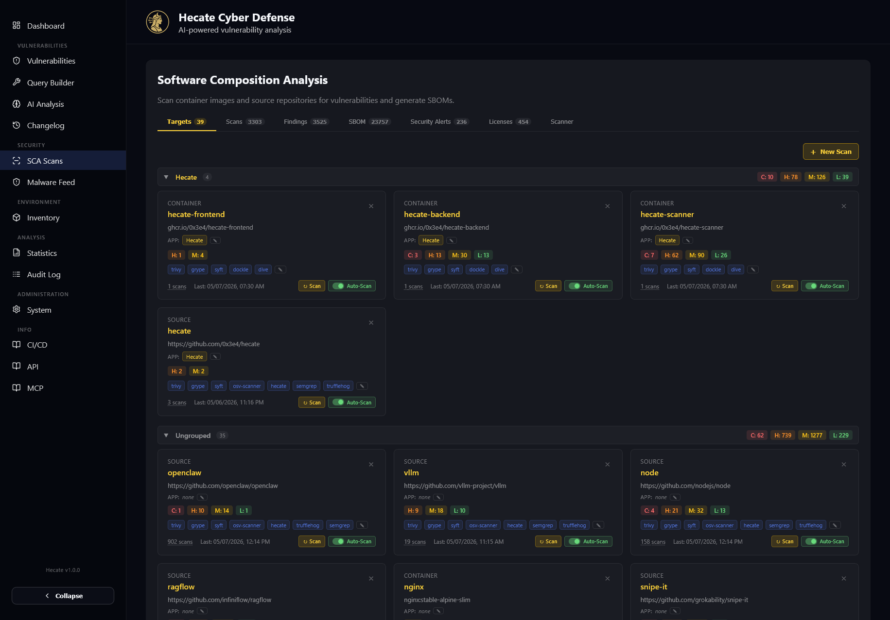

# Getting Started

Hecate ships as a Docker Compose stack: backend (FastAPI), frontend (React/Vite), scanner
sidecar, MongoDB, OpenSearch, and an optional Apprise notification sidecar.

## Prerequisites

- Docker and Docker Compose
- ~4 GB RAM free for OpenSearch + MongoDB (more for large initial syncs)

## Quick start

```bash
# 1. Copy the example compose + env files
cp docker-compose.yml.example docker-compose.yml
cp .env.example .env

# 2. Review .env — at minimum set timezone (TZ) and, for a shared/live
#    instance, a SYSTEM_PASSWORD (see Security & Access Control).

# 3. Start the stack
docker compose up -d

# 4. Open the UI
#    http://localhost:8080  (or whatever you mapped the frontend to)
```

The backend begins ingesting feeds on a schedule immediately. Initial syncs (NVD, EUVD, OSV)
take a while — the UI is usable as data streams in.

## First steps in the UI

Once the UI loads, the [User Guide](guide/overview.md) walks through every page in detail. The quickest
way to get oriented:



1. **Dashboard** — a live "Today" view of newly published CVEs.
2. **Vulnerabilities** — search with the Keyword / DQL / Regex mode pill.
3. **SCA Scans** — register a target (container image or repo) and run a scan. The target
   card title links to a per-target overview page (see [SCA Scanning](sca-scanning.md)).
4. **Inventory** — declare the products/versions you run to get "affected in your environment"
   callouts.
5. **System** — language, timezone, notifications, data sync, license policies, and (if you set
   `SYSTEM_PASSWORD`) **Target Access** for per-target write delegation.

## Updating

Images are published to GHCR (`ghcr.io/0x3e4/hecate-{backend,frontend,scanner}` — the namespace is
configurable via `HECATE_GHCR_OWNER`, default `0x3e4`). Pull the
newest and recreate:

```bash
docker compose pull && docker compose up -d
```

The in-app **Support** page compares your running build SHA against the latest published image.
