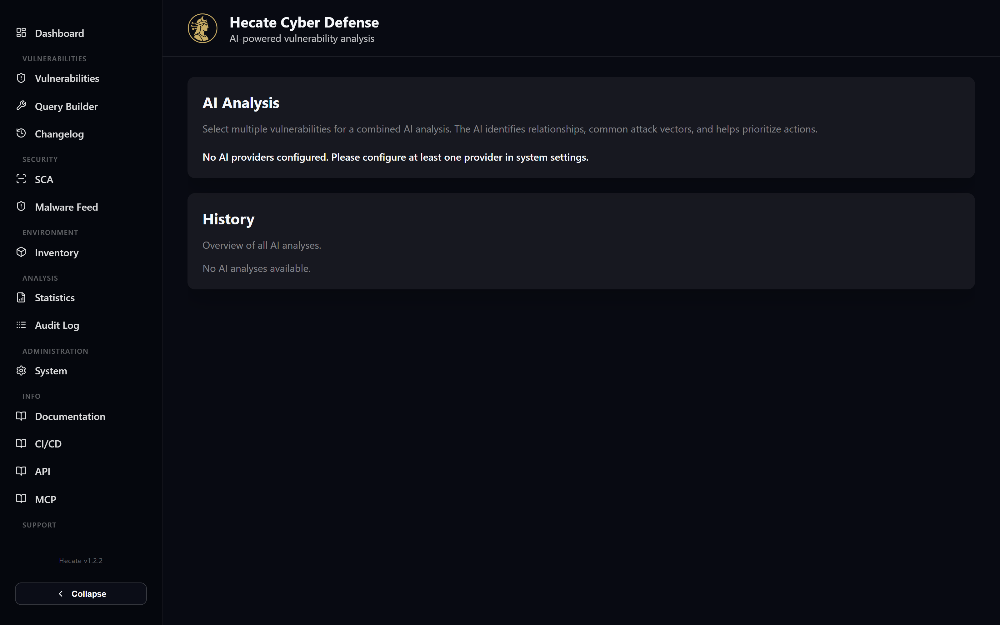
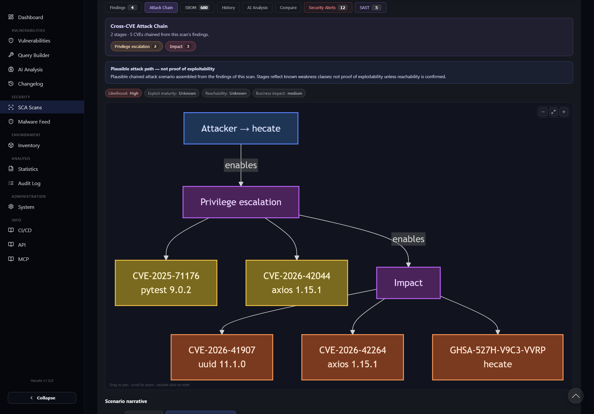

# AI Analysis & Attack Paths

Hecate can layer a generated, human-readable triage on top of the raw data it already collects — a
narrative that explains what a vulnerability means for *you*, how several findings relate, and which
ones to fix first. This is entirely optional: Hecate works without it, and the deterministic data
(CVSS, EPSS, KEV status, CWE/CAPEC mappings, inventory matches) is always there whether or not you
turn AI on. When you do enable it, the AI sits on top of that data as an interpretation layer, not a
replacement for it.

AI in Hecate is provider-agnostic. You can point it at OpenAI (using the Responses API with reasoning
and web search), Anthropic, Google Gemini, or any OpenAI-compatible endpoint — a self-hosted Ollama or
vLLM instance, OpenRouter, LM Studio, and so on. As soon as at least one provider is configured the AI
features appear; nothing is hard-wired to a single vendor, and the same prompts are used everywhere.

This page covers the three AI triage flows (single CVE, batch, and scan), the combined timeline on the
**AI Analysis** page, and the **Attack Path** feature — a structural graph of how a weakness could be
abused, with an optional AI-written scenario narrative on top.



## Enabling AI

There is nothing to install — you only need credentials for a provider. Configure one (or more) in
**System → General**, and the AI features light up automatically once the backend sees a usable
provider. The frontend learns this at runtime, so a configuration change takes effect after a backend
restart with no image rebuild. If no provider is configured, the AI Analysis page shows a notice
explaining that you need to add one, and the **AI Analysis** tab simply does not appear on the
vulnerability detail page.

When several providers are configured, you pick which one to use per analysis from a dropdown — the
first configured provider is preselected. The dropdown label comes from the provider itself (for an
OpenAI-compatible endpoint you can override the displayed name), so a list with both a hosted model and
a local Ollama instance reads clearly.

### The AI password gate

AI triggers can be protected by a dedicated password, separate from the system admin password. When
`AI_ANALYSIS_PASSWORD` is set, every action that *starts* an analysis is gated: opening the AI Analysis
page prompts for the password, and triggering an analysis from a CVE detail page or a scan asks for it
too. Reading existing analyses is never gated — only generating new ones.

The password you enter is remembered in your browser for the session, so you are not asked repeatedly.
If you enter the wrong one, the page tells you directly rather than bouncing you elsewhere.

!!! note
    The AI password is a shared-secret gate on AI generation, not user authentication. It exists so an
    instance with metered, paid AI providers does not let anyone with browser access run up costs. Pair
    it with TLS and network ACLs — see [Security & Access Control](../security-access-control.md).

## The three triage flows

Hecate offers three ways to get an AI-written assessment, depending on whether you are looking at one
CVE, a set of them, or a whole scan.

| Flow | Where you start it | What it produces |
| --- | --- | --- |
| **Single CVE** | The **AI Analysis** tab on a vulnerability detail page | A focused assessment of one CVE in your context |
| **Batch** | The **AI Analysis** page (`/ai-analyse`) | A combined analysis across several CVEs — relationships, shared attack vectors, priority order |
| **Scan triage** | The **AI Analysis** tab on a scan detail page | A triage of an SCA scan's findings, surfacing what to act on first |

All three run **asynchronously**. When you start one, Hecate accepts the request immediately and does
the work in the background; the result arrives over the live Server-Sent-Events stream and the page
updates itself — you do not have to wait on a spinning request or reload. The single and scan flows
poll or stream their respective detail pages, and the batch flow streams its completion straight into
the AI Analysis page.

### Single-CVE analysis

On any vulnerability's detail page, open the **AI Analysis** tab (visible only when a provider is
configured). Choose a provider, optionally type something into the **Additional information** box —
the version you actually run, deployment specifics, or anything else that should colour the
assessment — and click **Start AI analysis**. The result is rendered as formatted text, and the tab
keeps a history of every analysis run for that CVE, newest first.

Any inventory entry that matches the CVE is fed into the analysis automatically as your environment
context, so the assessment can reason about the versions you are actually running. See
[Environment Inventory](inventory.md) and [Vulnerabilities](vulnerabilities.md) for how that matching
works.

### Batch analysis

The dedicated **AI Analysis** page is built for analysing several vulnerabilities together. On the left
you select the CVEs — pick them directly, or load a [saved search](search.md) and pull its results
into the selection. There is a configurable upper bound on how many you can include in a single batch.
On the right you choose a provider, optionally add context in the textarea, and click **Start
analysis**.

A batch analysis is more than a list of individual write-ups: it asks the model to find relationships
between the selected CVEs, point out shared attack vectors, and recommend a priority order. While it
runs you see a loading state, and the finished summary streams in with a brief typing animation before
settling into the rendered Markdown.

### Scan triage

From a scan's detail page, the **AI Analysis** tab triages that scan's findings as a whole — the
practical question of "given everything this scan found, what do I deal with first?" It uses the same
provider-select-plus-context pattern and persists each run on the scan, so the assessment travels with
the scan record. The cross-CVE attack chain on the same scan complements this with a structural,
multi-stage view — see [Cross-CVE Attack Chain](../sca/attack-chain.md).

## The combined timeline

Below the controls, the **AI Analysis** page keeps a single **History** section that merges all three
flows — single, batch, and scan analyses — into one timeline sorted newest-first. Each entry is a card
showing the rendered summary, the provider and language used, the timestamp, and token usage when the
provider reported it.

Every card carries an origin chip telling you *how* it was generated. An analysis run through the web
UI or REST API is marked `API`, while one generated by an MCP client (for example Claude Desktop) is
marked `MCP`, each suffixed with the flow (`Single`, `Batch`, or `Scan`). Batch cards list their
constituent CVEs as clickable chips; single and scan cards link straight to the vulnerability or scan
they describe. The history is paged, with the combined total shown alongside the page controls.

!!! tip
    MCP-connected assistants can generate these analyses on the client side and write them back into
    Hecate, where they appear in this same timeline. The model runs in your assistant, not on the
    server, so no server-side AI key is needed for that path. See the
    [MCP Server](../integrations/mcp.md) page for the prepare/save tool pattern.

## Attack Path

The **Attack Path** tab on a vulnerability detail page answers a different question from triage: not
"how bad is this?" but "what would an attacker actually do with it?" It renders a structured chain that
walks from an entry point all the way to a fix:

```text
Entry → Asset → Package → CVE → CWE → CAPEC → Exploit → Impact → Fix
```



This graph is built **deterministically** from data Hecate already has — the CWE and CAPEC catalogues,
EPSS scores, KEV status, your inventory match, and the CVSS vector. It contains no invented IDs and no
AI guesswork in its structure, and it **always renders**, even when AI is disabled, no narrative has
been generated, or the inventory is empty. Nodes are colour-coded by severity, and CVE, CWE and CAPEC
nodes are clickable: CVE nodes jump to the relevant Hecate detail page, while CWE and CAPEC nodes open
the corresponding MITRE definition. You can pan, zoom, and double-click to reset the view; if the graph
renderer cannot load (for instance behind a strict content blocker), Hecate falls back to a plain
vertical chain that conveys the same information.

!!! warning
    A banner sits above every graph: **"Plausible attack path — not proof of exploitability."** The
    chain shows a *plausible* route, assembled from how this class of weakness is typically abused. It
    is a reasoning aid, not a confirmation that the path is reachable in your specific deployment.

### The label chips

Above the graph, a row of chips summarises the risk signals at a glance, colour-toned from muted
through info, warning, and danger so the high-risk values stand out. Six labels can appear:

| Chip | What it conveys |
| --- | --- |
| **Likelihood** | How likely exploitation is, derived from EPSS bands and KEV status (very high → very low, or unknown) |
| **Exploit maturity** | Whether exploitation is active, a functional exploit exists, only a proof of concept, or merely theoretical |
| **Reachability** | Whether the vulnerable code path is confirmed, likely, not reachable, or — by default — unknown |
| **Privileges required** | The privilege level an attacker needs, read from the CVSS vector |
| **User interaction** | Whether exploitation needs a user to do something, read from the CVSS vector |
| **Business impact** | The severity-and-exposure weighted impact on your environment |

Reachability stays **unknown** in most cases today — Hecate does not yet trace whether the vulnerable
function is actually called in your code, so it deliberately makes no confident claim rather than
guessing.

### The optional narrative

Beneath the graph is the **Scenario narrative** section. The graph is the skeleton; the narrative is
the prose that walks through it — an AI-written description of how the steps connect into a believable
attack. It is strictly optional: the deterministic graph is complete on its own, and the narrative only
appears once you generate it.

To generate one, pick a provider, optionally add context in the **Additional information** box (for
example, "we run this on Kubernetes" or "this service is internet-facing"), and click **Generate
scenario narrative**. Generation runs in the background and the narrative streams back into the page
when it is ready, rendered as Markdown with the provider, timestamp, and origin shown above it. If AI
is not configured, this section instead explains that you need to add a provider to enable it. The
narrative generator is constrained to the identifiers already in the graph, so it cannot invent CVE,
CWE, or CAPEC IDs that are not part of the chain.

When you open the attack path from a scan finding rather than the bare CVE page, the entry and package
nodes are enriched with the scan's context — the exact package version from the finding, and the scan
target as the entry — so the chain reflects the component you actually shipped.

## Cross-CVE Attack Chain

The per-CVE attack path explains one weakness. On a scan detail page, the **Attack Chain** tab takes
the next step and synthesises a single multi-stage attacker story from *all* of a scan's findings,
bucketed into kill-chain stages — foothold, credential access, privilege escalation, lateral movement,
and impact. Like the per-CVE graph it is deterministic, with an optional AI narrative on top. It lives
with the scan rather than the CVE, so it is documented on its own page:
[Cross-CVE Attack Chain](../sca/attack-chain.md).

## Where to go next

The data the AI reasons over comes from the rest of Hecate, so these pages are the natural companions
to this one. [Vulnerabilities](vulnerabilities.md) is where you find a CVE and open its AI Analysis or
Attack Path tab; [Environment Inventory](inventory.md) is what supplies the "your environment" context
to every analysis; and [SCA Scanning](../sca-scanning.md) produces the findings that scan triage and
the attack chain operate on. To let an external assistant drive these flows client-side, set up the
[MCP Server](../integrations/mcp.md).
