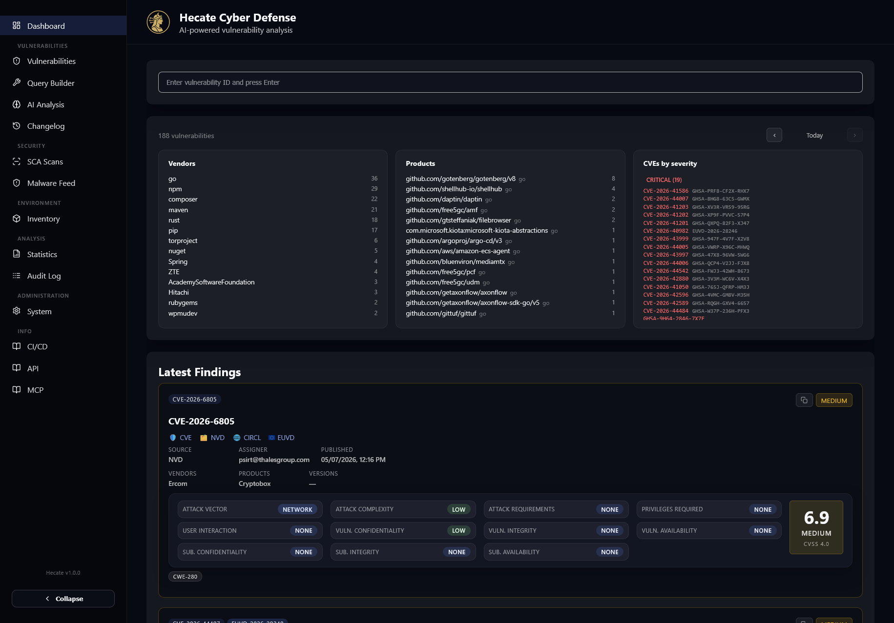

# Dashboard

The Dashboard is what you land on at `/` — the at-a-glance home of Hecate. It answers the two
questions you have most mornings: *what got published today that I should care about,* and *what is
the latest thing the feeds have brought in?* It also gives you the fastest possible path to a single
record: type an ID, press Enter, and you are on its detail page.

Nothing here needs a password, and nothing here is destructive. The page reads from the same
normalised vulnerability index the rest of Hecate uses, refreshes itself live as new data is
ingested, and links onward into the parts of the app where you do deeper work — the full
[Vulnerabilities](vulnerabilities.md) list and [Search & Query Builder](search.md).

## Quick ID lookup

At the very top sits a single text box: *Enter vulnerability ID and press Enter.* Type any
identifier Hecate understands — a CVE (`CVE-2024-3094`), a GitHub advisory (`GHSA-…`), an OSV
malicious-package ID (`MAL-…`), a Python advisory (`PYSEC-…`), an ENISA ID (`EUVD-…`) — and hit
Enter. The input is trimmed and upper-cased for you, so case and stray whitespace never matter.

If the record exists locally, Hecate jumps straight to its detail page (resolving to the canonical
ID along the way, so looking up a GHSA that maps to a CVE lands you on the CVE). A small spinner and
a *Searching local database…* line show while the lookup runs, and the `×` button clears the box.

If the ID is **not** in the local database, the box turns amber and offers to fetch it for you — see
[Fetching a missing ID](#fetching-a-missing-id) below.

!!! tip
    The lookup is for jumping to one known record. To search by keyword, vendor, product, severity,
    DQL or regex, use the [Vulnerabilities list](vulnerabilities.md) or the
    [Query Builder](search.md) instead.

### Fetching a missing ID

When a lookup misses, Hecate doesn't just shrug — it can pull the record on demand. The amber panel
explains that the vulnerability hasn't been synchronised yet and offers a **Load from
NVD/EUVD/GHSA** button (with a **Cancel** alongside).

Clicking it dispatches a one-off refresh for that single identifier against the upstream sources.
CVE-prefixed IDs are looked up by CVE number; everything else is resolved by its source ID. The
request runs in the background — you'll see a *Synchronizing "…" from upstream sources…* toast and a
spinner while it works. When the sync completes, Hecate navigates you to the freshly imported
record's detail page automatically. If none of NVD, EUVD or GHSA has the identifier, you get an
error toast explaining that it couldn't be found.

This is the same per-ID refresh mechanism the [detail page](vulnerabilities.md) exposes; the
Dashboard simply offers it at the point where you discover something is missing.

## Today's summary

Below the lookup is the *Today* card — a snapshot of vulnerabilities **published** within the
selected calendar day. The header shows the total count for the day, and three columns break that
total down so you can see at a glance who and what is affected:

| Column | What it shows |
| --- | --- |
| **Vendors** | The vendors named in the day's CVEs, each with a count |
| **Products** | The affected products (with their vendor), each with a count |
| **CVEs by severity** | Every CVE of the day, grouped under Critical / High / Medium / Low / Unknown headers |

Every entry is a link. Clicking a vendor or product opens the Vulnerabilities list pre-filtered to
that vendor (or vendor + product) **for that day**, expressed as a DQL query so you can refine it
further. Clicking a severity header opens the list filtered to that severity for the day, and
clicking any individual CVE jumps straight to its detail page. Each CVE row also shows its known
aliases (GHSA, MAL, and so on) next to the primary ID.

If you maintain an [Environment Inventory](inventory.md), the *Today* card cross-references it:
vendors, products, and CVEs that touch software you run are marked with an **"in inventory"** tag and
floated to the top of their lists, and a line above the columns tells you how many of the day's CVEs
affect your inventory. With no inventory configured, the card looks unchanged. Because the columns
refresh live as new CVEs arrive, newly published inventory-relevant issues highlight as soon as they
land.

The same widgets also cross-reference your **SCA scans** (the latest completed scan of each target): a
today-item is tagged (teal, with the **scan target's name**) and floated up when it's a package in your
latest SBOMs or a CVE your scans found — so a brand-new CVE for a package you actually run stands out even
if your last scan predates it. Both tags are **clickable**: the "in inventory" tag opens the
[Inventory](inventory.md) page, and the SCA tag opens the most-recent [scan](../sca/scan-results.md) (for
the named target) that covers the item.

The day boundary is **timezone-aware**: "today" begins at local midnight in the timezone you set
under **System → General**, not at UTC midnight. This matters near midnight, where a UTC-based view
would briefly show the wrong day. Arrows beside the header let you step back to previous days
(`‹` / `›`), and a **Today** button returns you to the current day. If a day has no newly published
CVEs, the card collapses to just the date navigator.

!!! note
    The *Today* card counts vulnerabilities by their **publication** date, so a CVE that existed
    locally for a while but was only formally published today still appears here. For long-run
    trends and the full CVSS / EPSS distribution across the whole index, see
    [Statistics & Changelog](statistics.md).

## Latest findings

The bottom of the page is the live feed: a *Latest Findings* list of roughly the twenty most
recently ingested vulnerabilities, rendered as severity-coloured cards. Each card is a compact
summary of the record and a launch pad into it.

The card header carries the primary ID plus any aliases as chips (CVE, EUVD source ID, GHSA, MAL,
PYSEC), a one-click **copy** button that puts the IDs, severity, vendors, products, versions and
summary on your clipboard, and a severity tag. The title links to the full detail page. A row of
external links points out to the authoritative sources for that record — CVE.org, NVD, CIRCL, EUVD,
and, for advisories with the relevant aliases, OSV, deps.dev and GitHub Advisories.

Below that, each card lays out the metadata that drives prioritisation: the data **source**, the
**EPSS** exploit probability (shown as a percentage), an **Exploited** indicator when the CVE is on
CISA's Known Exploited list, the **assigner**, the **published** date, and the affected **vendors /
products / versions**. The summary block renders the preferred CVSS metric and any associated CWE
chips. Cards for known-exploited vulnerabilities are highlighted in red so they stand out in the
feed.

### Live auto-refresh

The feed keeps itself current. Hecate streams ingestion progress over Server-Sent Events, and the
Dashboard listens for `new_vulnerabilities` events — whenever a pipeline finishes importing fresh
records, the *Latest Findings* list reloads on its own. You'll see a quiet *Refreshing results…*
line while it does, and you never need to reload the page to see what just arrived.

## Where to go next

The Dashboard is a starting point, not a workbench. When you want to search the whole index, filter
by vendor or severity, or build a precise query, move to the
[Vulnerabilities list](vulnerabilities.md) and the [Search & Query Builder](search.md). To turn the
day's findings into ongoing alerts, set up a watch rule under
[System Settings](../admin/system.md).
