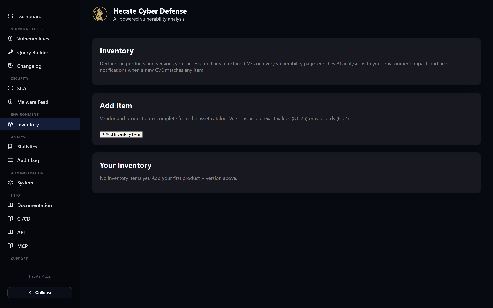

# Environment Inventory

Most vulnerability feeds tell you what *exists* in the world; the inventory tells Hecate what *you actually run*. On this page you declare the products and versions deployed in your environment — ".NET 8.0.25 on the prod cluster", "nginx 1.24.0 on staging", and so on — and Hecate continuously checks each entry against the vulnerability index. The point is to turn a firehose of CVEs into a short, personal list: *these* are the ones that touch software you operate, at the exact versions you run.

What makes this more than a keyword filter is the version matching. Hecate doesn't just look for CVEs that mention your product; it evaluates whether the version you declared falls inside each advisory's affected range. If you run version 8.0.25 and a CVE affects everything from 8.0.0 up to but not including 8.0.26, Hecate marks it as affecting you — and if the next minor release fixes it, your entry stops matching automatically as soon as you bump the version.

Once an entry matches, the result surfaces in several places at once: an expandable list of affecting CVEs on the inventory row itself, a **Flagged CVEs** table rolling up every match across all your entries, a red "Affected in your environment" callout on the matching vulnerability detail pages, an environment-impact block injected into AI analyses, and an optional notification rule that alerts you when a newly published CVE touches your inventory. Each entry is also annotated with its **support / end-of-life status** from [endoflife.date](https://endoflife.date).

## Adding, editing and deleting entries

The page is reached from the sidebar under the **Environment** group. It is laid out as stacked cards: a short summary at the top (with chips showing how many items and total instances you have declared), **Configuration management** — a compact list, one row per entry — and **Flagged CVEs**, a single table rolling up every distinct CVE that affects any of your entries.

To create an entry, click the **Add** button in the top-right of the **Configuration management** header; a dialog opens with the form. Fill it in and press **Create**. To change an existing entry, click **Edit** on its card; the same dialog re-populates with the current values, and **Save** writes the changes back. Close the dialog with **Cancel**, the **✕** in its corner, the **Escape** key, or by clicking outside it. **Delete** removes an entry (you are asked to confirm first). Because the version is part of the match, the normal way to keep the inventory accurate is simply to edit the version field whenever you upgrade — there is no separate "mark as fixed" step.

The form fields are:

| Field | Required | Notes |
| --- | --- | --- |
| **Name** | yes | A free-text label for your own benefit, e.g. ".NET 8.0.25 — prod cluster". |
| **Vendor** | yes | Auto-completes from Hecate's asset catalogue. Type to search; aliases are shown beneath each suggestion. |
| **Product** | yes | Also from the catalogue. Disabled until a vendor is chosen, and re-filters to that vendor's products. |
| **Version** | yes | An exact version (`8.0.25`) or a wildcard (`8.0.*`, which expands to "anything in the 8.0 line"). |
| **Deployment** | — | A chip choice of **On-Prem**, **Cloud** or **Hybrid**. |
| **Environment** | — | Free text with suggestions (`prod`, `staging`, `dev`, `test`, `dr`); you can type your own. |
| **Instance Count** | — | How many instances you run (minimum 1). Feeds the "total instances potentially affected" figure used in AI prompts and notifications. |
| **Owner / Team** | — | Optional owning team, e.g. `platform-team`. |
| **End-of-life tracking** | — | The [endoflife.date](https://endoflife.date) product used for the support / EOL status. Auto-detected from the product name; change it to pick a different product, or clear it to unlink. Hidden when EOL tracking is disabled on the server. |
| **Notes** | — | Optional free-text notes. |

Picking the vendor and product from the catalogue rather than typing them by hand matters: it ensures the entry uses the same normalised vendor/product identifiers Hecate stores on vulnerability records, which is what lets the matcher line your entry up against the right advisories.

!!! tip
    Use the search box above the inventory grid to filter the cards by any field — name, vendor, product, version, environment, owner or notes. It is a quick local filter, so it responds as you type.

## How matching works

You don't configure matching — it runs automatically against every advisory in the index. In plain terms, for each inventory entry Hecate finds the vulnerabilities recorded against that vendor and product, then decides, version by version, whether the version you declared is actually in scope. It does this in three tiers, stopping at the first one that gives a definite answer:

1. **Curated affected-version ranges.** If an advisory carries explicit affected-version data (for example "`>= 8.0.0, < 8.0.26`"), Hecate parses it and checks whether your version falls inside. This is the most precise source, so it wins when present — and "your version is *not* in the range" counts as a definite *no match*, it does not fall through to a looser tier.
2. **Structured NVD configuration ranges.** When the curated data is absent, Hecate evaluates NVD's structured version-range configurations the same way. A bare product entry with no version bounds (a "this product, any version" CPE) is treated as carrying *no* version information, so it never matches a specific installed version.
3. **Flat CPE fallback.** Only when neither of the above mentions your product does Hecate fall back to the plain list of affected product identifiers, and there it requires an exact version match — an unbounded wildcard never counts as a match, to avoid flagging you for a version you don't run.

Throughout, matching is **fail-closed for version-less references**: an "any version" wildcard or an open-ended "from 0 upwards" range carries no usable version evidence, so it is never treated as a match for a specific version. This is what stops an old advisory about a third-party add-on that merely lists your platform as "affected" (with no version) from being reported against the exact release you run — for example, several legacy phpBB module advisories that reference `phpbb` only as a version-less platform tag no longer match a concrete phpBB version.

The version comparison understands dotted version numbers, pre-release suffixes (so `8.0.25-preview.1` sorts before `8.0.25`), and a leading `v`. When a version string can't be parsed, Hecate falls back to a plain case-insensitive equality check rather than guessing an ordering — a deliberately conservative choice, so you get false negatives rather than false positives.

A small number of vendors number releases as an independent build counter per branch rather than one continuous scale — Citrix NetScaler ADC/Gateway is the confirmed example, where a version like `14.1, 66.59` means "branch 14.1, build 66.59". For those vendors, Hecate matches the branch first and only then compares build numbers within it, so a fix threshold on one branch (e.g. "branch 14.1, build < 56.73") can never accidentally cover an installed build on a different branch.

## Where matches show up

### On the inventory row

Each row carries a coloured status dot (and left border) for the severity of its worst current match, so a glance down the list tells you which entries are exposed. The row shows the item name, vendor/product and version, chips for deployment / environment / instance count, the endoflife.date support badge, and a CVE-count pill. **Click the row** to expand an in-line list of the affecting vulnerabilities, sorted by severity and CVSS, each linking straight to its detail page and flagged with a **KEV** chip when CISA lists it as known-exploited. The **DQL** button opens the same set of matches as a pre-built query in the [Vulnerabilities](vulnerabilities.md) list, which is handy when you want to sort, export or filter them with the full search UI. Edits made in the dialog (including a version bump) refresh the row, its CVEs and the **Flagged CVEs** table immediately — no reload.

### In the Flagged CVEs table

Below the grid, the **Flagged CVEs** table is a single roll-up of every distinct CVE affecting *any* of your entries, sorted by severity then CVSS. Each row links to the vulnerability detail page and shows severity, CVSS, EPSS, the publication date, a **KEV** chip for known-exploited issues, and which inventory items it affects (name and version). It's the fastest way to see your whole exposure at once without expanding each card.

### On vulnerability detail pages

When you open a CVE that touches one of your inventory entries, its detail page shows a red-bordered **"Affected in your environment"** callout just below the summary, listing the matching entries (version, deployment, environment, instance count, owner) with a deep link back here. This is the reverse view of the inventory row: from any vulnerability, you can immediately see whether — and where — it lands in your estate. See [Vulnerabilities](vulnerabilities.md) for the rest of the detail page.

### In AI analyses

When you run an AI analysis on a CVE, the inventory match is folded into the prompt as a **"Your environment impact"** block listing the affected entries and the total number of instances at risk, with an instruction for the model to weigh the priority assessment against the versions you actually run. The same context flows into batch analyses and into the MCP `prepare_*` tools, so an assistant reasoning about a CVE knows it matters to you specifically. More on this in [AI Analysis & Attack Paths](ai-analysis.md).

### In notifications

A dedicated **inventory** notification rule type fires when a newly published CVE touches your inventory. You can scope a rule to all entries (the default) or to a chosen subset, so a team can be alerted only about the products they own. Rules are created and managed alongside the other rule types — see [Notifications](../integrations/notifications.md) for channels, templates and the full rule editor.

## End-of-life and support status

Beyond CVEs, each entry is annotated with its **lifecycle status** from [endoflife.date](https://endoflife.date). Hecate links every item to the matching endoflife.date product automatically (you can override or clear the link in the **End-of-life tracking** field), looks up the release cycle your declared version belongs to, and shows a badge on the card:

- **Active support** — the cycle is still fully maintained.
- **Security support** — active support has ended, but security fixes continue (with the date).
- **End of life** — the cycle is no longer supported (with the date) — a strong signal to upgrade.

The compact badge on the row shows the status, the **support-until date** for your cycle (when active support ends, or when the cycle goes end-of-life), an **LTS** chip for long-term-support cycles, and an **"update available"** hint when you're behind the latest release. **Expand the row** for the full endoflife.date detail above the CVE list — the release cycle and its dates, the **latest release** in that cycle, a **"newer release line"** marker when a newer major line exists (so the inventory doubles as a quick "what's overdue for an upgrade" view), and a **↗ endoflife.date** link to the product's page (e.g. `endoflife.date/rabbitmq`) for the full release table. The lookup is best-effort and cached, so a temporary endoflife.date outage never blocks the page — the badge simply doesn't appear. An administrator can disable the whole feature server-side (see [Configuration](../configuration.md)).

## Backup and restore

The inventory is included in Hecate's backup tooling. Under **System → General** you'll find an **Environment Inventory** row with export and upload buttons next to Vulnerabilities and Saved Searches. Exporting downloads every entry as a JSON file; restoring upserts by entry ID, so re-importing a backup overwrites entries that still exist and re-creates ones that were deleted, without producing duplicates. This makes the round trip — export, edit elsewhere, restore — safe to repeat.
