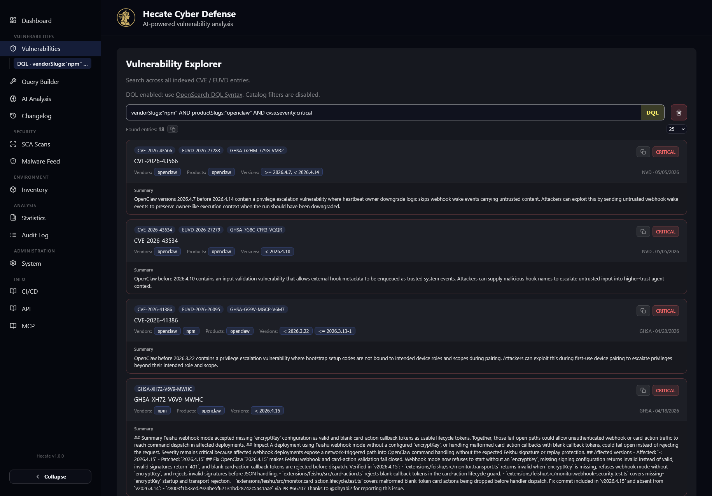

# Search & Query Builder

Search is how you turn hundreds of thousands of normalised vulnerability records into the handful that
matter to you right now. Hecate gives you three ways to ask the question, a visual builder for when you
don't remember the field names, and saved searches so you never have to type the same query twice.

This page explains the three search modes and when to reach for each, walks through the visual
[Query Builder](#the-query-builder) at `/query-builder`, and covers [saved searches](#saved-searches) —
how they remember the mode you wrote them in, surface in the sidebar, and double as
[notification](../integrations/notifications.md) watch rules. The search bar itself lives on the
[Vulnerabilities](vulnerabilities.md) page; everything here applies to that bar.

## The three search modes

Above the search input on the Vulnerabilities page sit two toggle buttons, **DQL** and **REGEX**. With
neither active you are in plain keyword mode; clicking one switches into that mode (and the placeholder
text and helper line change to match), clicking it again returns you to keyword. Only one advanced mode
is ever active at a time. When DQL or Regex is on, the catalogue vendor/product/version filters are
hidden — those clauses belong in the query string itself.

### Keyword (full-text)

Keyword mode is the default and the one you'll use most. Type any text — a CVE ID, a vendor name, a
fragment of a description — and Hecate runs a full-text search across the index. This is the mode behind
the catalogue filters too: picking a vendor, product or version from the dropdowns, or opening the
**Advanced Filters** panel (severity, EPSS range, CVSS band, attack vector, exploited-only, date range
and more), composes a structured keyword query for you without any syntax.

Very short queries are handled specially. A one- or two-character term switches to a prefix match
(`ab` becomes `ab*`) and caps the result set, because an unbounded two-letter search across the whole
index isn't useful. A short banner tells you when this is happening; enter at least three characters to
load the full list.

### DQL (field-level queries)

DQL — OpenSearch's Domain-Specific Query Language — is for precise, field-scoped questions. Instead of
matching free text, you write `field:value` clauses and combine them with boolean operators. A few
shapes cover most of what you'll want:

| Pattern | Example | Meaning |
| --- | --- | --- |
| Exact field match | `cvss.severity:critical` | Severity is critical |
| Wildcard | `vuln_id:CVE-2024-*` | Any 2024 CVE ID |
| Boolean combination | `vendors:microsoft AND exploited:true` | Microsoft products with active exploitation |
| Range | `published:>=2026-01-01` | Published on or after 1 January 2026 |
| Negation | `NOT rejected:true` | Exclude rejected entries |

Ranges work on the numeric and date fields — `epss_score:>=0.5`, `cvss.base_score:>=9.0`,
`published:>=2026-01-01 AND published:<2026-02-01` for a single month. Boolean operators are `AND`, `OR`
and `NOT`; `*` is a multi-character wildcard and `?` matches a single character.

One convenience is worth knowing: a `source:` clause is automatically expanded so it matches both the
primary source and any source alias on a record. Writing `source:NVD` finds entries whose primary feed is
NVD *and* entries that NVD merely contributed to, so you don't have to know which feed "owns" a given CVE.

The Vulnerabilities page links the [OpenSearch DQL reference](https://docs.opensearch.org/latest/dashboards/dql/)
directly from the helper line under the search bar. If a DQL query is malformed the page surfaces the
backend's validation message rather than silently returning nothing.

### Regex (pattern matching)

Regex mode runs a Lucene `regexp` pattern, case-insensitively, over a curated set of the most
search-worthy fields. It's the right tool when you're hunting for a textual pattern that spans several
fields at once — `(injection|rce|xss)` to sweep titles and summaries, or a version-token shape across the
product and reference fields. The pattern is matched against:

`summary`, `title`, `vendors`, `products`, `aliases`, the identifier fields (`source_id`, `vuln_id`),
the version fields (`productVersions`, CPE version tokens), `references`, and `cwes`.

!!! note "Lucene regexp, not PCRE"
    The pattern uses OpenSearch's Lucene `regexp` flavour, which differs from PCRE — there are no
    anchors (`^`/`$`; the pattern is implicitly anchored to the whole field), and the syntax for
    alternation, grouping and quantifiers follows Lucene's rules. Keep patterns simple and test them
    against a few known records.

## The Query Builder

When you can't recall the exact field name or want to see what values actually exist, open the
**Query Builder** at `/query-builder`. It's a two-panel workspace: a hierarchical field browser on the
left and a DQL editor on the right. Everything you build here is DQL — the builder's job is to make DQL
discoverable.

The left panel groups every queryable field into expandable categories — Identification, Description,
Impact & Scoring, the three CVSS metric families (4.0 / 3.x / 2.0), Impacted Products, Assets & Products,
and Dates. Each field shows a colour-coded type badge (string, number, boolean, date, array) and a short
description of what it holds. A search box at the top filters the whole tree by field name or
description, so typing `epss` or `vendor` jumps straight to the relevant entries.

Clicking a field name inserts `field:` into the query at your cursor position, ready for you to type the
value. Fields that are *aggregatable* carry an expand chevron: opening it queries the index live and
lists the **top values for that field with their occurrence counts** — for example the most common
`cvss.severity` buckets or the busiest `vendors`. Clicking one of those value rows inserts the full
`field:value` clause (quoting the value automatically if it contains spaces), so you can compose a valid
clause without typing a character. These aggregations are the quickest way to learn which sources,
severities or vendors are even present in your data.

The editor on the right is a plain text area with the query so far, a live character count, and a row of
**operator buttons** — `AND`, `OR`, `NOT`, `*`, `?` — that splice the operator in at the cursor with the
right surrounding spaces. Below the editor, three actions finish the job:

| Action | What it does |
| --- | --- |
| **Execute query** | Opens the Vulnerabilities page with the query applied in DQL mode |
| **Save** | Stores the query as a named saved search |
| **Copy URL** | Copies a shareable link that opens the query in DQL mode for anyone with access |

!!! tip "Round-trip with the Vulnerabilities page"
    Execute and Copy URL both encode the query into the page URL (`/vulnerabilities?mode=dql&search=…`).
    That means a query is also a bookmark and a shareable link — paste it to a colleague and they land on
    the same result set. Conversely, anything you build in the search bar can be reopened in the builder
    for further editing.

## Saved searches

A saved search is a named query you can run again in one click. Save one from the Query Builder's **Save**
button, or directly from the Vulnerabilities page using the save (disk) icon next to the search bar — it
appears whenever you have a non-empty query or active filters. Give it a name (the dialog pre-fills a
sensible default from the mode and search terms) and it's stored server-side.

Crucially, a saved search remembers the **mode it was written in**. Alongside the query parameters,
Hecate persists the originating `queryMode` — `keyword`, `dql` or `regex` — so when you reopen the search
the page restores the correct mode and the right input rather than guessing. Regex searches get special
handling: because notification watch rules execute through the DQL path, a regex search is *also*
materialised into an equivalent DQL query (one `field:/pattern/` clause per curated field, OR-joined) at
save time. You write a regex once and it works both as a re-runnable search and as a notification rule.

Saved searches surface in the sidebar as a sub-navigation under the **Vulnerabilities** section. Each one
is a direct link that re-applies its query; the active search is highlighted when the current page matches
it. To remove a saved search, open it (so its query is the current one) and the save icon turns into a
delete (trash) icon — confirm in the dialog.

The real payoff comes when you connect a saved search to alerting. On the
[Notifications](../integrations/notifications.md) configuration you can create a `saved_search` watch
rule that re-runs the stored query after every ingestion and notifies you on Slack, email, or any Apprise
channel when newly published vulnerabilities match. A saved search is therefore both a shortcut you click
and a standing query that watches the feed on your behalf.

## Where to go next

- [Vulnerabilities](vulnerabilities.md) — the search bar in context, plus the per-CVE detail tabs.
- [Notifications](../integrations/notifications.md) — turn a saved search into a watch rule.
- [Environment Inventory](inventory.md) — match the products you run against the index without writing a query at all.
