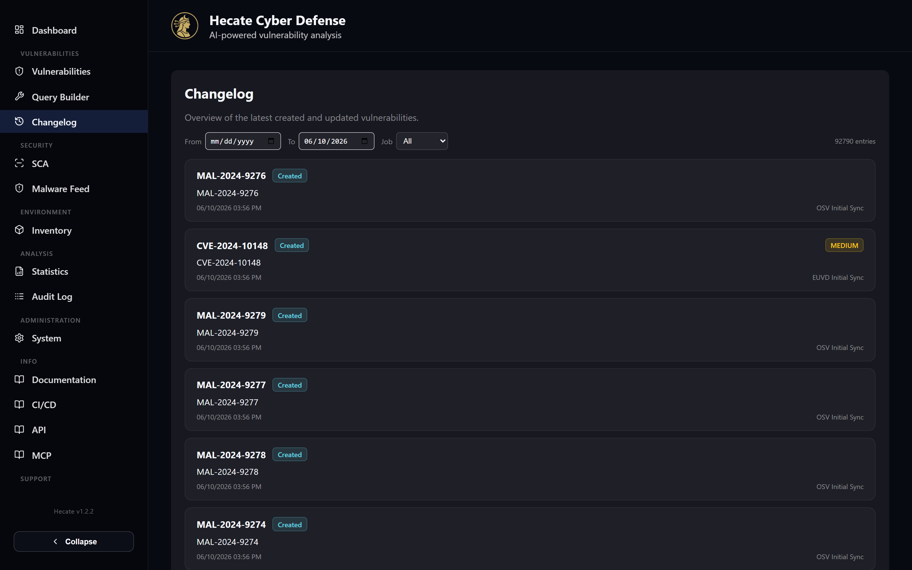

# Statistics & Changelog

Two read-only pages sit at the analytical edge of Hecate. **Statistics** (`/stats`) gives you the
shape of the whole index at a glance — how many vulnerabilities you hold, where they came from, how
they break down by severity and exploit probability, and which weaknesses, vendors and products
dominate. The **Changelog** (`/changelog`) is the opposite zoom level: a live, paginated feed of
*what actually changed* in each ingestion pass, entry by entry, so you can watch the database grow
and see exactly which fields a feed touched on any given CVE.

Neither page lets you mutate anything; both are about understanding. Use Statistics to answer "what
does our coverage look like overall?" and the Changelog to answer "what did the last few syncs bring
in, and which source wrote it?"

!!! note "Two different changelogs"
    The page described here is the **in-app data changelog** — a record of vulnerability records
    being created and updated as feeds run. It is not the **release changelog** that tracks new
    Hecate versions and features; that lives in [Changelog](../changelog.md) on this documentation
    site. They share a name but answer entirely different questions.

## Statistics

The Statistics page loads a single overview snapshot of the index and renders it as a summary grid
followed by a column of charts. Everything is computed server-side and refreshed each time you open
the page; there are no filters or controls — it is a dashboard you read, not one you drive.

### The summary grid

At the top, five tiles give you the headline counts. Vulnerabilities is the total number of records
in the index; **Exploited (KEV)** is the subset that CISA has flagged as known-exploited; and the
last three — **Vendors**, **Products** and **Versions** — count the entries in the asset catalogue
that Hecate derives from CPE data and the affected-product fields across every record. All values are
formatted in your locale, so large numbers carry the thousands separators you expect.

### The charts

Below the grid, the charts move from "where the data comes from" to "what it looks like" to "how it
trends over time". Each renders as an animated bar, line or ranked-list visualisation; hover any bar
or point for an exact count.

| Chart | What it shows |
| --- | --- |
| **Source** | Distribution of records across the ingestion feeds (NVD, EUVD, GHSA, OSV, …), top six by volume |
| **Severity** | Record counts bucketed Critical → High → Medium → Low → Unknown, colour-coded |
| **Top 5 CWEs** | The most frequently assigned weakness types (the `NVD-CWE-noinfo` / `NVD-CWE-Other` placeholders are filtered out) |
| **EPSS Score** | How records spread across exploit-probability bands (0–10 %, 10–30 %, 30–50 %, 50–70 %, 70–100 %), green for low risk through red for high |
| **Publication trend (last 30 days)** | A smoothed daily line of how many CVEs were published over the past month |
| **Historical overview** | A cumulative running total of published vulnerabilities across the whole timeline |
| **Most named vendors / products** | Ranked bar lists of the vendors and products that appear most across the index |
| **Top reference domains / assigners** | Ranked lists of the most common reference hostnames and CNA assigners |

A final pair of cards at the bottom, **Asset Vendors** and **Asset Products**, samples the derived
asset catalogue and shows representative entries with their known aliases — a quick way to confirm
that vendor and product normalisation is producing the names you expect.

!!! tip "Day buckets follow your timezone"
    The publication trend and historical overview compute calendar-day and month boundaries in the
    timezone you set under **System → General**, not in UTC. Set the right zone there and the trend
    charts will line up with your local calendar rather than shifting by your offset. See
    [System Settings](../admin/system.md).

## Changelog (in-app data changes)

The Changelog is a chronological feed of the most recently created and updated vulnerability records.
Every time a feed ingests data, the records it writes carry a change stamp — which job ran, when, and
which fields it altered — and this page surfaces that stamp as a scannable list. It is where you go
to confirm that a sync actually landed, to see what NVD changed about a CVE overnight, or simply to
keep an eye on the flow of new advisories into the database.

Each row shows the vulnerability ID, a **Created** (cyan) or **Updated** (amber) badge reflecting the
latest change, a severity chip in the corner, the title (which links straight to the
[vulnerability detail page](vulnerabilities.md)), the timestamp in your configured timezone, and the
job that made the change. Clicking a row expands it to a field-by-field diff: every field the job
touched, shown as old value versus new value, with object and array values rendered as formatted
JSON. This is the same change-history view you see on a CVE's own detail page, scoped to the single
most recent change.

### Filtering and paging

Three controls sit above the feed. A **From** and **To** date pair narrows the feed to a window —
the *To* field defaults to today, and *From* is open until you set it. A **Job** dropdown filters by
the source that made the change, with options for NVD, EUVD, GHSA, KEV, CIRCL, OSV and deps.dev (the
malicious-package enrichment job), plus **All** to clear it. When a date or source filter is active,
a **Reset** button appears to clear everything back to the default; the total entry count is shown on
the right.

The feed pages in blocks of 50, with **Previous** / **Next** controls and a page indicator below the
list whenever there is more than one page. Changing any filter returns you to the first page.

### Live updates

The Changelog refreshes itself as ingestion happens. It listens for job-completion events over
Server-Sent Events and reloads the current view the moment a sync finishes, so you see new entries
appear without touching the page. Because some reverse proxies (Cloudflare among them) can interrupt
long-lived SSE connections, a 60-second polling fallback runs alongside it — even if the live stream
drops, the feed never goes more than a minute stale.

!!! note "Why a CVE shows up under one source and not another"
    The job shown on each entry is the one that wrote the *latest* change, not every source that has
    ever touched the record. A single CVE enriched by NVD, then EUVD, then CIRCL will appear in the
    feed under whichever job ran most recently. Filter by **Job** to follow one feed's output in
    isolation. For the deeper mechanics of how Hecate reconciles the same CVE across feeds, see the
    [Architecture](../architecture.md) reference.
