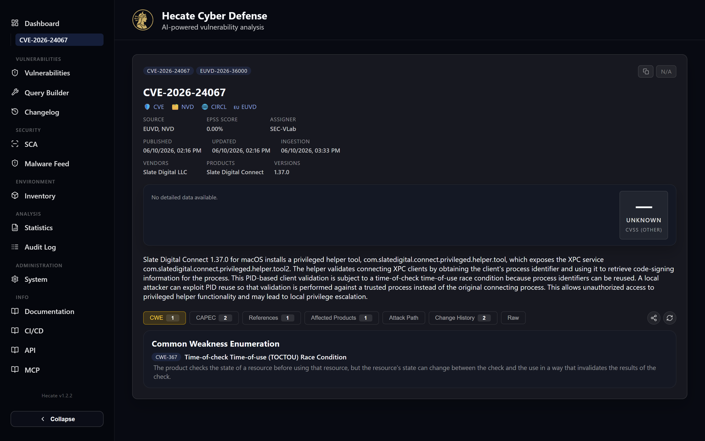
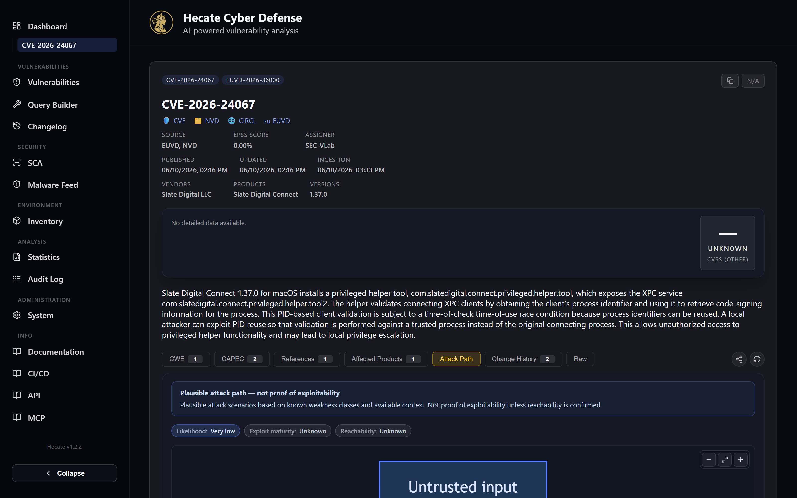

# Vulnerabilities

The Vulnerabilities section is where you work with the whole normalised index — every CVE, EUVD,
GHSA, OSV and MAL record Hecate has ingested, reconciled across nine feeds into one record apiece.
It has two halves that you move between constantly: a **list page** for finding the entries that
matter, and a **detail page** for understanding a single one in depth.

The list page (`/vulnerabilities`, labelled *Vulnerability Explorer*) is built for narrowing a
six-figure index down to the handful of records relevant to a question. You start broad — a keyword,
a vendor, a severity band — and add filters until the result set is something you can act on. Every
search you run is reflected in the URL, so a useful query is a link you can bookmark or share, and
worth-keeping queries can be saved as named searches.

The detail page (`/vulnerability/:id`) is the full dossier for one entry: its scores, affected
products, weaknesses and attack patterns, an optional AI write-up, a structural attack-path graph,
and a complete change history of how the record evolved as feeds enriched it. From here you can pull
a fresh copy from any upstream source and share the entry by link, email or Mastodon.

## The list page

### Three search modes

Above the search box sits a pair of mode toggles — **DQL** and **REGEX** — that switch the input
between three behaviours. With neither active you are in **Keyword** mode, which matches against
vulnerability IDs and ranks by relevance; this is the default and the right choice for "find me
CVE-2024-3094" or "anything mentioning libxml". Pressing **DQL** switches to OpenSearch's Domain
Query Language for structured, field-level queries such as `severity:CRITICAL AND vendorSlugs:apache`.
Pressing **REGEX** matches a regular expression (case-insensitive) across a curated set of fields —
summary, title, vendor, product, references, aliases, identifiers, versions and CWEs — so a pattern
like `(injection|rce|xss)` sweeps everything at once.

The two advanced modes turn off the catalog filters (vendor/product autocomplete and the advanced
panel) because they express their constraints directly in the query text instead. The deep syntax for
both — operator reference, field names, worked examples and the visual field browser — lives in
[Search & Query Builder](search.md); this page covers only how the modes behave on the list.

!!! tip "Short keyword searches are capped"
    A keyword shorter than three characters runs a prefix search capped at a few thousand results,
    so the page stays responsive. Enter at least three characters to load the full, unbounded list —
    the page tells you when the cap is in effect.

### Vendor, product and version filters

In keyword mode the search box is paired with **asset filters**: autocomplete pickers for vendor,
product and version drawn from Hecate's asset catalogue. Pick a vendor and the product picker scopes
to that vendor; pick a product and the version picker scopes to it in turn. These are the fastest way
to answer "what affects the software I actually run" without writing a query by hand. Selecting a
filter from a list row's chips automatically switches you into DQL mode and appends the matching
clause, so you can start by clicking and refine by typing.

### The advanced filter panel

Below the asset filters, **Advanced Filters** expands a panel for everything that isn't a free-text
match. A badge on the toggle shows how many filters are currently active, and a **Clear all filters**
button at the bottom resets them in one click. The panel opens with four quick toggles —

- **Show rejected CVEs** — include entries the issuing authority has withdrawn
- **Show reserved CVEs** — include placeholder IDs with no published data yet
- **Exploited CVEs only** — restrict to entries on CISA's Known Exploited list
- **AI-analysed CVEs only** — restrict to entries that already carry an AI assessment

— and then a grid of structured filters. You can constrain **severity** (Critical / High / Medium /
Low / None) and **source** (NVD, EUVD, GHSA, OSV, CIRCL, KEV) as multi-select chips, set numeric
ranges for the **EPSS score** and the **CVSS score**, pick a specific **CVSS version**, filter by
**publication date** range, and match on **CWE** IDs or the **assigner** (with autocomplete from the
values present in your index).

A collapsible **CVSS Vector Components** section drills into the vector itself — attack vector, attack
complexity, privileges required, user interaction, scope, and the confidentiality / integrity /
availability impacts. The available options adapt to the CVSS version you selected: choosing 2.0
surfaces the v2 labels (access vector, authentication, partial/complete impacts), while 4.0 adds
attack requirements and the v4 user-interaction values.

### Results, page size and sort

Each result is a card showing its IDs, severity, summary and affected vendors/products, with a
running **Found entries** count above the table. Exploited entries are flagged with a red accent so
they stand out. A page-size selector lets you show **25, 50, 100 or 200** entries per page, and
pagination walks the rest. A copy icon next to the count copies the whole visible page to the
clipboard as plain text, and each card carries its own copy button for a single entry's details.

!!! note "The list refreshes itself"
    When an ingestion publishes new vulnerabilities, the list picks them up over Server-Sent Events
    and reloads in place — you do not need to refresh the page to see freshly ingested CVEs.

### Saving a search

Once a query is worth keeping, the save (floppy-disk) button stores it as a named saved search. The
mode you used — keyword, DQL or regex — is preserved, so reopening the search restores the exact
state, and saved searches can additionally drive notification watch rules. If the current query
matches a search you already saved, the button turns into a delete (trash) button instead. Managing
the full list of saved searches is covered in [Search & Query Builder](search.md).

## The detail page

Opening any entry takes you to its detail page. The header lists every identifier the record is known
by as chips (CVE, EUVD, GHSA, MAL, PYSEC aliases), a severity tag, and — when applicable — a red
**REJECTED** banner. Below it sit external deep links that adapt to the ID type: CVE entries link out
to CVE.org, NVD, CIRCL, EUVD and (after a week) Wazuh; GHSA, MAL and PYSEC aliases link to GitHub
Advisories, OSV and deps.dev.

The metadata rows beneath summarise source, EPSS score, exploited status, assigner, the
published / updated / ingested timestamps, and the affected vendors, products and versions. The
summary text follows, and then the tabbed body.

### The CVSS metric selector

A vulnerability often carries CVSS scores from several versions and sources at once (for example a
v3.1 score from NVD and a v4.0 score from a vendor). When more than one is present, a row of tabs
above the score lets you switch between them, each showing the full vector breakdown for that metric.
The newest version is selected by default.

### Affected in your environment

If the entry matches something you have declared in your [Environment Inventory](inventory.md), a
red-bordered **Affected in your environment** callout appears directly under the summary. It lists
each matching inventory item with its version, deployment, environment and instance count, plus a
link straight to the inventory page. This is the bridge between "this CVE exists" and "this CVE is my
problem" — the matching logic and how to populate the inventory are covered in
[Environment Inventory](inventory.md).

### Affected in your scans

When this CVE (or one of its aliases) turns up in your [SCA scan](../sca-scanning.md) results, a red
**Affected in your scans** callout appears below the inventory block. It lists each affected scan
target with the offending package and version, the scanner that flagged it and a fix version when one
is known — every row linking straight to the covering scan. It's the reverse of the per-scan findings
view: instead of "what does this scan contain", it answers "which of my scanned projects does this
CVE touch".

It surfaces two kinds of match. A confirmed **finding** comes straight from a scan that flagged the
CVE. A package can also match through the **SBOM**: if a target's most recent scan catalogued the
package at a version that falls in this CVE's affected range — but the scan ran before the advisory
existed, so it was never flagged — the row is tagged *in SBOM · rescan to confirm*. Re-running that
scan turns it into a normal finding.

### The detail tabs

The body is organised into tabs, each badged with a count where one applies. They render only the
information the record actually has, so an entry with no references shows an empty References tab
rather than hiding it.

| Tab | What it shows |
| --- | --- |
| **CWE** | The Common Weakness Enumeration entries linked to the vulnerability, with titles. |
| **CAPEC** | Common Attack Pattern Enumeration & Classification patterns resolved from the CWEs at display time. |
| **References** | The deduplicated list of advisory and reference URLs. |
| **Affected Products** | Structured affected-product data — CPE version ranges, impacted-product version lists, or the raw CPE list, whichever the record carries. |
| **Attack Path** | A deterministic Mermaid graph of how the weakness could be abused, with an optional AI narrative (see below). |
| **AI Analysis** | AI-generated triage for this CVE — only shown when AI providers are configured. |
| **Change History** | Every recorded change to the record, expandable per entry with old/new field values, the job that made the change, and optional metadata/snapshot. |
| **Raw** | The full underlying document as formatted JSON. |

The **CISA Known Exploited Vulnerability** block, when present, sits above the tabs and surfaces the
ransomware-use flag and CISA's recommended action — a strong signal that an entry deserves immediate
attention.

### The Attack Path tab

The Attack Path tab visualises a single CVE as a structural chain —
`Entry → Asset → Package → CVE → CWE → CAPEC → Exploit → Impact → Fix` — rendered as a Mermaid graph
with colour-coded nodes and labelled likelihood, exploit-maturity and impact signals. The structure
is built deterministically from existing enrichment data (CWE/CAPEC catalogues, EPSS, KEV, your
inventory match, the CVSS vector), so it always renders without inventing anything, even when no AI
is configured. A disclaimer above the graph makes the "plausible, not proven" framing explicit.

When at least one AI provider is configured, you can layer an optional prose **narrative** on top by
picking a provider and (optionally) adding context, then generating the scenario description. The
narrative is gated by the AI password and runs in the background. The mechanics of attack-path
narratives, refinement and the cross-CVE attack chain are covered in
[AI Analysis & Attack Paths](ai-analysis.md).

### Refreshing from a source

The refresh (circular-arrow) button in the tab bar opens a **Select source** dropdown that pulls a
fresh copy of the record from upstream — and crucially, it offers only the sources that apply to the
ID type. A CVE can be refreshed from **NVD, EUVD, CIRCL, GHSA** (when a GHSA alias exists) and **OSV**
(when a GHSA, MAL or PYSEC alias exists); an EUVD ID offers EUVD plus alias-resolved sources; a GHSA
ID offers GHSA only. The refresh runs asynchronously — the page tells you the job is queued and
updates the record in place when the backend finishes, then shows a summary of how many fields were
inserted, updated or skipped.

!!! note "Refresh is a write action"
    Pulling a fresh copy is a mutating operation and may prompt for a password if write protection is
    enabled. See [Security & Access Control](../security-access-control.md).

### Sharing and copying

The share button in the tab bar offers four ways to take the entry elsewhere: **Copy URL** for a
direct link, **Share on Mastodon** with a pre-filled post, **Share by email** with a formatted
subject and body (scores, vector, CWEs, affected products and references), and **Copy JSON to
clipboard** for the full record minus its change history. The copy button in the header copies a
compact text block — IDs, severity, vendors, products and the summary — for quick pasting into a
ticket or chat.

## Where to go next

For the full search-syntax reference and saved-search management, see
[Search & Query Builder](search.md). To turn matches into "this affects me" signals, populate your
[Environment Inventory](inventory.md). For AI triage, attack-path narratives and the cross-CVE attack
chain, see [AI Analysis & Attack Paths](ai-analysis.md). And for how write protection gates the
refresh and AI actions, see [Security & Access Control](../security-access-control.md).
