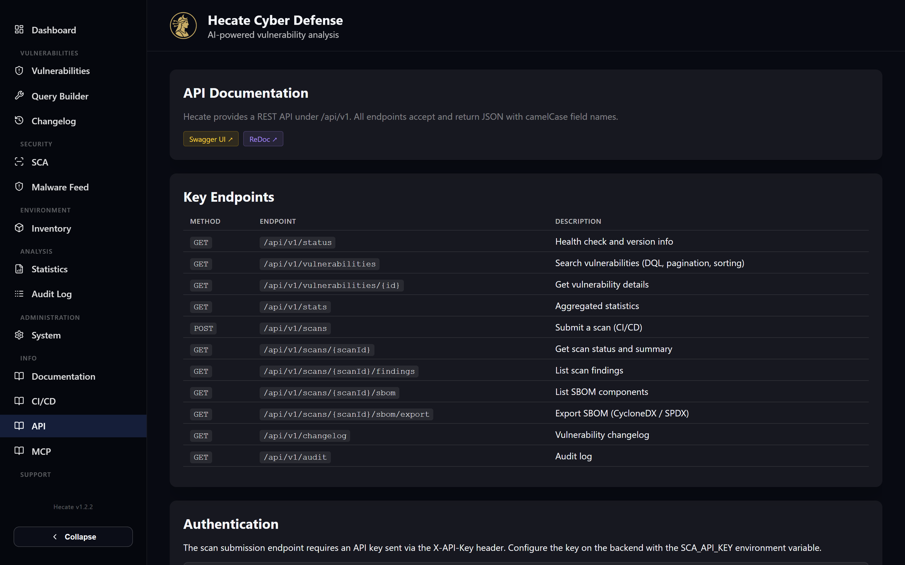

# REST API

Everything you see in the Hecate web UI is driven by a REST API, and that same API is open for you to use directly — for automation, dashboards, exports, or wiring Hecate into your own tooling. The backend serves it under `/api/v1` (the prefix is configurable), and every endpoint accepts and returns JSON with camelCase field names on the wire. If you can do something in the interface, there is almost always an endpoint behind it.

The fastest way to explore the surface is the in-app **API** page under **Integrations → API** (route `/info/api`), which links straight to the interactive documentation and lists the endpoints you reach for most often. You do not need to read source code or guess at request shapes: the live OpenAPI schema is always authoritative for your running version.



## Where the interactive docs live

Hecate ships the standard FastAPI documentation UIs, both reachable through the same proxy as the rest of the app. **Swagger UI** lives at `/api/docs` and lets you read every endpoint, expand its request and response schema, and fire test calls from the browser. **ReDoc** lives at `/api/redoc` and renders the same OpenAPI specification as a clean, printable reference. Both are linked from the in-app API page, so you can jump to either with one click without remembering the URLs.

Because these UIs are generated from the running backend, they always match your deployed version exactly — including any endpoints added since this page was written. When in doubt about a field name, an optional query parameter, or a status code, the Swagger schema is the source of truth.

!!! tip
    The raw OpenAPI JSON is served at `/api/openapi.json`. Point Postman, Insomnia, or a code generator at it to scaffold a typed client in your language of choice.

## Reads are open; writes can be gated

Hecate treats reading and writing very differently. **Every read endpoint is open** — searching, fetching a CVE, listing findings, pulling stats, exporting an SBOM, and so on, all work without any credential. This keeps dashboards and automation simple, and it is why the security model assumes you put network-level controls (VPN, firewall, reverse-proxy auth, TLS) in front of the instance.

**Mutating requests** — creating, updating, or deleting data — can be protected by one or more shared secrets, each carried in its own header. None of these are user accounts; they are shared-secret gates that you pair with network ACLs. The relevant headers are summarised below, and the full model is documented in [Security & Access Control](../security-access-control.md).

| Header | Protects | Set on the backend via |
| --- | --- | --- |
| `X-System-Password` | The global admin write gate — most mutating endpoints when a system password is configured | `SYSTEM_PASSWORD` |
| `X-Target-Password` | Writes scoped to a single SCA scan target that has its own write password | per-target, on the System → Access Control tab |
| `X-AI-Analysis-Password` | AI analysis trigger endpoints (single, batch, scan triage, attack-path narrative) | the AI analysis password setting |
| `X-API-Key` | The scan submission endpoint (`POST /scans`) for CI/CD pipelines | `SCA_API_KEY` |

Each gate is **fail-open**: if the corresponding secret is unset on the backend, that gate is a no-op and the write succeeds without a header. When a write is rejected, the response carries a marker header so the web UI knows to prompt you for the right password and retry the request once — you rarely have to think about this in the browser, but a script calling the API directly must send the header itself.

The CI-friendly scan submission flow uses its own `X-API-Key` rather than the admin password, so you can hand a pipeline a narrow key without granting it broader write access. That flow is covered end to end in [CI/CD Scanning](./cicd.md).

!!! warning
    Apart from these gates, endpoints are not individually authenticated and there is no per-user login. Restrict access to your Hecate instance at the network layer, and always serve it over TLS so the shared-secret headers are not exposed in transit.

## Key endpoints

The table below covers the endpoints you will use most. It is a curated shortlist, not the full surface — open Swagger UI for the complete, versioned catalogue including notifications, saved searches, inventory, license policies, sync, and backup.

| Method | Endpoint | What it does |
| --- | --- | --- |
| `GET` | `/api/v1/status` | Health check and version info |
| `GET` | `/api/v1/vulnerabilities` | Search vulnerabilities with DQL, pagination, and sorting |
| `POST` | `/api/v1/vulnerabilities` | Search via a JSON body (keyword, DQL, or regex query) |
| `GET` | `/api/v1/vulnerabilities/{id}` | Full details for a CVE / GHSA / OSV ID |
| `GET` | `/api/v1/stats` | Aggregated database and severity statistics |
| `POST` | `/api/v1/scans` | Submit a scan (the CI/CD entry point, gated by `X-API-Key`) |
| `GET` | `/api/v1/scans/{scanId}` | Scan status and severity summary |
| `GET` | `/api/v1/scans/{scanId}/findings` | List the findings of a scan |
| `GET` | `/api/v1/scans/{scanId}/sbom` | List the SBOM components of a scan |
| `GET` | `/api/v1/scans/{scanId}/sbom/export` | Export the SBOM as CycloneDX or SPDX |
| `GET` | `/api/v1/changelog` | The vulnerability changelog |
| `GET` | `/api/v1/audit` | The audit log |
| `GET` | `/api/v1/events` | A Server-Sent Events stream of live job and scan progress |

Searching is the one place where the same resource is exposed under two methods. `GET /api/v1/vulnerabilities` is convenient for quick, URL-shaped queries; `POST /api/v1/vulnerabilities` takes a JSON body and is the path to use for DQL or regex searches, since it avoids escaping complex query syntax into a query string. Both are reads and need no credential.

The `GET /api/v1/events` stream is how the UI stays live without polling. Subscribe to it and you receive events as ingestion runs, scans complete, and AI analyses finish — the same signals that refresh the browser refresh your own integration.

## Response format and conventions

Paginated endpoints return a consistent envelope so you can page through results the same way everywhere. The payload carries the page of `items`, the unfiltered `total` count, and the `limit` / `offset` you requested:

```json
{
  "items": [ ... ],
  "total": 1542,
  "limit": 50,
  "offset": 0
}
```

Two conventions hold across the whole API. First, **all field names are camelCase on the wire** — `scanId`, `commitSha`, `pipelineUrl`, `firstSeenAt`, and so on — even though the backend uses snake_case internally. Second, **timestamps are UTC** and serialise with an explicit `+00:00` offset, so your client never has to guess the timezone; render them in whatever zone your tooling prefers.

A minimal authenticated write looks like the scan submission below. Note the `X-API-Key` header and the JSON body — the same shape Swagger UI will show you, and the same call a CI pipeline makes:

```bash
curl -X POST https://hecate.example.org/api/v1/scans \
  -H "X-API-Key: your-secret-key" \
  -H "Content-Type: application/json" \
  -d '{ "target": "nginx:latest", "type": "container_image" }'
```

## Where to go next

For automated scanning from a pipeline — submitting builds, attaching commit and image metadata, and reading back the result — see [CI/CD Scanning](./cicd.md). If you want an AI assistant to query Hecate in natural language rather than calling endpoints by hand, the [MCP Server](./mcp.md) exposes the same data through the Model Context Protocol. And to understand exactly which writes are gated and how to configure the shared-secret headers, read [Security & Access Control](../security-access-control.md).
