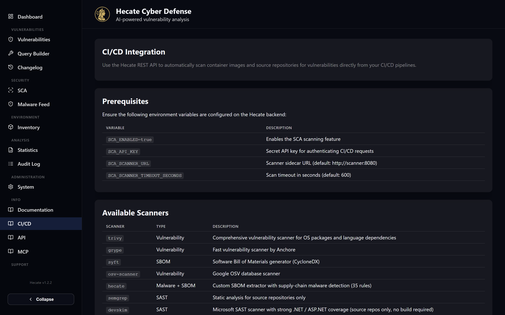

# CI/CD Integration

Hecate is built to run inside your delivery pipeline, not only beside it. Every container image you
build and every repository you ship can be submitted for a scan as part of the same workflow that
builds it, so a vulnerable artefact is caught before it reaches production rather than during the
next manual review. The pipeline talks to a single REST endpoint, authenticates with a secret key,
and reads the scan summary back to decide whether the build should pass.

This page covers how to submit a scan from a pipeline, how to authenticate, the difference between
scanning a container image and a source repository, how to turn the result into a pass/fail quality
gate, and how to embed a live status badge in your README. The same examples — for shell/cURL,
GitHub/Gitea Actions, and GitLab CI — are available in the app itself under **Integrations → CI/CD**,
together with a reference table of every available scanner.



## Submitting a scan

A pipeline submits work by sending an HTTP `POST` to `/api/v1/scans` on your Hecate backend. The
request body names the **target** (an image reference or a repository URL), a **type**, and the list
of **scanners** to run. The response returns a `scanId` immediately; the scan itself runs
asynchronously on the scanner sidecar, so the pipeline polls `GET /api/v1/scans/{scanId}` until the
status leaves `running`.

Authentication uses a dedicated header, `X-API-Key`, whose value is the `SCA_API_KEY` configured on
the backend. This key is specific to scan submission — it is **independent of the System password
gate** that protects the web UI, so a pipeline can run scans without ever touching an admin
password. Store the key as a pipeline secret (for example a repository secret in GitHub Actions or a
masked CI/CD variable in GitLab) and never commit it.

!!! warning "Keep the key secret and scoped"
    `SCA_API_KEY` grants the ability to submit scans against your Hecate instance. Treat it like any
    other deployment credential: store it in your CI secret store, rotate it if it leaks, and serve
    Hecate over TLS so the header is never sent in clear text.

Two prerequisites must be set on the backend before any of this works: `SCA_ENABLED=true` turns the
SCA feature on, and `SCA_API_KEY` defines the key your pipeline presents. The backend reaches its
scanner sidecar via `SCA_SCANNER_URL` (default `http://scanner:8080`) with a per-scan budget of
`SCA_SCANNER_TIMEOUT_SECONDS`.

### Image targets versus repository targets

The `type` field decides what Hecate scans and which scanners are meaningful.

For a **container image** set `type` to `container_image` and pass the fully qualified image
reference as `target` (for example `ghcr.io/my-org/my-app:latest`). Hecate pulls the image and runs
the image-capable scanners against it.

For a **source repository** set `type` to `source_repo` and pass the repository URL as `target`.
Hecate clones the repository and runs the source-capable scanners, which additionally include static
analysis (`semgrep`, `devskim`) and secret detection (`trufflehog`). When the repository is private
or you want to scan local working-tree code that is not yet pushed, attach a base64-encoded ZIP of
the source as `sourceArchiveBase64` instead of relying on a clone; the archive must be a valid ZIP
and at most 50 MB.

A handful of optional metadata fields make the resulting scan traceable back to the build that
produced it: `commitSha`, `branch`, `pipelineUrl`, and `source` (set this to `ci_cd` so the scan is
clearly attributed in the UI). The available scanners are:

| Scanner | Type | Targets |
| --- | --- | --- |
| `trivy` | Vulnerability | image + repo |
| `grype` | Vulnerability | image + repo |
| `syft` | SBOM | image + repo |
| `osv-scanner` | Vulnerability | image + repo |
| `hecate` | Malware + SBOM | image + repo |
| `semgrep` | SAST | source repos only |
| `devskim` | SAST | source repos only |
| `trufflehog` | Secrets | source repos only |
| `dockle` | Compliance (CIS) | container images only |
| `dive` | Layer analysis | container images only |

If you omit `scanners`, Hecate runs the defaults `trivy`, `grype`, and `syft`. See
[SCA Scanning](../sca-scanning.md) for what each scanner produces and how findings are ranked.

## A representative pipeline

The shape of the integration is the same regardless of platform: submit, poll, then read the
summary. The shell snippet below does all three and is portable to any runner that has `curl` and
`jq` — the in-app **CI/CD** page carries ready-to-paste variants for GitHub/Gitea Actions and
GitLab CI.

```bash
#!/bin/bash
set -euo pipefail

HECATE_URL="https://hecate.example.com"
API_KEY="${SCA_API_KEY}"

# 1. Submit the scan
RESPONSE=$(curl -sS -X POST "${HECATE_URL}/api/v1/scans" \
  -H "X-API-Key: ${API_KEY}" \
  -H "Content-Type: application/json" \
  -d '{
    "target": "ghcr.io/my-org/my-app:latest",
    "type": "container_image",
    "scanners": ["trivy", "grype", "syft", "hecate"],
    "commitSha": "'"${GITHUB_SHA:-}"'",
    "branch": "'"${GITHUB_REF_NAME:-}"'",
    "pipelineUrl": "'"${CI_PIPELINE_URL:-}"'",
    "source": "ci_cd"
  }')

SCAN_ID=$(echo "${RESPONSE}" | jq -r '.scanId')
echo "Scan started: ${SCAN_ID}"

# 2. Poll until the scan finishes
while true; do
  STATUS=$(curl -sS "${HECATE_URL}/api/v1/scans/${SCAN_ID}" \
    -H "X-API-Key: ${API_KEY}" | jq -r '.status')
  [ "${STATUS}" != "running" ] && break
  sleep 5
done

# 3. Read the summary
RESULT=$(curl -sS "${HECATE_URL}/api/v1/scans/${SCAN_ID}" \
  -H "X-API-Key: ${API_KEY}")
echo "${RESULT}" | jq '.summary'
```

!!! tip "There is a ready-made GitHub/Gitea Action"
    Rather than wiring up `curl` and `jq` by hand, the `0x3e4/hecate-scan-action` GitHub/Gitea Action
    handles submission, polling, the quality gate, and an optional SonarQube export in a single step.
    Its inputs cover `hecate-url`, `api-key`, `target`, `type`, `scanners`, `fail-on`, and a
    `source-archive` for private repos; its outputs expose `scan-id`, `status`, and the severity
    counts. The in-app CI/CD page shows the full workflow snippet.

## Using results as a quality gate

Because the scan response carries a severity breakdown under `summary`, the pipeline can decide on
its own whether the build is allowed to proceed. Read the counts back from the completed scan and
fail the job when your policy is exceeded — block on any critical, cap the combined critical-plus-high
total, or whatever threshold suits the project.

```bash
RESULT=$(curl -sS "${HECATE_URL}/api/v1/scans/${SCAN_ID}" \
  -H "X-API-Key: ${API_KEY}")

CRITICAL=$(echo "${RESULT}" | jq '.summary.critical')
HIGH=$(echo "${RESULT}" | jq '.summary.high')

# Fail on any critical finding
[ "${CRITICAL}" -gt 0 ] && exit 1

# Fail if critical + high exceeds a threshold
TOTAL_SEVERE=$((CRITICAL + HIGH))
[ "${TOTAL_SEVERE}" -gt 10 ] && exit 1

echo "Security gate passed."
```

The severity counts in `summary` are deduplicated by CVE, so the same CVE appearing in several
packages counts once toward your gate — the threshold you set reflects distinct vulnerabilities, not
repeated rows.

## Status badges

For a README or a dashboard, Hecate exposes shields.io endpoint badges that render the current
severity breakdown of a scan as a coloured pill. These endpoints are **public and need no
authentication**, which is what lets them be embedded straight into a Markdown file that anyone can
view.

There are two flavours. The scan-specific badge tracks one fixed scan:

```
GET /api/v1/scans/{scanId}/shield
```

The target badge auto-resolves to the **latest completed scan** of a target, so a README badge always
reflects the newest run without you editing the link:

```
GET /api/v1/scans/targets/{targetId}/shield
```

The badge message is a compact breakdown such as `2C 5H 12M 4L` (empty buckets are dropped, and a
clean scan reads `0 findings`), and its colour follows the worst severity present — red for critical
down through brightgreen for clean, with distinct states for pending, running, failed, and
not-found. Append `?label=` to override the left-hand label (it defaults to `findings`).

### Embedding a badge

To embed a badge, point shields.io at the Hecate endpoint and, ideally, wrap it in a link to the
target page so a reader can click through to the full results. Because a target ID can contain
characters such as slashes, **path-encode it** when building the URL:

```markdown
[](https://hecate.example.com/scans/targets/ghcr.io%2Fmy-org%2Fmy-app)
```

You do not have to assemble this by hand. Open the target's detail page under **SCA Scans →
Targets**, and use the **Copy badge** button there to copy a ready-made, correctly encoded badge
snippet for that target.

## Related pages

- [SCA Scanning](../sca-scanning.md) — registering targets, the scanner reference, and how findings
  are produced and ranked.
- [REST API](./api.md) — the full endpoint reference and the embedded Swagger UI.
