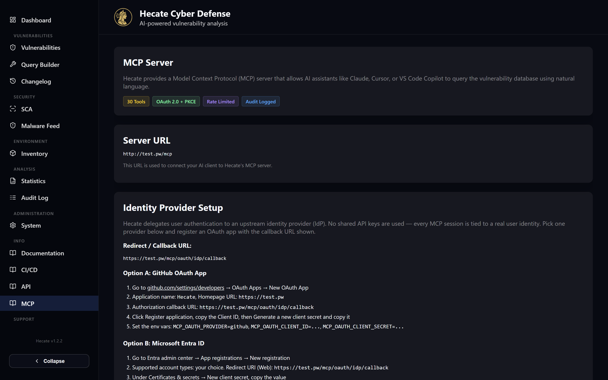

# MCP Server

Hecate ships a built-in **Model Context Protocol (MCP)** server so an AI assistant — Claude Desktop,
Cursor, VS Code Copilot, or the Claude Code CLI — can talk to your vulnerability database in plain
language. Instead of opening the web UI to look something up, you ask your assistant "*am I affected
by any vulnerabilities in OpenClaw 2026.02.24?*" and it queries Hecate directly, joins the answer to
whatever else you are working on, and writes the result back where useful.

The server is mounted at `/mcp` on the same host as the rest of Hecate and exposes 35 tools spanning
CVE search and detail lookups, CPE and asset catalogues, CWE/CAPEC weakness data, database
statistics, and a large set of SCA queries (findings, SBOMs, scan history, comparisons, security
alerts). A handful of write tools can trigger scans and syncs, and a set of AI-analysis tool pairs
let the assistant produce and persist vulnerability and scan triage using its own reasoning.

Authentication is **delegated OAuth 2.0** — there is no static API key. Hecate acts as an
authorization server toward your MCP client (Dynamic Client Registration + Authorization Code +
PKCE) but delegates the actual user login to an upstream identity provider you choose: GitHub,
Microsoft Entra ID, or any OIDC-compliant provider. Every session is tied to a real identity, and
every tool call lands in the audit log.



The in-app reference for all of this lives at **`/info/mcp`** — it shows your instance's exact server
URL and the redirect URI filled in with your hostname, so you can copy the values without guessing.

## Enabling the server

MCP is off by default and **fail-closed**: it is only mounted when `MCP_ENABLED=true` *and* either a
full OAuth provider is configured, or the dev-mode bypass is explicitly enabled. Configuration is
done entirely through `MCP_*` environment variables on the backend; changing them needs a backend
restart but no image rebuild. The full list lives in [Configuration](../configuration.md) — the keys
you will reach for most often are below.

| Variable | Default | What it controls |
| --- | --- | --- |
| `MCP_ENABLED` | `false` | Master on/off switch for the server. |
| `MCP_OAUTH_PROVIDER` | — | Upstream IdP: `github`, `microsoft`, or `oidc`. |
| `MCP_OAUTH_CLIENT_ID` | — | OAuth client ID issued by the IdP. |
| `MCP_OAUTH_CLIENT_SECRET` | — | OAuth client secret issued by the IdP. |
| `MCP_OAUTH_ISSUER` | — | OIDC discovery base URL, or the Microsoft tenant URL. Unused for GitHub. |
| `MCP_OAUTH_SCOPES` | provider default | Override the IdP scopes (space-separated). |
| `MCP_WRITE_IP_SAFELIST` | — | CSV of IPs/CIDRs whose sessions are granted write access. Empty = nobody can write. |
| `MCP_ALLOWED_USERS` | — | Optional CSV of allowed identities/emails. Empty = any IdP-authenticated user may read. |
| `MCP_RATE_LIMIT_PER_MINUTE` | `60` | Per-client request cap. |
| `MCP_MAX_RESULTS` | `50` | Maximum rows returned per query. |
| `MCP_MAX_CONCURRENT_CONNECTIONS` | `20` | Cap on simultaneous connections. |
| `MCP_PUBLIC_URL` | — | Pins the base URL advertised in OAuth metadata. Set it when a reverse proxy doesn't forward `Host`/`X-Forwarded-Host`, or several hostnames point at one backend. |
| `MCP_AUTH_DISABLED` | `false` | **Dev only.** Bypass OAuth entirely (see the warning below). |

## Registering the identity-provider app

Because Hecate never holds user credentials, you register one OAuth application with your provider
and point it back at Hecate's callback. The redirect URI is always the same shape:

```text
https://<your-host>/mcp/oauth/idp/callback
```

For **GitHub**, create a new OAuth App under *Settings → Developers → OAuth Apps*, set the homepage
to `https://<your-host>` and the authorization callback to the URL above, then copy the Client ID and
a generated client secret into `MCP_OAUTH_PROVIDER=github`, `MCP_OAUTH_CLIENT_ID`, and
`MCP_OAUTH_CLIENT_SECRET`. GitHub needs no issuer.

For **Microsoft Entra ID**, register an app in the Entra admin center with a *Web* redirect URI
matching the callback, create a client secret under *Certificates & secrets*, and set the same three
variables plus `MCP_OAUTH_ISSUER=https://login.microsoftonline.com/<tenant>/v2.0`.

For any **generic OIDC** provider — Authentik, Keycloak, Auth0, Zitadel, Okta, Google Workspace —
register a client with the redirect URI above and the `openid email profile` scopes, then set
`MCP_OAUTH_PROVIDER=oidc` together with the client ID, secret, and `MCP_OAUTH_ISSUER=https://your-idp/`.
Hecate fetches the discovery document from `{issuer}/.well-known/openid-configuration` at startup.

## Connecting Claude Desktop

Claude Desktop speaks OAuth natively, so no config file is needed. Open **Settings → Connectors → Add
custom connector**, enter the name `Hecate` and the URL `https://<your-host>/mcp`, and leave the
OAuth Client ID and Secret fields **empty** — Hecate registers the client for you via Dynamic Client
Registration. Click *Add*; a browser opens at claude.ai, then redirects to whichever identity
provider you configured. Sign in with your account and the connector is live.

!!! note "The first redirect goes through claude.ai"
    Claude Desktop validates remote MCP servers through the claude.ai connector backend, so the
    first step sends you to sign in to your Anthropic account before the flow hands off to *your*
    identity provider. That is expected.

If your client doesn't handle OAuth itself, the `mcp-remote` bridge runs the flow for you. It
requires Node.js and a small `claude_desktop_config.json` entry:

```json
{
  "mcpServers": {
    "hecate": {
      "command": "npx",
      "args": ["-y", "mcp-remote", "https://<your-host>/mcp"]
    }
  }
}
```

For a single-user **local** instance you can skip the IdP entirely with the dev bypass: set
`MCP_ENABLED=true` and `MCP_AUTH_DISABLED=true`, restart the backend, then register the server with
`claude mcp add --transport http hecate https://<your-host>/mcp`. In this mode every request is
stamped with a synthetic `local-dev` identity carrying both read and write scopes.

!!! warning "Never expose the dev bypass"
    With `MCP_AUTH_DISABLED=true` *every* caller gets full read **and** write access — there is no IP
    gate on the bypass. Only use it on a backend bound to localhost or a private network, never on a
    publicly reachable instance. Bypassed requests are still recorded in the audit log as warnings so
    you can see what was called.

## Read tools vs. write tools

Reading is the default, low-friction path: any user who successfully authenticates with the
configured IdP can call every read tool. Writing is deliberately harder. A write tool only works if
the session carries the `mcp:write` scope, and that scope is granted **only when the browser IP at
authorize time falls inside `MCP_WRITE_IP_SAFELIST`** (CIDR blocks are supported). Leave the safelist
empty and nobody can trigger scans, syncs, or save analyses, no matter who they are. You can
additionally restrict *read* access to named people with `MCP_ALLOWED_USERS`.

The tools group into a few families. The assistant picks the right one automatically from your
question — you never name a tool by hand.

| Family | Access | What it covers |
| --- | --- | --- |
| Vulnerability lookup | read | `search_vulnerabilities`, `get_vulnerability` — keyword/vendor/product/version/severity search and full CVE/GHSA/OSV detail. |
| Reference catalogues | read | `search_cpe`, `search_vendors`, `search_products`, `get_cwe`, `get_capec`, `get_vulnerability_stats`. |
| SCA findings & SBOM | read | `get_scan_findings`, `get_scan_findings_by_scan`, `get_security_alerts`, `get_scan_sbom`, `get_sbom_components`, `get_sbom_facets`. |
| Scans & history | read | `list_scan_targets`, `list_target_groups`, `list_scans`, `get_sca_scan`, `get_target_scan_history`, `compare_scans`, `get_layer_analysis`, `find_findings_by_cve`. |
| Attack-path & chain | read | `prepare_attack_path_analysis`, `refine_attack_path_analysis`, `prepare_scan_attack_chain_analysis`. |
| AI analysis (prepare) | read | `prepare_vulnerability_ai_analysis`, `prepare_vulnerabilities_ai_batch_analysis`, `prepare_scan_ai_analysis`. |
| Actions & persistence | **write** | `trigger_scan`, `trigger_sync`, and every `save_*` analysis tool. |

Every OAuth event and tool invocation is recorded with the caller's identity, email, source IP, and
granted scope. See [Security & Access Control](../security-access-control.md) for how this fits the
rest of Hecate's gating model.

## AI analysis: the prepare / save pattern

Hecate's MCP AI tools never call a server-side model. Instead they split the work into a read step
and a write step. A `prepare_*` tool returns Hecate's predefined system and user prompts plus the
full context it would otherwise send to a provider — including the relevant CVE data, scan findings,
and any matching environment-inventory impact. **Your assistant** then generates the analysis with
its own reasoning, and the matching `save_*` tool writes the result back onto the vulnerability or
scan document, tagged with an attribution like `Claude - MCP` so you can later see who produced it.

| Prepare (read) | Save (write) | Scope |
| --- | --- | --- |
| `prepare_vulnerability_ai_analysis` | `save_vulnerability_ai_analysis` | A single CVE / GHSA / EUVD. |
| `prepare_vulnerabilities_ai_batch_analysis` | `save_vulnerabilities_ai_batch_analysis` | Up to 10 vulnerabilities together. |
| `prepare_scan_ai_analysis` | `save_scan_ai_analysis` | An SCA scan risk triage. |

Two attack-path tools follow the same idea. `prepare_attack_path_analysis` returns the deterministic
graph (entry → asset → package → CVE → CWE → CAPEC → exploit → impact → fix) and prompts for an
optional narrative, while `refine_attack_path_analysis` re-renders that graph under hypothetical
assumptions you supply — *what if this were internet-facing? what if no privileges were required?* —
purely read-only, writing nothing. Saving the final narrative still goes through the dedicated save
tool. Because saving is a write, the source IP must be in `MCP_WRITE_IP_SAFELIST` for any `save_*`
tool to succeed.

## Example prompts

Once connected, you simply ask in natural language and let the assistant choose tools:

- *I use OpenClaw version 2026.02.24 — am I affected by any vulnerabilities?*
- *Show me all critical Apache Tomcat vulnerabilities.*
- *Are there any actively exploited vulnerabilities right now?*
- *Which of my scanned images are affected by CVE-2024-1234?*
- *Compare the two latest scans of target hecate-backend and highlight regressions.*
- *Analyze CVE-2024-1234 with your own reasoning and save the result to Hecate.*
- *Triage the latest scan of target frontend and write the summary back to the scan.*

!!! tip "Pair MCP with TLS and network ACLs"
    The write safelist is an IP-based gate, not a substitute for transport security. Put Hecate
    behind TLS and restrict who can reach `/mcp` at the network layer, exactly as you would for the
    rest of the platform.
