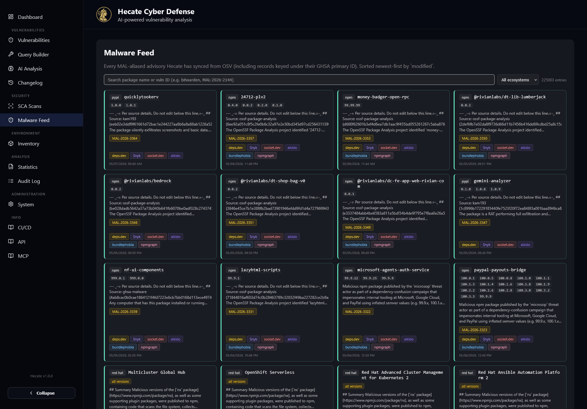

# Malware Detection & Feed

Most vulnerability tooling worries about *known-buggy* software. Hecate also worries about software
that was malicious from the start — the typosquats, install-hook backdoors, and compromised releases
that define modern supply-chain attacks. This page explains how Hecate catches that class of threat
from three different angles, and how the **Malware Feed** page lets you browse the intelligence
behind it.

The short version: when you scan a target, Hecate's own analyzer reads the actual package contents
and flags malicious behaviour, while `osv-scanner` checks every dependency against OSV's live
`MAL-*` advisory feed. A continuous watcher then keeps working *after* the scan finishes, so a
package that turns malicious tomorrow still surfaces on the scan you ran today — without a re-scan.
Everything it finds lands on the scan's **Security Alerts** tab, and can fire a notification.

## How Hecate finds malicious packages

### The Hecate Analyzer's malware detector

When the `hecate` scanner runs against a container image or source repository, it does more than
build an SBOM — it inspects the files themselves for malicious behaviour. The detector is built
around fourteen heuristic categories (thirty-five individual rules in total), each modelled on real
supply-chain attacks observed between 2020 and 2026. Rather than relying on a single smoking-gun
signature, it looks for the *patterns* that compromised packages share: code that runs the moment you
install it, code that reaches for credentials and then phones home, code that hides itself behind
layers of encoding, and so on.

The categories below summarise what each looks for. You do not need to memorise them — they all
surface the same way, as findings on the Security Alerts tab — but the table is useful when you want
to understand *why* something was flagged.

| Category | What it looks for |
| --- | --- |
| Install hooks | npm `preinstall` / `postinstall` / `install` scripts and Python `setup.py` command hooks that execute on install |
| Suspicious API / exfiltration | Dangerous combinations such as code execution plus network access, or credential reads plus network access |
| Obfuscation | Base64 / hex blocks and multi-layer encoding used to hide a payload |
| Unicode obfuscation | Invisible Unicode characters, variation selectors, private-use glyphs and homoglyphs |
| Typosquatting | Package names a short edit-distance away from the top 200 npm / PyPI packages, plus scope squatting |
| Python `.pth` backdoors | `.pth` files that smuggle executable code into the interpreter startup path |
| CI/CD abuse | Unpinned GitHub Actions tags, `pull_request_target` misuse, and process-memory access |
| Persistence | systemd, cron, launchd, Windows Startup / Registry Run keys and autostart entries |
| Kubernetes | Privileged pods, `kube-system` placement and RBAC escalation |
| Worm / self-propagation | Code that republishes itself, destructive payloads and runtime downloads |
| AI-tool abuse | Flags that disable AI agent safety (`--yolo`, `--dangerously-skip-permissions`, …) |
| Sandbox evasion | Payloads that only run when CI / sandbox indicators are absent |
| Platform-specific payloads | Different malicious behaviour gated on the operating system |
| Hash matching | SHA-256 fingerprints of known-malicious payload files (zero false positives by design) |

What makes the detector trustworthy is **combination scoring**: a single weak pattern stays `low` or
`medium`, but combinations escalate. Code that reads credentials *and* opens a network connection is
rated `critical`; code execution plus network access is `high`; a `.pth` file carrying a payload, or
a persistence mechanism that also exfiltrates, is `critical`. This keeps benign one-off matches quiet
while genuinely dangerous combinations rise to the top.

Just as important are the **false-positive guards**. The detector skips vendored and build artefacts
(`node_modules/`, `vendor/`, `dist/`, `build/`, `.git/`), minified files, and anything over 1 MB,
and it is locale-aware — it will not flag a translation file just because it contains Cyrillic text.
If a package you know to be safe keeps tripping a rule, an allow-list environment variable
(`HECATE_MALWARE_ALLOWLIST`) lets your operator exempt it by name.

!!! tip "Where the analyzer findings appear"
    Everything the malware detector reports is a `malicious-indicator` finding, which Hecate routes
    to the **Security Alerts** tab on the scan detail page — with severity chips, evidence blocks,
    confidence badges and category tags. See [Reading scan results](scan-results.md).

### Live OSV matching during a scan

Alongside the analyzer's behavioural heuristics, the `osv-scanner` tool matches every package in your
target against OSV's live advisory feed — including the `MAL-*` records that flag known-malicious
packages. This is a different signal entirely: instead of asking *"does this code behave maliciously?"*
it asks *"has the security community already published an advisory naming this exact package and
version as malicious?"* Because it queries OSV at scan time, it stays current without you updating any
local database. Hits arrive as the same `malicious-indicator` findings on the Security Alerts tab.

To run either of these checks, enable the `hecate` and/or `osv-scanner` scanners on your target — see
[SCA Scanning](../sca-scanning.md) for how to register targets and choose scanners.

### The continuous MAL-* watcher

The hardest supply-chain case is the package that was clean when you scanned it and turned malicious
afterwards. A scan is a point-in-time snapshot; if OSV publishes a `MAL-*` advisory the day after your
last run, nothing in a normal workflow would tell you until the next scheduled scan.

Hecate closes that gap with a continuous watcher. Every time the OSV feed is synced, the watcher
takes the newly arrived `MAL-*` advisories and cross-checks them against the SBOM of the most recent
completed scan for every target you have. If one of your already-scanned packages is now named in a
malicious advisory at a version you actually ship, Hecate retroactively injects a finding into that
existing scan — no re-scan required. The new finding shows up on both the **Findings** and **Security
Alerts** tabs of the affected scan, and on your next real re-scan the existing carry-forward logic
promotes it automatically.

The watcher is deliberately quiet on first contact: its very first run only records a watermark and
emits nothing, so enabling it never triggers a flood of historical alerts. From then on it only fires
for genuinely new hits, and an injected finding can also raise an `sca_malware_alert` notification so
you hear about it on Slack, email, or any channel you have configured. See
[Notifications](../integrations/notifications.md) to wire that up.

## The Malware Feed page

The **Malware Feed** page — under the **Security** group in the sidebar, at `/malware-feed` — is your
window onto the intelligence behind all of the above. It lists every `MAL-*`-aliased advisory Hecate
has synced from OSV, roughly 417,000 records across every supported ecosystem, sorted newest-first by
their last-modified date. This is the same corpus `osv-scanner` and the watcher draw on; the page lets
you browse and search it directly, whether you are investigating a specific package, vetting a
dependency before you adopt it, or just keeping an eye on what is being published.

The page is server-paginated at 100 records per page, with **Previous** / **Next** controls at the
bottom. Two filters sit at the top. A free-text search box matches on package name *or* a
vulnerability identifier — type `bitwarden` to find every malicious package whose name contains that
string, or paste an ID like `MAL-2026-2144`, `GHSA-…`, `CVE-…` or `PYSEC-…` to jump straight to a
specific advisory. An ecosystem dropdown narrows the list to a single package registry:

- npm, PyPI, RubyGems, NuGet, Cargo (crates.io), Go, Maven, Packagist, Hex, Pub, and GitHub Actions.

A counter on the right shows the total entry count for an unfiltered view; once a filter is active it
shows how many rows the current query returned instead.

### Reading a malware card

Each advisory is rendered as a card. The header carries an ecosystem tag, the package name (linked to
its registry page), and a severity chip when one is known. Below it, the affected versions appear as
chips — or an italic **all versions** marker for packages where the entire publish is malicious, as is
common with throwaway typosquats. A short description follows when OSV provides one.

The most useful part for investigation is the link row. Internal **pills** (`MAL-…`, `GHSA-…`,
`CVE-…` and similar) are cross-links into Hecate's own vulnerability detail page, so you can pivot from
the feed straight into the full record and its change history. A footer row of external research
links — deps.dev, Snyk, socket.dev, aikido, bundlephobia and npmgraph — opens the package on the major
supply-chain intelligence sites, always at package level (malicious versions are routinely retracted
from registries, so a version-pinned URL would simply 404). A timestamp in the corner shows when the
advisory was last modified.

!!! note "GHSA-keyed records"
    About half of the `MAL-*` corpus lives under a GHSA primary ID with the `MAL-*` identifier only in
    the advisory's aliases. The feed surfaces those records too, so a search will find a malicious
    package regardless of which identifier happens to be primary.
