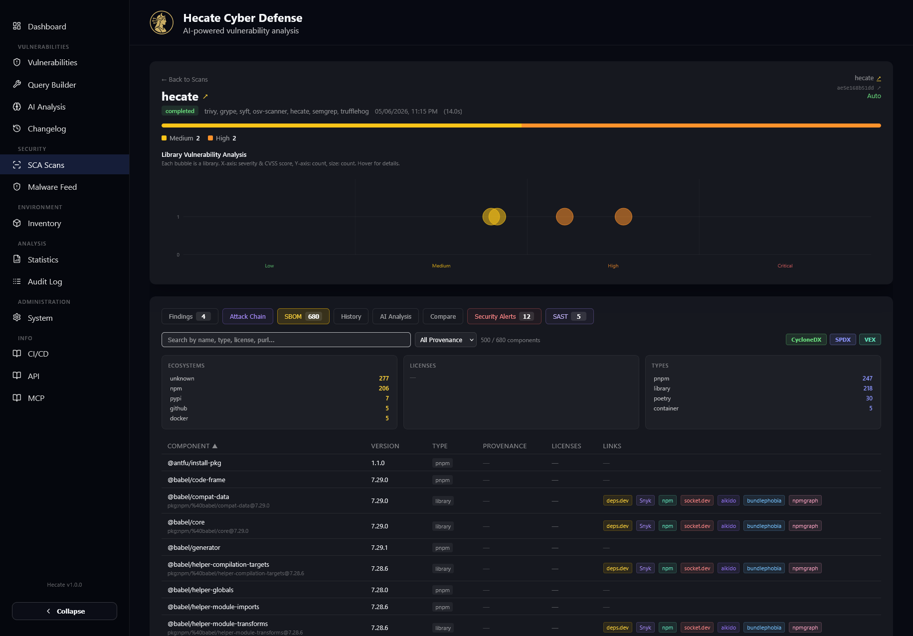

# Reading Scan Results

A finished scan is not a single number — it is a layered report. One run of the scanner sidecar can
produce a software bill of materials, a list of known vulnerabilities matched against that inventory,
malicious-package alerts, secrets that leaked into the source tree, static-analysis findings, container
best-practice checks, image-layer breakdowns and a license-compliance verdict — all bound to one
target at one point in time. This page explains how to read that report, tab by tab, and how to use the
features that let you triage findings without losing your annotations on the next rescan.

Every scan lives at `/scans/:scanId`. The header shows the target name (with a link out to the source
repository or registry), the scan status, which scanners ran, when it started and how long it took, the
commit SHA or image digest that was scanned, and a severity summary bar. While a scan is still running
the page polls itself every few seconds and streams partial results in, so you can start reading before
it finishes. To get there, open the **SCA Scans** page, pick a target or a scan, or follow **View latest
scan** from a target's overview page.

For how scans are configured and triggered in the first place, see [SCA Scanning](../sca-scanning.md).

## What a scan produces

The severity bar at the top counts **distinct vulnerabilities, not rows**. The same CVE found in three
packages from the same base image counts once, and when different packages report different severities
for it, the highest wins. That keeps the headline number honest — a CVE in `busybox`, `busybox-binsh`
and `ssl_client` is one problem to fix, not three. The findings table below still shows every per-package
row so you can see exactly where a vulnerability lands, and the badge on the Findings tab reflects that
row count.

Below the severity bar, library vulnerabilities are plotted as a bubble chart so you can see the shape of
the risk at a glance before drilling into the tabs.

## The tabs

The scan-detail page is organised into tabs that appear in a fixed order. Several of them only show up when
they have something to display — the SAST, Secrets and Licenses tabs are hidden until a scanner produced
the relevant findings, and Best Practices and Layer Analysis only appear for container-image scans.

| Tab | What it shows |
| --- | --- |
| **Findings** | Known vulnerabilities (CVE / GHSA / OSV) matched against the SBOM, merged per `(CVE, package)`, with severity, fix version, the scanners that reported each row, and VEX status. |
| **Attack Chain** | A single cross-CVE attacker narrative for the whole scan, bucketed into ATT&CK kill-chain stages. See [Attack Chains](attack-chain.md). |
| **SBOM** | Every software component the scan catalogued, consolidated by name and version, with ecosystem, license, type and provenance. |
| **History** | This target's previous scans over time, with a trend chart and a table of significant severity changes between consecutive runs. |
| **AI Analysis** | Optional AI-generated triage of the scan, kept as a timeline of analyses. |
| **Compare** | A diff of this scan against another completed scan of the same target — added, removed and changed findings. |
| **Security Alerts** | Malicious-package indicators (Hecate's malware rules plus retroactive `MAL-*` hits). See [Malware Detection & Feed](malware.md). |
| **SAST** | Static-analysis findings from Semgrep and DevSkim (source repositories only), with CWE/OWASP chips and code snippets. |
| **Secrets** | Secrets discovered by TruffleHog (source repositories only), flagged verified or unverified. |
| **Best Practices** | Dockle CIS Docker Benchmark checks (container images only). |
| **Layer Analysis** | Dive per-layer image breakdown — command, size and digest per layer (container images only). |
| **License Compliance** | The scan's components evaluated against your license policy. See [Licenses](licenses.md). |
| **Scanner Breakdown** | A per-scanner audit: which scanner ran, whether it succeeded, how many findings and SBOM rows it contributed. |

### Findings

The Findings tab is where most triage happens. Rows are merged so that the same vulnerability in the same
package version appears once even when several scanners report it, and the scanners that agreed are listed
in the row. A search box filters by CVE, package, version, scanner or fix version, and a row of severity
pills (All / Critical / High / Medium / Low) narrows the list further. Clicking a column header sorts by it.

Click a package name to expand a **detail row** with the source path, package type, CVSS score, data source,
title and advisory links. Each finding also carries a links column to the most useful external references —
deps.dev, Snyk, the package registry, socket.dev, bundlephobia and npmgraph — so you can pivot straight to
the upstream source. Findings with a CVE expose a **Show attack path** button that renders the structural
chain for that single vulnerability inline.

A checkbox on every row plus a "select all visible" header turns on a sticky multi-select toolbar. From there
you can apply a VEX status to the whole selection at once, or dismiss and restore findings in bulk. There is
also a button to open every CVE in the current view as a single query on the Vulnerabilities page.

### SBOM

The SBOM tab lists every component the scan catalogued, **consolidated server-side by name and version** — when
seven scanners all report `lodash@4.17.21`, you see it once. The columns are sortable by clicking the header,
and three clickable summary cards at the top (ecosystem, license, type) act as quick filters. A search box
trims the list, and a "Load more" pager loads the next page in 500-component steps for large bills of materials.

When provenance data is available, a **provenance column** marks each component as verified, unverified or unknown,
and a dropdown filter lets you isolate one of those states. Provenance reflects whether Hecate could confirm a
build attestation or signature for the package from its registry — a verified component carries a checkmark with
the attestation type; unverified means the registry returned no usable attestation, and unknown means the version
could not be checked.

Two export buttons produce a standards-compliant bill of materials: **CycloneDX 1.5** and **SPDX 2.3** JSON. A VEX
export sits alongside them, writing your finding annotations out as a CycloneDX VEX document.

### SAST, Secrets and Best Practices

These tabs separate the non-CVE findings into purpose-built views. **SAST** collects static-analysis results from
Semgrep and DevSkim — each card shows the CWE and OWASP classifications, the offending code snippet and reference
links. **Secrets** lists what TruffleHog found in a source tree, with a badge distinguishing verified secrets
(a live credential was confirmed) from unverified candidates. **Best Practices** surfaces Dockle's CIS Docker
Benchmark checks for container images. None of these count toward the vulnerability severity total — they are
reported in their own tabs with their own breakdowns.

### History, Compare and Scanner Breakdown

The **History** tab charts this target's past scans, with a 7-day / 30-day / 90-day / All range selector and a
table that highlights only the runs where severity counts actually changed. **Compare** lets you diff the current
scan against any other completed scan of the same target and shows what was added, removed or changed. **Scanner
Breakdown** is the audit trail: one row per requested scanner with its status (ok / empty / error), how many
findings it produced by severity, and how many SBOM rows it contributed — useful when one scanner timed out or
returned nothing and you want to know which.

## VEX status

VEX (Vulnerability Exploitability Exchange) is how you record your *judgement* about a finding rather than just
its raw severity. A scanner tells you a CVE is present in a package; VEX lets you state whether it actually affects
your software, and why. Hecate supports four statuses:

- **Not Affected** — the vulnerable code path is not reachable or the issue does not apply.
- **Affected** — confirmed to affect this software.
- **Fixed** — already remediated in this build.
- **Investigating** — under active assessment.

To set a status, click the VEX badge on a finding row. An editor opens below the row where you choose the status,
add an optional justification, and write a free-text detail note. Save applies it to all raw findings behind that
merged row. To annotate many findings at once, select them with the row checkboxes and use **Apply VEX** in the
multi-select toolbar.

You can also bring annotations in and out as files. **Import VEX** in the Findings toolbar reads a CycloneDX VEX
document and applies its statuses to matching findings, and the VEX export on the SBOM tab writes your current
annotations back out in the same format — so a VEX statement made once can travel across tools and teams.

## Dismissing findings

Dismissal is separate from VEX. Where VEX is a published, exportable statement about exploitability, **dismissal is a
personal display filter** — a way to push noise out of view without claiming anything about the vulnerability. Dismissed
findings are hidden by default; tick **Show dismissed** in the Findings toolbar to bring them back, rendered dimmed with
a "dismissed" badge. Dismiss and restore are available per finding through the multi-select toolbar, optionally with a
reason.

!!! tip "Annotations survive rescans"
    Both VEX statuses and dismissal flags are **carried forward** to the next scan of the same target automatically.
    Matching is on the vulnerability ID plus package name (falling back to title plus package for findings without a
    CVE), so the work you put into triaging one scan is not lost the moment the target is scanned again.

## The target overview page

Each registered target also has its own overview page at `/scans/targets/:targetId`, reachable by clicking a target
card on the SCA Scans page. Where the scan-detail page is about one run, the target page is about the asset over time.
It shows the target's metadata (type, application group, registry, auto-scan state and the configured scanners), the
severity rollup of its latest scan, and — when auto-scan is enabled — the last change-detection check with its verdict
and any error, so you can see why an automatic rescan did or did not fire.

Below that, a **Top findings** list summarises the worst of the latest scan, and a paginated **Scan history** table
lists every completed run with a link into each. Quick-action buttons let you trigger a rescan, run a change-detection
check on demand, copy a shields.io status badge for your README, or delete the target and all its data. When a target
is write-protected, a lock badge appears next to its name and the action buttons require the appropriate password —
see [Security & Access Control](../security-access-control.md). SBOM-import targets are read-only and do not show the
rescan, check or delete actions.

!!! note "Status badges for your README"
    The **Copy badge** button copies Markdown for a shields.io badge that always tracks the target's latest completed
    scan — drop it into a repository README to show the current severity breakdown at a glance.
