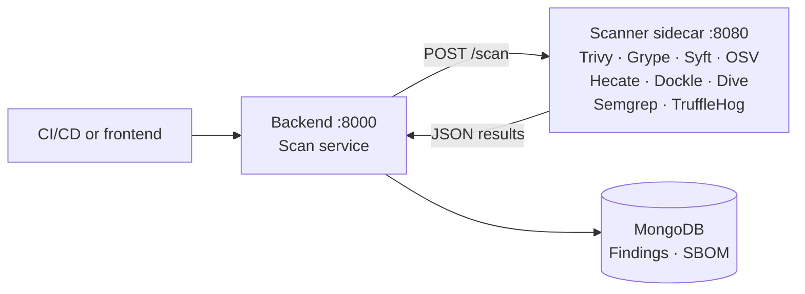

# Hecate Scanner Sidecar

> Sidecar that powers the SCA (Software Composition Analysis) features of Hecate. Runs vulnerability scans, SBOM generation, and supply-chain malware detection against container images and source repositories.


---

## Installed scanner tools

| Tool | Purpose | Output format |
| --- | --- | --- |
| [Trivy](https://github.com/aquasecurity/trivy) | Vulnerability scan + SBOM | `trivy-json` |
| [Grype](https://github.com/anchore/grype) | Vulnerability scan | `grype-json` |
| [Syft](https://github.com/anchore/syft) | SBOM generation | `cyclonedx-json` |
| [OSV Scanner](https://github.com/google/osv-scanner) | Vulnerability scan (OSV DB) | `osv-json` |
| Hecate Analyzer | SBOM extraction (28 parsers, 12 ecosystems) + malware detection | `hecate-json` |
| [Dockle](https://github.com/goodwithtech/dockle) | CIS Docker Benchmark linter (container images only) | `dockle-json` |
| [Dive](https://github.com/wagoodman/dive) | Docker image-layer analysis (container images only) | `dive-json` |
| [Semgrep](https://github.com/semgrep/semgrep) | SAST scanner (source repos only) | `semgrep-json` |
| [TruffleHog](https://github.com/trufflesecurity/trufflehog) | Secret scanner (source repos only) | `trufflehog-json` |
| [DevSkim](https://github.com/microsoft/DevSkim) | Microsoft SAST scanner with strong .NET / ASP.NET coverage (source repos only, no build required) | `devskim-sarif` |

Trivy, Grype, Syft, Dockle, and OSV Scanner are installed as binaries inside the Docker image. Dive, TruffleHog, and DevSkim come in as GitHub releases. Semgrep is installed via pip. DevSkim is a framework-dependent .NET 8 app — the runtime is copied in from `mcr.microsoft.com/dotnet/runtime:8.0` as a multi-stage build and runs in globalization-invariant mode (`DOTNET_SYSTEM_GLOBALIZATION_INVARIANT=1`). The Hecate Analyzer is a native Python scanner with no external dependencies.

> [!NOTE]
> Dockle and Dive are container-image-only. Semgrep, TruffleHog, DevSkim, OSV Scanner, and the Hecate Analyzer are source-repo-only.

### Enhanced detection

- **Trivy** — `--list-all-pkgs` for complete package listing (incl. non-vulnerable packages)
- **Syft** — `SYFT_DEFAULT_CATALOGERS=all` enables every cataloger including binary detection (so it picks up binaries like Trivy or Grype that are installed via Dockerfile `COPY --from=`)

---

## Integration into the wider system



1. A scan is submitted through the backend API (`POST /api/v1/scans` or `/scans/manual`).
2. The backend `ScanService` forwards the request to the sidecar (`POST /scan`).
3. The sidecar runs the requested scanners and returns the raw results.
4. The backend `ScanParser` normalises the results and stores findings + SBOM components in MongoDB.

---

## API

### `GET /health`

Health check.

**Response:** `{"status": "ok"}`

### `POST /scan`

Run one or more scanners against a target.

**Request:**

```json
{
  "target": "git.nohub.lol/rk/hecate-backend:latest",
  "type": "container_image",
  "scanners": ["trivy", "grype", "syft"]
}
```

| Field | Type | Description |
| --- | --- | --- |
| `target` | string | Container-image reference or source-repo URL |
| `type` | string | `container_image` or `source_repo` |
| `scanners` | string[] | Scanners to run (`trivy`, `grype`, `syft`, `osv-scanner`, `hecate`, `dockle`, `dive`, `semgrep`, `trufflehog`, `devskim`) |

**Response:**

```json
{
  "target": "git.nohub.lol/rk/hecate-backend:latest",
  "type": "container_image",
  "results": [
    {
      "scanner": "trivy",
      "format": "trivy-json",
      "report": { "...": "..." },
      "error": null
    }
  ]
}
```

### `POST /check`

Lightweight fingerprint check — fetches the current image digest (`skopeo inspect` / `docker inspect`) or the HEAD commit SHA (`git ls-remote`) without running a scan. Used by the backend's auto-scan to skip unchanged targets.

> [!TIP]
> `ls-remote` and `git clone` automatically fall back to an anonymous retry if `SCANNER_AUTH` was injected for the host and the credentials are rejected. A stale token for a private repo should not block public repos on the same host.

### `GET /stats`

cgroup-v1 / v2-aware memory and tmpfs disk usage plus the number of active scans. Called by the backend during resource gating before a scan starts.

---

## Hecate Analyzer & malware detection

### SBOM extraction

The Hecate Analyzer (`scanner/app/hecate_analyzer.py`) extracts SBOM components from 28 manifest types across 12 ecosystems. Lockfiles and manifests are read in parallel — exact resolved versions from lockfiles plus declared dependencies from manifests. Overlap is merged downstream by `_filter_and_merge_sbom` (`backend/app/services/scan_parser.py`) on `name:version`.

| Ecosystem | Manifest files | PURL type |
| --- | --- | --- |
| Docker | `Dockerfile*`, `docker-compose*.yml` | `pkg:docker` |
| npm | `package.json`, `package-lock.json`, `yarn.lock` (v1 + Berry YAML), `pnpm-lock.yaml`, `bun.lock` | `pkg:npm` |
| Python | `requirements*.txt`, `pyproject.toml` (PEP 621 + Poetry), `Pipfile`, `Pipfile.lock`, `poetry.lock`, `uv.lock`, `setup.cfg` | `pkg:pypi` |
| Go | `go.mod`, `go.sum` | `pkg:golang` |
| Rust | `Cargo.toml`, `Cargo.lock` | `pkg:cargo` |
| Ruby | `Gemfile.lock` (preferred), `Gemfile` | `pkg:gem` |
| PHP | `composer.lock` (preferred), `composer.json` | `pkg:composer` |
| Java | `pom.xml` (incl. property resolution), `build.gradle(.kts)`, `gradle.lockfile` | `pkg:maven` |
| .NET | `*.csproj` / `*.fsproj` / `*.vbproj` (PackageReference), `Directory.Packages.props` (Central Package Management), `packages.config`, `packages.lock.json`, `project.assets.json` | `pkg:nuget` |
| Swift | `Package.resolved` (v1 / v2 / v3) | `pkg:swift` |
| Elixir | `mix.lock` | `pkg:hex` |
| Dart / Flutter | `pubspec.lock` (preferred), `pubspec.yaml` | `pkg:pub` |
| CocoaPods | `Podfile.lock` | `pkg:cocoapods` |

**Notable behaviours**

- **Dockerfiles** — ARG variable resolution (`${VAR:-default}`); unresolvable placeholders are skipped.
- **Java / Maven** — `${property}` placeholders in versions are resolved via `<properties>`.
- **.NET CPM** — `<PackageReference Include="X" />` without `Version` is resolved against `Directory.Packages.props` / `<PackageVersion>`.
- **Lockfiles additive to manifests** — the same path can yield both `package.json` and `package-lock.json`; duplicates are merged downstream on `name:version`.
- **PURL deduplication** — identical packages from different manifests are recorded once.
- **Skipped directories** — `node_modules/`, `.git/`, `vendor/`, `dist/`, `build/`, `__pycache__/`, `.venv/`.

### Malware detection

The malware detector (`scanner/app/malware_detector/`) flags potentially malicious packages using static heuristics. No external dependencies — pure Python.

#### Detection rules (35 rules)

The malware detector implements 35 detection rules across 14 categories, informed by real-world supply-chain attacks from 2020 to 2026.

| Rule ID | Name | Severity | Category | Source / attack |
| --- | --- | --- | --- | --- |
| HEC-001 | npm install script detected | medium | `install_hook` | — (standard heuristic) |
| HEC-002 | npm install script with suspicious payload | critical | `install_hook` | — (standard heuristic) |
| HEC-003 | Python `setup.py` `cmdclass` override | medium | `install_hook` | — (standard heuristic) |
| HEC-004 | Python `setup.py` `cmdclass` with suspicious payload | critical | `install_hook` | — (standard heuristic) |
| HEC-010 | Potential credential exfiltration | critical | `exfiltration` | — (standard heuristic) |
| HEC-011 | Dynamic code execution with network access | high | `suspicious_api` | — (standard heuristic) |
| HEC-012 | Encoded payload with network access | high | `suspicious_api` | — (standard heuristic) |
| HEC-013 | Suspicious API usage | low | `suspicious_api` | — (standard heuristic) |
| HEC-020 | Obfuscated code detected | medium | `obfuscation` | — (standard heuristic) |
| HEC-021 | Heavily obfuscated code | high | `obfuscation` | — (standard heuristic) |
| HEC-022 | Multi-layer encoded payload | high | `obfuscation` | [LiteLLM v1.82.8](https://snyk.io/articles/poisoned-security-scanner-backdooring-litellm/) (double-base64), [s1ngularity / Nx](https://orca.security/resources/blog/s1ngularity-supply-chain-attack/) (triple-base64) |
| HEC-023 | Invisible Unicode characters in source code | high | `unicode_obfuscation` | [Glassworm](https://arstechnica.com/security/2026/03/supply-chain-attack-using-invisible-code-hits-github-and-other-repositories/) (151+ packages, Variation Selectors, PUA) |
| HEC-024 | Invisible Unicode payload with code execution | critical | `unicode_obfuscation` | [Glassworm](https://arstechnica.com/security/2026/03/supply-chain-attack-using-invisible-code-hits-github-and-other-repositories/) (`eval` + `.codePointAt` decoder) |
| HEC-030 | Potential typosquatting package | high | `typosquatting` | [DIMVA 2020 study](https://pmc.ncbi.nlm.nih.gov/articles/PMC7338168/) (61 % of malicious packages) |
| HEC-031 | Potential scope squatting | medium | `typosquatting` | — (standard heuristic) |
| HEC-040 | Python `.pth` file with executable code | medium | `pth_backdoor` | [LiteLLM v1.82.8](https://snyk.io/articles/poisoned-security-scanner-backdooring-litellm/) (`.pth` fires on every Python startup) |
| HEC-041 | Python `.pth` file with suspicious payload | critical | `pth_backdoor` | [LiteLLM v1.82.8](https://snyk.io/articles/poisoned-security-scanner-backdooring-litellm/) (34 KB `.pth`, credential theft + systemd C2) |
| HEC-050 | GitHub Action pinned to mutable tag | high | `cicd` | [tj-actions / changed-files CVE-2025-30066](https://www.cisa.gov/news-events/alerts/2025/03/18/supply-chain-compromise-third-party-tj-actionschanged-files-cve-2025-30066-and-reviewdogaction) (tag poisoning, 23 K repos) |
| HEC-051 | Dangerous `pull_request_target` workflow | critical | `cicd` | [Trivy v0.69.4](https://www.paloaltonetworks.com/blog/cloud-security/trivy-supply-chain-attack/) (PAT theft via misconfigured workflow) |
| HEC-052 | Process-memory access in CI workflow | critical | `cicd` | [Trivy v0.69.4](https://www.paloaltonetworks.com/blog/cloud-security/trivy-supply-chain-attack/), [tj-actions](https://www.cisa.gov/news-events/alerts/2025/03/18/supply-chain-compromise-third-party-tj-actionschanged-files-cve-2025-30066-and-reviewdogaction) (`/proc/mem` harvesting) |
| HEC-053 | `curl` / `wget` piped to shell in CI workflow | high | `cicd` | — (CI security best practice) |
| HEC-054 | Unpinned third-party GitHub Action | medium | `cicd` | [tj-actions / changed-files CVE-2025-30066](https://www.cisa.gov/news-events/alerts/2025/03/18/supply-chain-compromise-third-party-tj-actionschanged-files-cve-2025-30066-and-reviewdogaction) |
| HEC-055 | Direct process-memory access | critical | `suspicious_api` | [Trivy v0.69.4](https://www.paloaltonetworks.com/blog/cloud-security/trivy-supply-chain-attack/) (`/proc/pid/mem`, bypasses log masking) |
| HEC-060 | System persistence mechanism detected | high | `persistence` | [Trivy v0.69.4](https://www.paloaltonetworks.com/blog/cloud-security/trivy-supply-chain-attack/) (blockchain canister C2), [LiteLLM](https://snyk.io/articles/poisoned-security-scanner-backdooring-litellm/) (`sysmon.service`), [Telnyx SDK](https://telnyx.com/resources/telnyx-python-sdk-supply-chain-security-notice-march-2026) (Windows Startup folder) |
| HEC-061 | Persistence mechanism with suspicious payload | critical | `persistence` | [Trivy v0.69.4](https://www.paloaltonetworks.com/blog/cloud-security/trivy-supply-chain-attack/), [LiteLLM v1.82.8](https://snyk.io/articles/poisoned-security-scanner-backdooring-litellm/) (systemd + network C2) |
| HEC-070 | Kubernetes privilege escalation | critical | `kubernetes` | [LiteLLM v1.82.8](https://snyk.io/articles/poisoned-security-scanner-backdooring-litellm/) (privileged pods in `kube-system`) |
| HEC-075 | Package self-propagation detected | critical | `worm` | [Shai-Hulud V2](https://about.gitlab.com/blog/gitlab-discovers-widespread-npm-supply-chain-attack/) (npm-publish worm, 47+ packages in <60 s) |
| HEC-076 | Destructive file operations detected | critical | `worm` | [Shai-Hulud V2](https://about.gitlab.com/blog/gitlab-discovers-widespread-npm-supply-chain-attack/) (dead man's switch: `shred`, `cipher /W:`, `del`) |
| HEC-077 | External runtime / tool download in install script | high | `install_hook` | [Shai-Hulud V2](https://about.gitlab.com/blog/gitlab-discovers-widespread-npm-supply-chain-attack/) (Bun installer disguise, weaponised TruffleHog) |
| HEC-078 | AI tool bypass flags detected | critical | `ai_abuse` | [s1ngularity / Nx](https://orca.security/resources/blog/s1ngularity-supply-chain-attack/) (first AI CLI tool abuse: `--yolo`, `--trust-all-tools`) |
| HEC-079 | Conditional execution based on environment detection | medium | `sandbox_evasion` | [DIMVA 2020 study](https://pmc.ncbi.nlm.nih.gov/articles/PMC7338168/) (41 % of malicious packages use conditional execution) |
| HEC-080 | Sandbox evasion with suspicious payload | high | `sandbox_evasion` | [DIMVA 2020 study](https://pmc.ncbi.nlm.nih.gov/articles/PMC7338168/) (CI env check + credential theft) |
| HEC-081 | Platform-specific payload delivery | high | `suspicious_api` | [Telnyx SDK](https://telnyx.com/resources/telnyx-python-sdk-supply-chain-security-notice-march-2026) (`sys.platform` + subprocess per OS) |
| HEC-082 | Media-file steganography pattern | high | `obfuscation` | [Telnyx SDK](https://telnyx.com/resources/telnyx-python-sdk-supply-chain-security-notice-march-2026) (WAV steganography C2, XOR decode) |
| HEC-090 | Known malicious file hash | critical | `known_compromised` | SHA-256 hash matching for known malicious payload files (zero-false-positive detection). Renamed from HEC-091; the previous HEC-090 (a static blocklist of compromised package versions) was removed because `osv-scanner` covers MAL-* findings dynamically against OSV's live feed and made the hard-coded snapshot redundant. |

#### Category summary

| Category | Rule IDs | Description |
| --- | --- | --- |
| `install_hook` | HEC-001–004, HEC-077 | npm preinstall / postinstall scripts, Python `setup.py` `cmdclass`, runtime downloads |
| `suspicious_api` | HEC-010–013, HEC-055, HEC-081 | Dangerous API combinations, process-memory access |
| `exfiltration` | HEC-010 | Credential access + network calls |
| `obfuscation` | HEC-020–022, HEC-082 | Base64 blocks, hex strings, multi-layer encoding, media steganography |
| `unicode_obfuscation` | HEC-023–024 | Invisible Unicode characters (Variation Selectors, PUA, homoglyphs) |
| `typosquatting` | HEC-030–031 | Levenshtein distance against the top 200 npm / PyPI + scope squatting |
| `pth_backdoor` | HEC-040–041 | Python `.pth` files with executable code |
| `cicd` | HEC-050–054 | GitHub Actions, CI/CD pipeline security |
| `persistence` | HEC-060–061 | systemd, cron, launchd, Windows Startup / Registry Run keys, xdg-autostart |
| `kubernetes` | HEC-070 | Privileged pods, `kube-system`, RBAC escalation |
| `worm` | HEC-075–076 | Self-propagation, destructive payloads |
| `ai_abuse` | HEC-078 | AI tool abuse (bypass flags) |
| `sandbox_evasion` | HEC-079–080 | Conditional execution based on environment detection |
| `known_compromised` | HEC-090 | SHA-256 hash matching of malicious payload files |

#### Combination scoring

Single pattern matches yield `low` / `medium` severity. Combinations within the same file escalate:

| Combination | Severity |
| --- | --- |
| Credential access + network access | `critical` |
| Code execution + network access | `high` |
| Data encoding + network access | `high` |
| `.pth` file + network / credentials / encoding | `critical` |
| Persistence + network / encoding | `critical` |
| Invisible Unicode + `eval` / `Function` / `exec` | `critical` |
| CI environment detection + payload | `high` |
| Platform detection + subprocess / network | `high` |
| Media download + XOR decode + network | `high` |

#### Confidence levels

- **high** — multiple suspicious patterns, known compromised version, or typosquatting with Levenshtein distance 1
- **medium** — install hook with suspicious payload, single dangerous API combination, or invisible Unicode without code execution
- **low** — single suspicious pattern without context

#### False-positive guards

- Skipped directories: `node_modules/`, `.git/`, `vendor/`, `dist/`, `build/`, `__pycache__/`, `.venv/`
- Skipped files: minified files (average line length > 500), files > 1 MB
- Package allow-list via `HECATE_MALWARE_ALLOWLIST` env var (comma-separated)
- Typosquatting: 3-tier validation (lockfile → registry → Levenshtein)
- Unicode: BOM at file start is ignored; threshold ≥ 5 invisible characters
- Unicode / homoglyphs: locale awareness — files in `locale/`, `i18n/`, `translations/` directories and files with > 1 % Cyrillic density are skipped
- Credentials: generic env vars (`SECRET_KEY`, `DATABASE_URL`, `PRIVATE_KEY`) are no longer counted as credential access

#### Sources & references

The detection rules are based on analysis of these real supply-chain attacks:

| Attack | Date | Primary vector | Reference |
| --- | --- | --- | --- |
| Trivy v0.69.4 (TeamPCP) | Mar 2026 | `pull_request_target`, `/proc/mem`, systemd C2 via blockchain | [Palo Alto Unit 42](https://www.paloaltonetworks.com/blog/cloud-security/trivy-supply-chain-attack/) |
| LiteLLM v1.82.7 / 1.82.8 | Mar 2026 | `.pth` backdoor, double-base64, K8s lateral movement | [Snyk](https://snyk.io/articles/poisoned-security-scanner-backdooring-litellm/) |
| Glassworm | Oct 2025 – Mar 2026 | Invisible Unicode, LLM-generated cover commits | [Ars Technica](https://arstechnica.com/security/2026/03/supply-chain-attack-using-invisible-code-hits-github-and-other-repositories/) |
| Shai-Hulud V2 | Nov 2025 | npm worm, Bun camouflage, dead man's switch | [GitLab](https://about.gitlab.com/blog/gitlab-discovers-widespread-npm-supply-chain-attack/) |
| s1ngularity / Nx | Aug 2025 | AI tool abuse, triple-base64 | [Orca Security](https://orca.security/resources/blog/s1ngularity-supply-chain-attack/) |
| tj-actions / changed-files (CVE-2025-30066) | Mar 2025 | Tag poisoning, runner memory dump | [CISA](https://www.cisa.gov/news-events/alerts/2025/03/18/supply-chain-compromise-third-party-tj-actionschanged-files-cve-2025-30066-and-reviewdogaction) |
| Telnyx SDK v4.87.1 / 4.87.2 (TeamPCP) | Mar 2026 | WAV steganography, platform-specific payloads, Windows Startup persistence | [Telnyx](https://telnyx.com/resources/telnyx-python-sdk-supply-chain-security-notice-march-2026) |
| Axios v1.14.1 / v0.30.4 | Mar 2026 | Stolen maintainer credentials, RAT dropper via `plain-crypto-js`, self-cleaning | [StepSecurity](https://www.stepsecurity.io/blog/axios-compromised-on-npm-malicious-versions-drop-remote-access-trojan) |
| Shai-Hulud (V1 + V2) | Sep – Nov 2025 | npm worm, preinstall credential theft, self-propagation via `npm publish`, destructive fallback | [Unit 42](https://unit42.paloaltonetworks.com/npm-supply-chain-attack/) |
| TeamPCP / KICS GitHub Actions | Mar 2026 | GitHub Action tag hijacking, credential harvesting | [Checkmarx](https://checkmarx.com/blog/checkmarx-security-update/), [Wiz](https://www.wiz.io/blog/tracking-teampcp-investigating-post-compromise-attacks-seen-in-the-wild) |
| `prt-scan` | Mar – Apr 2026 | `pull_request_target` exploitation, CI secret theft, npm-token abuse | [Wiz](https://www.wiz.io/blog/six-accounts-one-actor-inside-the-prt-scan-supply-chain-campaign) |
| Backstabber's Knife Collection | 2020 (study) | Taxonomy of 174 malicious packages | [PMC / DIMVA](https://pmc.ncbi.nlm.nih.gov/articles/PMC7338168/) |

#### Output format (`hecate-json`)

```json
{
  "components": [
    {"type": "container", "name": "python", "version": "3.13-slim", "...": "..."}
  ],
  "findings": [
    {
      "ruleId": "HEC-001",
      "ruleName": "npm postinstall script with suspicious payload",
      "severity": "critical",
      "category": "install_hook",
      "packageName": "evil-package",
      "packageVersion": "1.0.0",
      "filePath": "package.json",
      "evidence": "\"postinstall\": \"node -e 'require(\\\"child_process\\\")...'\"",
      "confidence": "high",
      "description": "..."
    }
  ],
  "bomFormat": "CycloneDX",
  "specVersion": "1.5"
}
```

#### Malware-detector modules

| Module | Purpose |
| --- | --- |
| `rules.py` | 35 `DetectionRule` definitions |
| `install_hooks.py` | npm + Python install-hook detection |
| `suspicious_patterns.py` | API combinations, obfuscation, process memory, multi-layer encoding, platform payload, steganography |
| `typosquatting.py` | Levenshtein + registry verification |
| `pth_files.py` | Python `.pth` backdoor detection |
| `cicd_analysis.py` | GitHub Actions + CI/CD pipeline analysis |
| `persistence.py` | systemd / cron / launchd / Windows Startup / Registry Run keys / xdg-autostart persistence |
| `unicode_obfuscation.py` | Invisible Unicode payload detection (with Cyrillic locale awareness) |
| `worm_detection.py` | Self-propagation, destructive payloads, AI tool abuse |
| `sandbox_evasion.py` | Conditional sandbox detection |
| `hash_matching.py` | SHA-256 hash matching of known malicious payload files (HEC-090). Predecessor: HEC-091 (renamed). The earlier static package-version blocklist was removed — `osv-scanner` covers MAL-* dynamically. |
| `sarif_formatter.py` | SARIF 2.1.0 output formatter for GitHub / GitLab Code Scanning integration (severity: critical / high → error, medium → warning, low → note) |
| `popular_packages.py` | Top 200 npm / PyPI packages (reference lists) |
| `utils.py` | Shared utilities (package-name resolution from manifests / `.git/config`) |

### Provenance verification

After SBOM extraction, the Hecate Analyzer optionally checks the provenance / attestation of every component via registry APIs.

| Ecosystem | Registry | Check |
| --- | --- | --- |
| npm | `registry.npmjs.org` | Sigstore attestations, GitHub Actions build provenance |
| PyPI | `pypi.org/integrity/` | PEP 740 attestations (Trusted Publishers, Sigstore) |
| Go | `sum.golang.org` | Go Checksum Database (transparency log) |
| Maven | `search.maven.org` | PGP signatures, Sigstore |
| RubyGems | `rubygems.org/api/v2/` | SHA checksums, Sigstore |
| Cargo | `crates.io/api/v1/` | Checksum verification |
| NuGet | `api.nuget.org/v3/` | Package signature validation |
| Docker | Registry v2 API | Cosign signatures, Content Trust |

- Inspired by [who-touched-my-packages](https://github.com/Point-Wild/who-touched-my-packages)
- Async httpx with 5 s timeout per request, `asyncio.Semaphore(10)` for concurrency
- In-memory cache per scan (no duplicate lookups)
- Best-effort: errors are ignored and never break a scan
- Results stored as a `provenance` object on SBOM components (verified, source_repo, build_system, attestation_type)
- Frontend shows the provenance status in the SBOM table (verified / unverified / unknown)

### Scan metadata

- **Source repos** — Git commit SHA extracted from the cloned repository
- **Container images** — image digest via `docker inspect` or `skopeo inspect`

---

## Sandbox hardening

The scanner container is hardened because it processes arbitrary code (cloned repos):

```yaml
scanner:
  security_opt:
    - no-new-privileges:true
  read_only: true
  tmpfs:
    - /tmp:size=10G
    - /root:size=50M
  cap_drop:
    - ALL
  deploy:
    resources:
      limits:
        memory: 12G
```

- Scans run in temporary directories under `/tmp`
- No Docker-socket mounting — image pulls go through the registry API
- Resource limits: 12 GB memory, 10 GB tmpfs (needed for large container images when Trivy DB + Grype DB + Dive tar + layer extraction run concurrently)

---

## Authentication

Authentication for private container registries and Git repositories is configured via the `SCANNER_AUTH` environment variable:

```text
SCANNER_AUTH=git.nohub.lol:my-api-token
```

Multiple hosts are comma-separated:

```text
SCANNER_AUTH=git.nohub.lol:token1,ghcr.io:ghp_abc
```

At startup the sidecar configures:

- `~/.docker/config.json` — for container-image pulls (Trivy, Grype, Syft)
- `~/.git-credentials` — fallback for HTTPS clones of private repositories

For `git clone` / `ls-remote`, the scanner additionally injects credentials as `-c http.extraHeader=Authorization: Basic <b64>` directly into the `git` invocation. This sidesteps the WWW-Authenticate negotiation that, especially for **Azure DevOps Server** (URL pattern `/<Collection>/<Project>/_git/<Repo>`), bypasses the credential helper and ends up failing with "Authentication failed". For the two-segment `host:token` form, `PersonalAccessToken` is used as the basic-auth user — compatible with ADO Server, Gitea, and GitHub PATs. If you need a specific user (e.g. Docker Hub), use the three-segment `host:user:token` form.

> [!IMPORTANT]
> No Docker-socket mounting. Scanner tools pull container images directly from the registry API.

---

## Source-repository scans

For `type: "source_repo"` the sidecar clones the repository via `git clone --depth 1` into a temporary directory and runs the scanners against it (`trivy fs`, `grype dir:`, `osv-scanner -r`).

---

## Resources

The scanner sidecar needs enough memory to scan large images:

```yaml
deploy:
  resources:
    limits:
      memory: 12G
```

---

## Configuration

| Variable | Default | Description |
| --- | --- | --- |
| `SCANNER_AUTH` | — | Authentication for registries and Git repos (`host:token`, comma-separated) |
| `SYFT_DEFAULT_CATALOGERS` | `all` | Syft catalogers (set in the Dockerfile, enables binary detection) |
| `HECATE_MALWARE_ALLOWLIST` | — | Comma-separated package names ignored by the malware detector |

Backend-side configuration of the sidecar:

| Variable | Default | Description |
| --- | --- | --- |
| `SCA_SCANNER_URL` | `http://scanner:8080` | URL of the scanner sidecar |
| `SCA_SCANNER_TIMEOUT_SECONDS` | `1560` | Floor for the backend → sidecar HTTP read timeout. The actual per-call timeout is `max(this, max(<SCANNER>_TIMEOUT_SECONDS) + 60s)`, so bumping a single scanner's subprocess budget auto-grants enough HTTP wait — no need to bump this in lock-step |
| `DEVSKIM_TIMEOUT_SECONDS` | `1500` | DevSkim subprocess timeout. The `<SCANNER>_TIMEOUT_SECONDS` convention works for any scanner wired through `_scanner_timeout()` in `scanner/app/scanners.py`; the backend reads the same env vars to size the sidecar HTTP timeout |

---

## Development

### Dependencies (Poetry)

```sh
cd scanner
poetry install
```

### Run locally

```sh
uvicorn app.main:app --host 0.0.0.0 --port 8080
```

> [!NOTE]
> Trivy, Grype, Syft, and OSV Scanner must be installed locally — or you run the scanner from its Docker container.

### Docker build

Based on `python:3.13-slim`. Scanner binaries are copied from the official container images (Trivy, Grype, Syft). OSV Scanner is downloaded as a GitHub release.

```sh
docker build -t hecate-scanner ./scanner
docker run -p 8080:8080 hecate-scanner
```

---

## Tech stack

| Technology | Purpose |
| --- | --- |
| Python 3.13 | Runtime |
| FastAPI | HTTP API |
| Uvicorn | ASGI server |
| Trivy | Vulnerability scanner |
| Grype | Vulnerability scanner |
| Syft | SBOM generator (CycloneDX) |
| OSV Scanner | Vulnerability scanner (OSV DB) |
| Hecate Analyzer | SBOM extractor + malware detector |
| Dockle | CIS Docker Benchmark linter |
| Dive | Docker image-layer analysis |
